# Loop Extractor Pipeline - Mermaid Diagram

**Author:** Alexander Krause, TU Berlin
**Co-Author:** Claude Code (Anthropic)

---

## Main Pipeline Flow

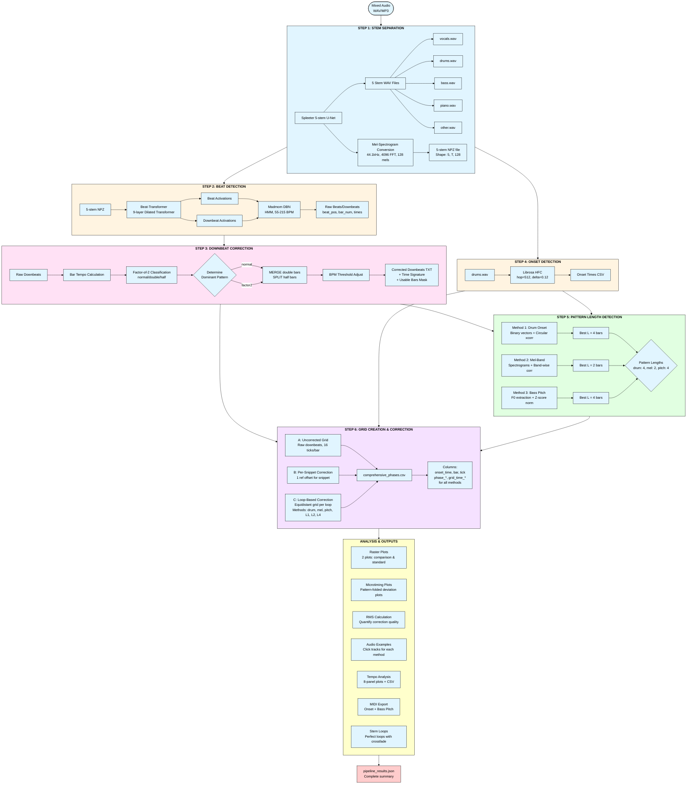

---

## Detailed Step 3: Downbeat Correction Logic

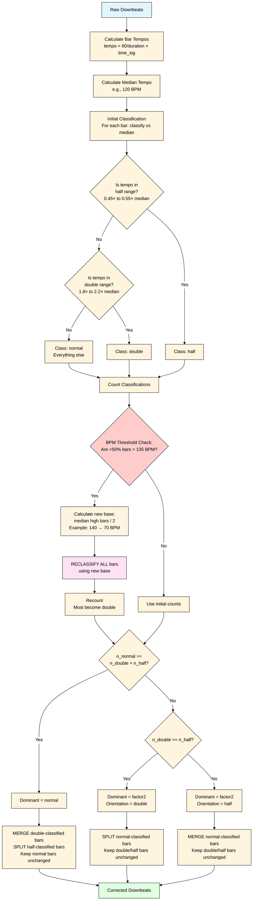

### How 3-Beat and 5-Beat Bars are Corrected

The downbeat correction automatically fixes bars that were misdetected as having 3 or 5 beats when the dominant time signature is 4/4:

| Misdetected Bar | Actual Beats | Duration vs 4/4 | Tempo Classification | Correction Action |
|----------------|--------------|-----------------|---------------------|-------------------|
| **3-beat bar** | 3 beats | 75% of normal | ~1.33x tempo → "double" | **MERGED** with next bar to create one 4/4 bar |
| **5-beat bar** | 5 beats | 125% of normal | ~0.8x tempo → "half" | **SPLIT** into two bars (4+4 beats) |

**Example**: If BeatTransformer detects a sequence like:
```
Bar 1: 4 beats ✓
Bar 2: 3 beats ✗ (too short)
Bar 3: 1 beat   (remainder from merge)
Bar 4: 4 beats ✓
```

After correction:
```
Bar 1: 4 beats ✓
Bar 2: 4 beats ✓ (merged Bar 2 + Bar 3)
Bar 3: 4 beats ✓
```

This tempo-based classification and correction ensures consistent 4/4 bars for downstream analysis, even when the beat detection model makes occasional errors.

---

## Detailed Step 5: Pattern Length Detection Methods

**Important**: By default, the three methods analyze only **FULL bars within the snippet boundaries** (bars where both start AND end times fall within the snippet). This ensures pattern detection focuses on the analyzed region. You can optionally set `use_all_bars=True` to analyze all corrected bars regardless of snippet boundaries.

Each method creates an N×N similarity matrix comparing every bar to every other bar, then extracts the diagonal at lag L to measure periodicity. The median similarity at each lag determines the best pattern length.

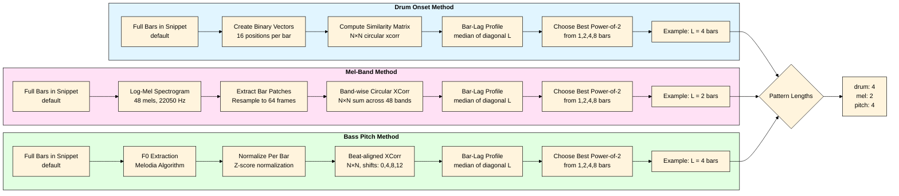

---

## Method 1: Drum Onset Pattern Detection (Detailed)

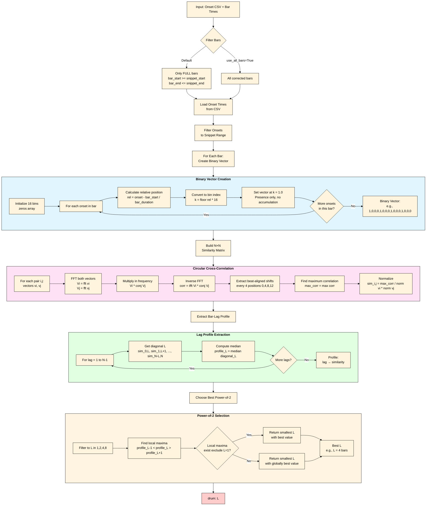

---

## Method 2: Mel-Band Pattern Detection (Detailed)

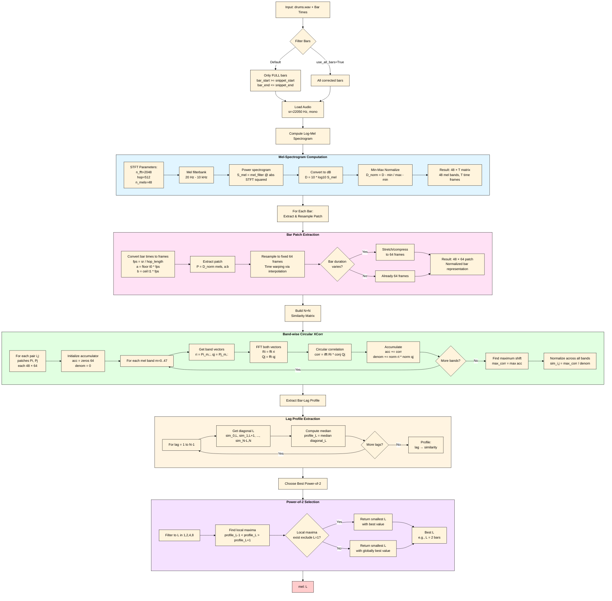

---

## Method 3: Bass Pitch Pattern Detection (Detailed)

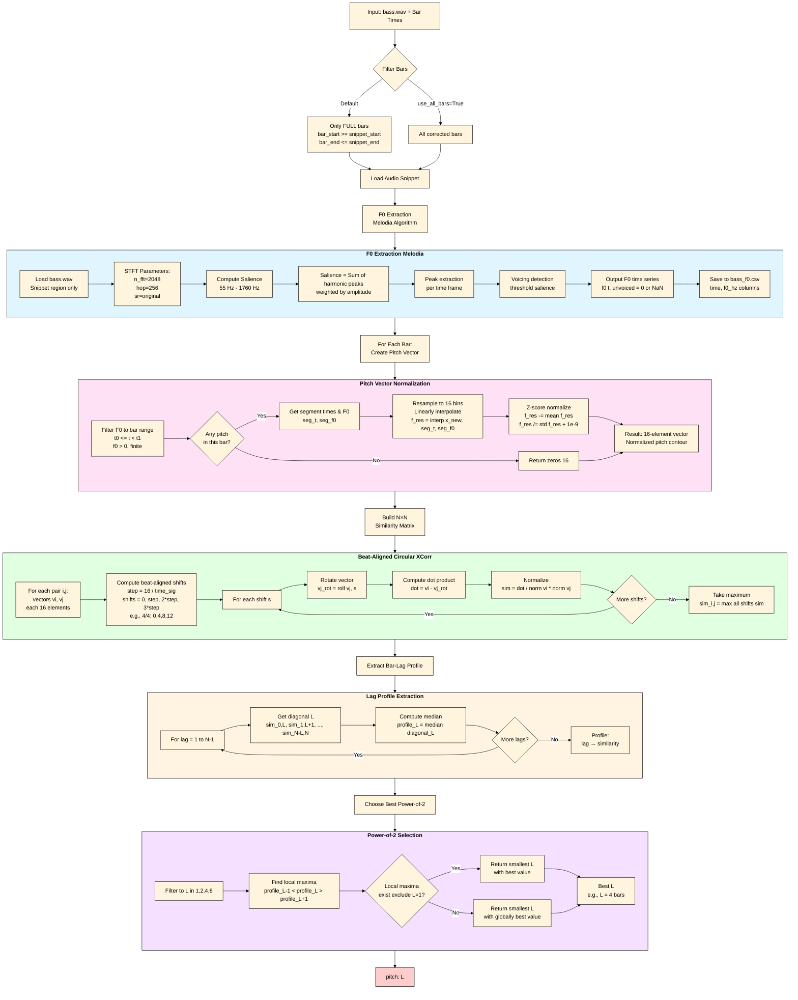

---

## Pattern Detection: Similarity Matrix Visualization

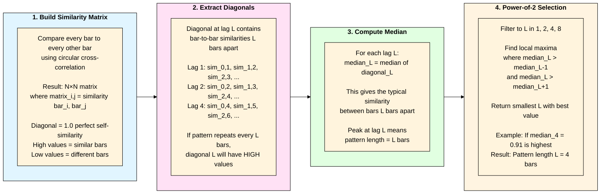

### Example: 8-Bar Pattern with L=4 Repetition

**Similarity Matrix (8×8):**
```
       Bar0  Bar1  Bar2  Bar3  Bar4  Bar5  Bar6  Bar7
Bar0 │ 1.00  0.45  0.32  0.28  0.92  0.41  0.29  0.25 │
Bar1 │ 0.45  1.00  0.43  0.31  0.44  0.89  0.40  0.28 │
Bar2 │ 0.32  0.43  1.00  0.42  0.31  0.43  0.87  0.39 │
Bar3 │ 0.28  0.31  0.42  1.00  0.27  0.30  0.41  0.85 │
Bar4 │ 0.92  0.44  0.31  0.27  1.00  0.43  0.30  0.26 │
Bar5 │ 0.41  0.89  0.43  0.30  0.43  1.00  0.42  0.29 │
Bar6 │ 0.29  0.40  0.87  0.41  0.30  0.42  1.00  0.40 │
Bar7 │ 0.25  0.28  0.39  0.85  0.26  0.29  0.40  1.00 │
```

**Diagonal Extraction:**
- **Lag 1:** [0.45, 0.43, 0.42, 0.27, 0.43, 0.42, 0.40] → median = **0.42**
- **Lag 2:** [0.32, 0.31, 0.42, 0.31, 0.43, 0.87] → median = **0.37**
- **Lag 3:** [0.28, 0.31, 0.42, 0.27, 0.30, 0.41] → median = **0.31**
- **Lag 4:** [**0.92**, 0.89, **0.87**, **0.85**] → median = **0.88** ⭐ **PEAK!**
- **Lag 5:** [0.41, 0.43, 0.41] → median = **0.41**

**Result:** L = 4 bars (highest median at lag 4)

**Interpretation:**
- Bar 0 and Bar 4 are very similar (0.92)
- Bar 1 and Bar 5 are very similar (0.89)
- Bar 2 and Bar 6 are very similar (0.87)
- Bar 3 and Bar 7 are very similar (0.85)
- This indicates a **4-bar repeating pattern**

---

## Detailed Step 6: Grid Correction Methods

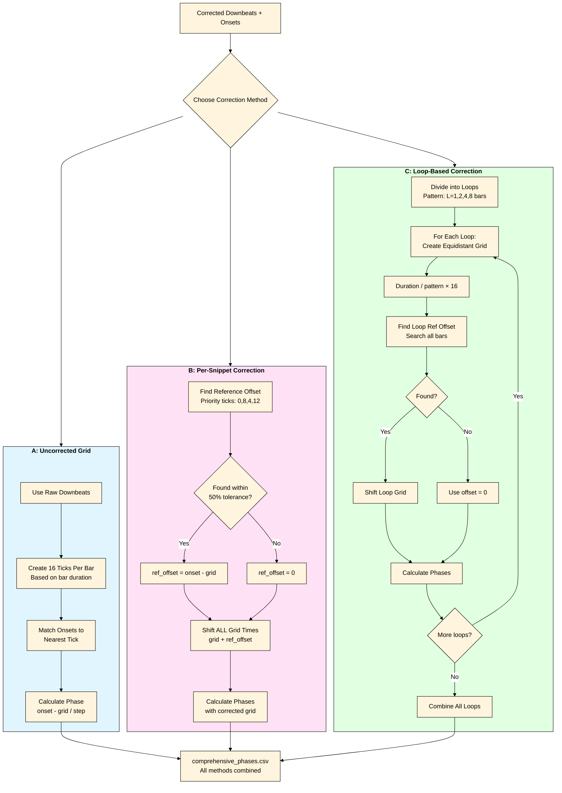

---

## Output Generation Flow

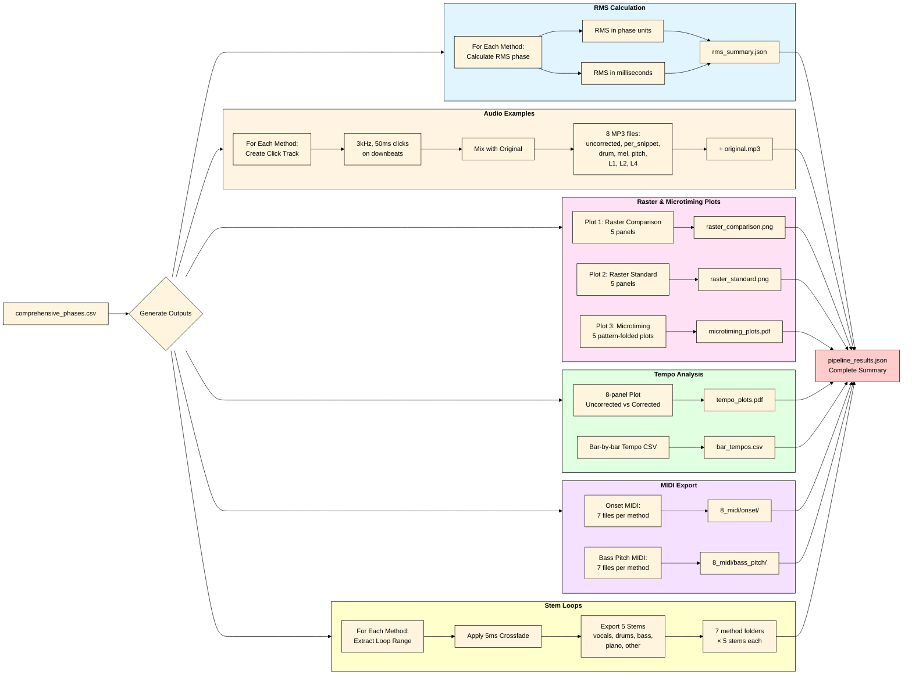

---

## Complete Pipeline Architecture

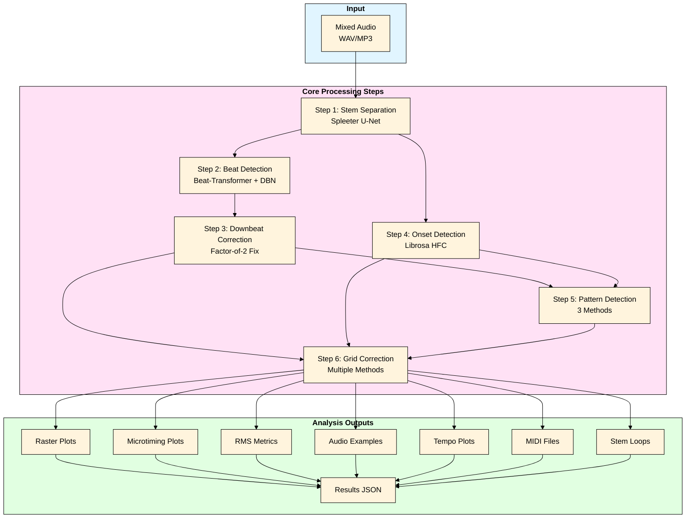

---

## Data Dependencies

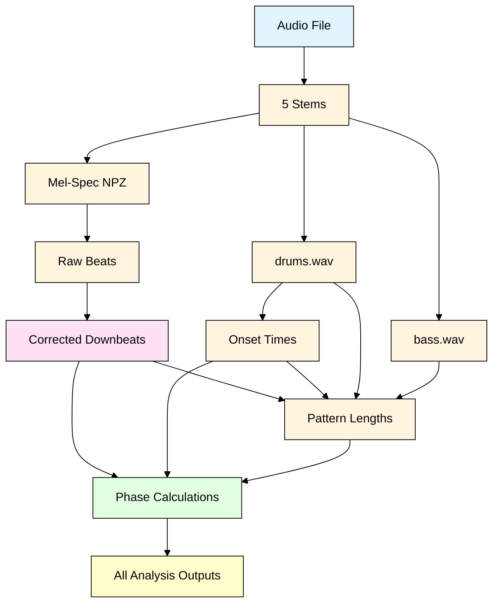

---

## Legend

- **Blue boxes**: Input/intermediate audio data
- **Pink boxes**: Beat/rhythm detection
- **Green boxes**: Pattern/timing analysis
- **Purple boxes**: Grid correction
- **Yellow boxes**: Final outputs
- **Red boxes**: Summary/results files

---

## Notes

- Steps 2 and 4 can run in parallel
- Step 6 produces the most important output: `comprehensive_phases.csv`
- All correction methods are calculated simultaneously and stored in one CSV
- Users can compare methods using RMS metrics or by listening to audio examples
