# Loop Extractor Pipeline - Mermaid Diagram

**Author:** Alexander Krause, TU Berlin
**Co-Author:** Claude Code (Anthropic)

---

## Main Pipeline Flow

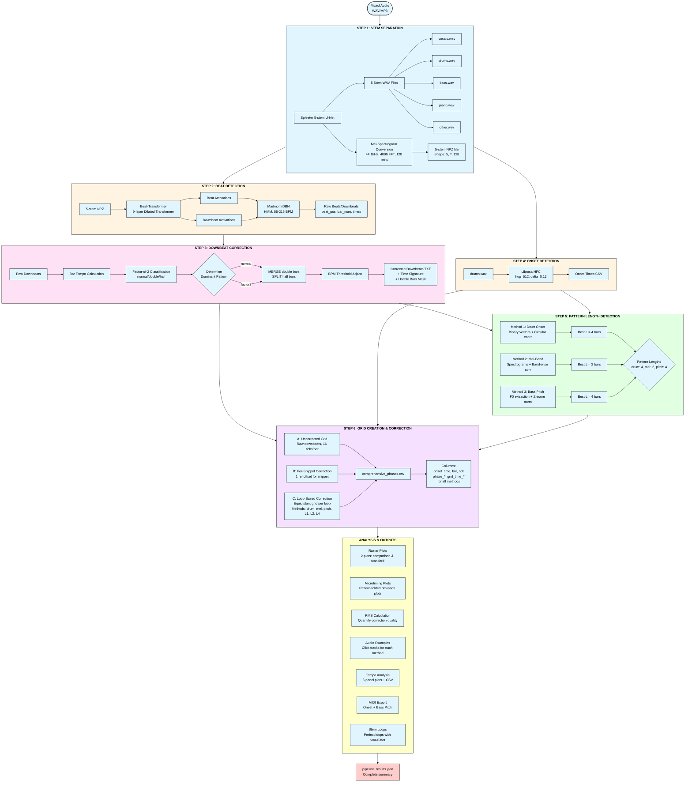
```mermaid
%%{init: {'theme':'base', 'themeVariables': { 'primaryColor':'#e1f5ff','primaryTextColor':'#000','primaryBorderColor':'#000','lineColor':'#000','secondaryColor':'#fff4e1','tertiaryColor':'#ffe1f5','clusterBkg':'#f9f9f9','clusterBorder':'#000','edgeLabelBackground':'#fff'}}}%%
flowchart TD
    Start([Mixed Audio<br/>WAV/MP3]) --> Step1

    subgraph Step1["<b>STEP 1: STEM SEPARATION</b>"]
        A1[Spleeter 5-stem U-Net] --> A2[5 Stem WAV Files]
        A2 --> A3[vocals.wav]
        A2 --> A4[drums.wav]
        A2 --> A5[bass.wav]
        A2 --> A6[piano.wav]
        A2 --> A7[other.wav]
        A1 --> A8[Mel-Spectrogram Conversion<br/>44.1kHz, 4096 FFT, 128 mels]
        A8 --> A9[5-stem NPZ file<br/>Shape: 5, T, 128]
    end

    Step1 --> Step2
    Step1 --> Step4

    subgraph Step2["<b>STEP 2: BEAT DETECTION</b>"]
        B1[5-stem NPZ] --> B2[Beat-Transformer<br/>9-layer Dilated Transformer]
        B2 --> B3[Beat Activations]
        B2 --> B4[Downbeat Activations]
        B3 --> B5[Madmom DBN<br/>HMM, 55-215 BPM]
        B4 --> B5
        B5 --> B6[Raw Beats/Downbeats<br/>beat_pos, bar_num, times]
    end

    subgraph Step4["<b>STEP 4: ONSET DETECTION</b>"]
        D1[drums.wav] --> D2[Librosa HFC<br/>hop=512, delta=0.12]
        D2 --> D3[Onset Times CSV]
    end

    Step2 --> Step3

    subgraph Step3["<b>STEP 3: DOWNBEAT CORRECTION</b>"]
        C1[Raw Downbeats] --> C2[Bar Tempo Calculation]
        C2 --> C3[Factor-of-2 Classification<br/>normal/double/half]
        C3 --> C4{Determine<br/>Dominant Pattern}
        C4 -->|normal| C5[MERGE double bars<br/>SPLIT half bars]
        C4 -->|factor2| C5
        C5 --> C6[BPM Threshold Adjust]
        C6 --> C7[Corrected Downbeats TXT<br/>+ Time Signature<br/>+ Usable Bars Mask]
    end

    Step3 --> Step5
    Step3 --> Step6
    Step4 --> Step5
    Step4 --> Step6

    subgraph Step5["<b>STEP 5: PATTERN LENGTH DETECTION</b>"]
        E1[Method 1: Drum Onset<br/>Binary vectors + Circular xcorr] --> E4[Best L = 4 bars]
        E2[Method 2: Mel-Band<br/>Spectrograms + Band-wise corr] --> E5[Best L = 2 bars]
        E3[Method 3: Bass Pitch<br/>F0 extraction + Z-score norm] --> E6[Best L = 4 bars]
        E4 --> E7{Pattern Lengths<br/>drum: 4, mel: 2, pitch: 4}
        E5 --> E7
        E6 --> E7
    end

    subgraph Step6["<b>STEP 6: GRID CREATION & CORRECTION</b>"]
        F1[A: Uncorrected Grid<br/>Raw downbeats, 16 ticks/bar] --> F4[comprehensive_phases.csv]
        F2[B: Per-Snippet Correction<br/>1 ref offset for snippet] --> F4
        F3[C: Loop-Based Correction<br/>Equidistant grid per loop<br/>Methods: drum, mel, pitch, L1, L2, L4] --> F4
        F4 --> F5[Columns:<br/>onset_time, bar, tick<br/>phase_*, grid_time_*<br/>for all methods]
    end

    Step5 --> Step6
    Step6 --> Analysis

    subgraph Analysis["<b>ANALYSIS & OUTPUTS</b>"]
        G1[Raster Plots<br/>2 plots: comparison & standard]
        G2[Microtiming Plots<br/>Pattern-folded deviation plots]
        G3[RMS Calculation<br/>Quantify correction quality]
        G4[Audio Examples<br/>Click tracks for each method]
        G5[Tempo Analysis<br/>8-panel plots + CSV]
        G6[MIDI Export<br/>Onset + Bass Pitch]
        G7[Stem Loops<br/>Perfect loops with crossfade]
    end

    Analysis --> Final[pipeline_results.json<br/>Complete summary]

    style Step1 fill:#e1f5ff,stroke:#000,color:#000
    style Step2 fill:#fff4e1,stroke:#000,color:#000
    style Step3 fill:#ffe1f5,stroke:#000,color:#000
    style Step4 fill:#fff4e1,stroke:#000,color:#000
    style Step5 fill:#e1ffe1,stroke:#000,color:#000
    style Step6 fill:#f5e1ff,stroke:#000,color:#000
    style Analysis fill:#ffffcc,stroke:#000,color:#000
    style Final fill:#ffcccc,stroke:#000,color:#000
```

---

## Detailed Step 3: Downbeat Correction Logic

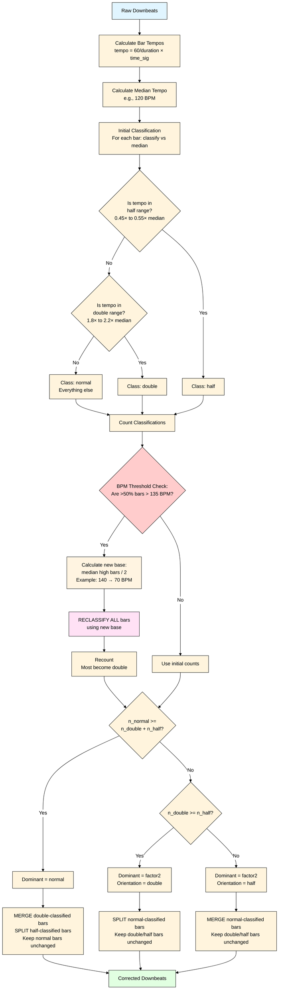
```mermaid
%%{init: {'theme':'base', 'themeVariables': { 'primaryTextColor':'#000','primaryBorderColor':'#000','lineColor':'#000','clusterBorder':'#000','edgeLabelBackground':'#fff'}}}%%
flowchart TD
    Start[Raw Downbeats] --> CalcTempo[Calculate Bar Tempos<br/>tempo = 60/duration × time_sig]
    CalcTempo --> Median[Calculate Median Tempo<br/>e.g., 120 BPM]

    Median --> Classify1[Initial Classification<br/>For each bar: classify vs median]

    Classify1 --> CheckHalf{Is tempo in<br/>half range?<br/>0.45× to 0.55× median}
    CheckHalf -->|Yes| ClassHalf1[Class: half]
    CheckHalf -->|No| CheckDouble{Is tempo in<br/>double range?<br/>1.8× to 2.2× median}
    CheckDouble -->|Yes| ClassDouble1[Class: double]
    CheckDouble -->|No| ClassNormal1[Class: normal<br/>Everything else]

    ClassNormal1 --> Count1
    ClassDouble1 --> Count1
    ClassHalf1 --> Count1[Count Classifications]

    Count1 --> BPMCheck{BPM Threshold Check:<br/>Are >50% bars > 135 BPM?}
    BPMCheck -->|Yes| Rebase[Calculate new base:<br/>median high bars / 2<br/>Example: 140 → 70 BPM]
    BPMCheck -->|No| UseCounts[Use initial counts]

    Rebase --> Reclassify[RECLASSIFY ALL bars<br/>using new base]
    Reclassify --> Count2[Recount<br/>Most become double]
    Count2 --> Dominant
    UseCounts --> Dominant

    Dominant{n_normal >=<br/>n_double + n_half?}
    Dominant -->|Yes| DomNormal[Dominant = normal]
    Dominant -->|No| DomFactor{n_double >= n_half?}
    DomFactor -->|Yes| DomDouble[Dominant = factor2<br/>Orientation = double]
    DomFactor -->|No| DomHalf[Dominant = factor2<br/>Orientation = half]

    DomNormal --> ApplyNormal[MERGE double-classified bars<br/>SPLIT half-classified bars<br/>Keep normal bars unchanged]
    DomDouble --> ApplyDouble[SPLIT normal-classified bars<br/>Keep double/half bars unchanged]
    DomHalf --> ApplyHalf[MERGE normal-classified bars<br/>Keep double/half bars unchanged]

    ApplyNormal --> Output[Corrected Downbeats]
    ApplyDouble --> Output
    ApplyHalf --> Output

    style Start fill:#e1f5ff
    style BPMCheck fill:#ffcccc
    style Rebase fill:#fff4e1
    style Reclassify fill:#ffe1f5
    style Output fill:#e1ffe1
```

### How 3-Beat and 5-Beat Bars are Corrected

The downbeat correction automatically fixes bars that were misdetected as having 3 or 5 beats when the dominant time signature is 4/4:

| Misdetected Bar | Actual Beats | Duration vs 4/4 | Tempo Classification | Correction Action |
|----------------|--------------|-----------------|---------------------|-------------------|
| **3-beat bar** | 3 beats | 75% of normal | ~1.33x tempo → "double" | **MERGED** with next bar to create one 4/4 bar |
| **5-beat bar** | 5 beats | 125% of normal | ~0.8x tempo → "half" | **SPLIT** into two bars (4+4 beats) |

**Example**: If BeatTransformer detects a sequence like:
```
Bar 1: 4 beats ✓
Bar 2: 3 beats ✗ (too short)
Bar 3: 1 beat   (remainder from merge)
Bar 4: 4 beats ✓
```

After correction:
```
Bar 1: 4 beats ✓
Bar 2: 4 beats ✓ (merged Bar 2 + Bar 3)
Bar 3: 4 beats ✓
```

This tempo-based classification and correction ensures consistent 4/4 bars for downstream analysis, even when the beat detection model makes occasional errors.

---

## Detailed Step 5: Pattern Length Detection Methods

**Important**: By default, the three methods analyze only **FULL bars within the snippet boundaries** (bars where both start AND end times fall within the snippet). This ensures pattern detection focuses on the analyzed region. You can optionally set `use_all_bars=True` to analyze all corrected bars regardless of snippet boundaries.

Each method creates an N×N similarity matrix comparing every bar to every other bar, then extracts the diagonal at lag L to measure periodicity. The median similarity at each lag determines the best pattern length.

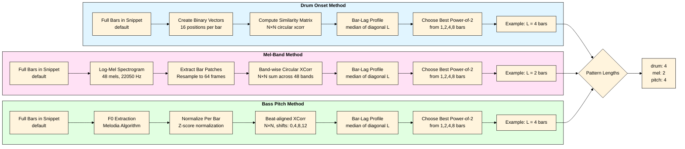
```mermaid
%%{init: {'theme':'base', 'themeVariables': { 'primaryTextColor':'#000','primaryBorderColor':'#000','lineColor':'#000','clusterBorder':'#000','edgeLabelBackground':'#fff'}}}%%
flowchart LR
    subgraph Method1["<b>Drum Onset Method</b>"]
        D1[Full Bars in Snippet<br/>default] --> D2[Create Binary Vectors<br/>16 positions per bar]
        D2 --> D3[Compute Similarity Matrix<br/>N×N circular xcorr]
        D3 --> D4[Bar-Lag Profile<br/>median of diagonal L]
        D4 --> D5[Choose Best Power-of-2<br/>from 1,2,4,8 bars]
        D5 --> D6[Example: L = 4 bars]
    end

    subgraph Method2["<b>Mel-Band Method</b>"]
        M1[Full Bars in Snippet<br/>default] --> M2[Log-Mel Spectrogram<br/>48 mels, 22050 Hz]
        M2 --> M3[Extract Bar Patches<br/>Resample to 64 frames]
        M3 --> M4[Band-wise Circular XCorr<br/>N×N sum across 48 bands]
        M4 --> M5[Bar-Lag Profile<br/>median of diagonal L]
        M5 --> M6[Choose Best Power-of-2<br/>from 1,2,4,8 bars]
        M6 --> M7[Example: L = 2 bars]
    end

    subgraph Method3["<b>Bass Pitch Method</b>"]
        P1[Full Bars in Snippet<br/>default] --> P2[F0 Extraction<br/>Melodia Algorithm]
        P2 --> P3[Normalize Per Bar<br/>Z-score normalization]
        P3 --> P4[Beat-aligned XCorr<br/>N×N, shifts: 0,4,8,12]
        P4 --> P5[Bar-Lag Profile<br/>median of diagonal L]
        P5 --> P6[Choose Best Power-of-2<br/>from 1,2,4,8 bars]
        P6 --> P7[Example: L = 4 bars]
    end

    D6 --> Combine{Pattern Lengths}
    M7 --> Combine
    P7 --> Combine
    Combine --> Output[drum: 4<br/>mel: 2<br/>pitch: 4]

    style Method1 fill:#e1f5ff,stroke:#000,color:#000
    style Method2 fill:#ffe1f5,stroke:#000,color:#000
    style Method3 fill:#e1ffe1,stroke:#000,color:#000
```

---

## Method 1: Drum Onset Pattern Detection (Detailed)

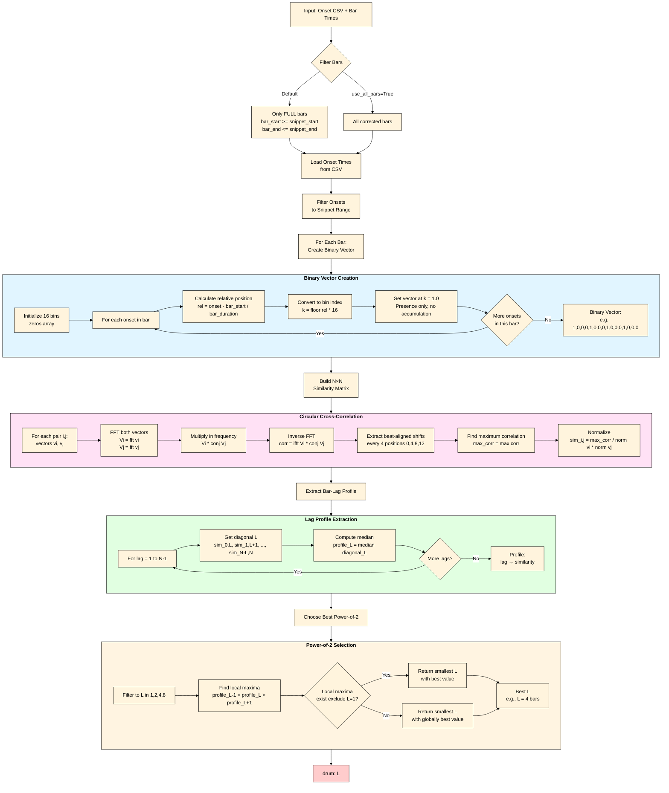
```mermaid
%%{init: {'theme':'base', 'themeVariables': { 'primaryTextColor':'#000','primaryBorderColor':'#000','lineColor':'#000','clusterBorder':'#000','edgeLabelBackground':'#fff'}}}%%
flowchart TD
    Start[Input: Onset CSV + Bar Times] --> Filter{Filter Bars}
    Filter -->|Default| FullBars[Only FULL bars<br/>bar_start >= snippet_start<br/>bar_end <= snippet_end]
    Filter -->|use_all_bars=True| AllBars[All corrected bars]

    FullBars --> LoadOnsets[Load Onset Times<br/>from CSV]
    AllBars --> LoadOnsets

    LoadOnsets --> FilterOnsets[Filter Onsets<br/>to Snippet Range]

    FilterOnsets --> CreateVectors[For Each Bar:<br/>Create Binary Vector]

    subgraph VectorCreation["<b>Binary Vector Creation</b>"]
        VC1[Initialize 16 bins<br/>zeros array] --> VC2[For each onset in bar]
        VC2 --> VC3[Calculate relative position<br/>rel = onset - bar_start / bar_duration]
        VC3 --> VC4[Convert to bin index<br/>k = floor rel * 16]
        VC4 --> VC5[Set vector at k = 1.0<br/>Presence only, no accumulation]
        VC5 --> VC6{More onsets<br/>in this bar?}
        VC6 -->|Yes| VC2
        VC6 -->|No| VC7[Binary Vector:<br/>e.g., 1,0,0,0,1,0,0,0,1,0,0,0,1,0,0,0]
    end

    CreateVectors --> VectorCreation
    VectorCreation --> SimMatrix[Build N×N<br/>Similarity Matrix]

    subgraph Similarity["<b>Circular Cross-Correlation</b>"]
        S1[For each pair i,j:<br/>vectors vi, vj] --> S2[FFT both vectors<br/>Vi = fft vi<br/>Vj = fft vj]
        S2 --> S3[Multiply in frequency<br/>Vi * conj Vj]
        S3 --> S4[Inverse FFT<br/>corr = ifft Vi * conj Vj]
        S4 --> S5[Extract beat-aligned shifts<br/>every 4 positions 0,4,8,12]
        S5 --> S6[Find maximum correlation<br/>max_corr = max corr]
        S6 --> S7[Normalize<br/>sim_i,j = max_corr / norm vi * norm vj]
    end

    SimMatrix --> Similarity
    Similarity --> LagProfile[Extract Bar-Lag Profile]

    subgraph LagExtraction["<b>Lag Profile Extraction</b>"]
        L1[For lag = 1 to N-1] --> L2[Get diagonal L<br/>sim_0,L, sim_1,L+1, ..., sim_N-L,N]
        L2 --> L3[Compute median<br/>profile_L = median diagonal_L]
        L3 --> L4{More lags?}
        L4 -->|Yes| L1
        L4 -->|No| L5[Profile:<br/>lag → similarity]
    end

    LagProfile --> LagExtraction
    LagExtraction --> Choose[Choose Best Power-of-2]

    subgraph PowerOf2["<b>Power-of-2 Selection</b>"]
        P1[Filter to L in 1,2,4,8] --> P2[Find local maxima<br/>profile_L-1 < profile_L > profile_L+1]
        P2 --> P3{Local maxima<br/>exist exclude L=1?}
        P3 -->|Yes| P4[Return smallest L<br/>with best value]
        P3 -->|No| P5[Return smallest L<br/>with globally best value]
        P4 --> P6[Best L<br/>e.g., L = 4 bars]
        P5 --> P6
    end

    Choose --> PowerOf2
    PowerOf2 --> Output[drum: L]

    style VectorCreation fill:#e1f5ff,stroke:#000,color:#000
    style Similarity fill:#ffe1f5,stroke:#000,color:#000
    style LagExtraction fill:#e1ffe1,stroke:#000,color:#000
    style PowerOf2 fill:#fff4e1,stroke:#000,color:#000
    style Output fill:#ffcccc,stroke:#000,color:#000
```

---

## Method 2: Mel-Band Pattern Detection (Detailed)

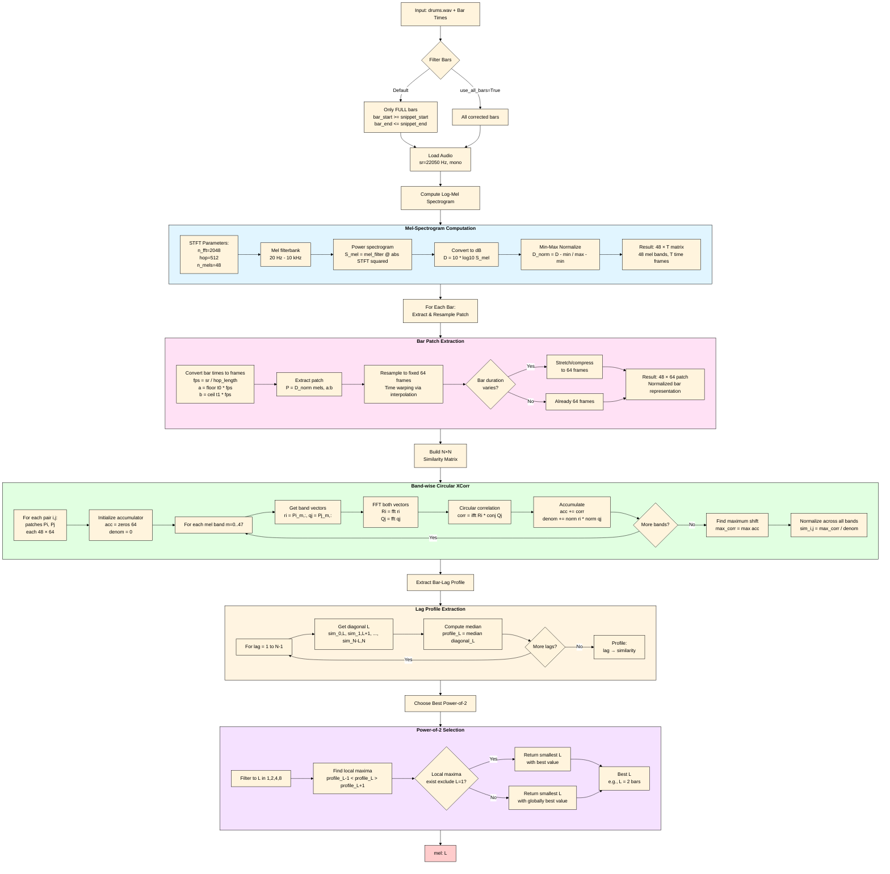
```mermaid
%%{init: {'theme':'base', 'themeVariables': { 'primaryTextColor':'#000','primaryBorderColor':'#000','lineColor':'#000','clusterBorder':'#000','edgeLabelBackground':'#fff'}}}%%
flowchart TD
    Start[Input: drums.wav + Bar Times] --> Filter{Filter Bars}
    Filter -->|Default| FullBars[Only FULL bars<br/>bar_start >= snippet_start<br/>bar_end <= snippet_end]
    Filter -->|use_all_bars=True| AllBars[All corrected bars]

    FullBars --> LoadAudio[Load Audio<br/>sr=22050 Hz, mono]
    AllBars --> LoadAudio

    LoadAudio --> ComputeMel[Compute Log-Mel Spectrogram]

    subgraph MelComputation["<b>Mel-Spectrogram Computation</b>"]
        M1[STFT Parameters:<br/>n_fft=2048<br/>hop=512<br/>n_mels=48] --> M2[Mel filterbank<br/>20 Hz - 10 kHz]
        M2 --> M3[Power spectrogram<br/>S_mel = mel_filter @ abs STFT squared]
        M3 --> M4[Convert to dB<br/>D = 10 * log10 S_mel]
        M4 --> M5[Min-Max Normalize<br/>D_norm = D - min / max - min]
        M5 --> M6[Result: 48 × T matrix<br/>48 mel bands, T time frames]
    end

    ComputeMel --> MelComputation
    MelComputation --> ExtractPatches[For Each Bar:<br/>Extract & Resample Patch]

    subgraph PatchExtraction["<b>Bar Patch Extraction</b>"]
        PE1[Convert bar times to frames<br/>fps = sr / hop_length<br/>a = floor t0 * fps<br/>b = ceil t1 * fps] --> PE2[Extract patch<br/>P = D_norm mels, a:b]
        PE2 --> PE3[Resample to fixed 64 frames<br/>Time warping via interpolation]
        PE3 --> PE4{Bar duration<br/>varies?}
        PE4 -->|Yes| PE5[Stretch/compress<br/>to 64 frames]
        PE4 -->|No| PE6[Already 64 frames]
        PE5 --> PE7[Result: 48 × 64 patch<br/>Normalized bar representation]
        PE6 --> PE7
    end

    ExtractPatches --> PatchExtraction
    PatchExtraction --> SimMatrix[Build N×N<br/>Similarity Matrix]

    subgraph Similarity["<b>Band-wise Circular XCorr</b>"]
        S1[For each pair i,j:<br/>patches Pi, Pj<br/>each 48 × 64] --> S2[Initialize accumulator<br/>acc = zeros 64<br/>denom = 0]
        S2 --> S3[For each mel band m=0..47]
        S3 --> S4[Get band vectors<br/>ri = Pi_m,:, qj = Pj_m,:]
        S4 --> S5[FFT both vectors<br/>Ri = fft ri<br/>Qj = fft qj]
        S5 --> S6[Circular correlation<br/>corr = ifft Ri * conj Qj]
        S6 --> S7[Accumulate<br/>acc += corr<br/>denom += norm ri * norm qj]
        S7 --> S8{More bands?}
        S8 -->|Yes| S3
        S8 -->|No| S9[Find maximum shift<br/>max_corr = max acc]
        S9 --> S10[Normalize across all bands<br/>sim_i,j = max_corr / denom]
    end

    SimMatrix --> Similarity
    Similarity --> LagProfile[Extract Bar-Lag Profile]

    subgraph LagExtraction["<b>Lag Profile Extraction</b>"]
        L1[For lag = 1 to N-1] --> L2[Get diagonal L<br/>sim_0,L, sim_1,L+1, ..., sim_N-L,N]
        L2 --> L3[Compute median<br/>profile_L = median diagonal_L]
        L3 --> L4{More lags?}
        L4 -->|Yes| L1
        L4 -->|No| L5[Profile:<br/>lag → similarity]
    end

    LagProfile --> LagExtraction
    LagExtraction --> Choose[Choose Best Power-of-2]

    subgraph PowerOf2["<b>Power-of-2 Selection</b>"]
        P1[Filter to L in 1,2,4,8] --> P2[Find local maxima<br/>profile_L-1 < profile_L > profile_L+1]
        P2 --> P3{Local maxima<br/>exist exclude L=1?}
        P3 -->|Yes| P4[Return smallest L<br/>with best value]
        P3 -->|No| P5[Return smallest L<br/>with globally best value]
        P4 --> P6[Best L<br/>e.g., L = 2 bars]
        P5 --> P6
    end

    Choose --> PowerOf2
    PowerOf2 --> Output[mel: L]

    style MelComputation fill:#e1f5ff,stroke:#000,color:#000
    style PatchExtraction fill:#ffe1f5,stroke:#000,color:#000
    style Similarity fill:#e1ffe1,stroke:#000,color:#000
    style LagExtraction fill:#fff4e1,stroke:#000,color:#000
    style PowerOf2 fill:#f5e1ff,stroke:#000,color:#000
    style Output fill:#ffcccc,stroke:#000,color:#000
```

---

## Method 3: Bass Pitch Pattern Detection (Detailed)

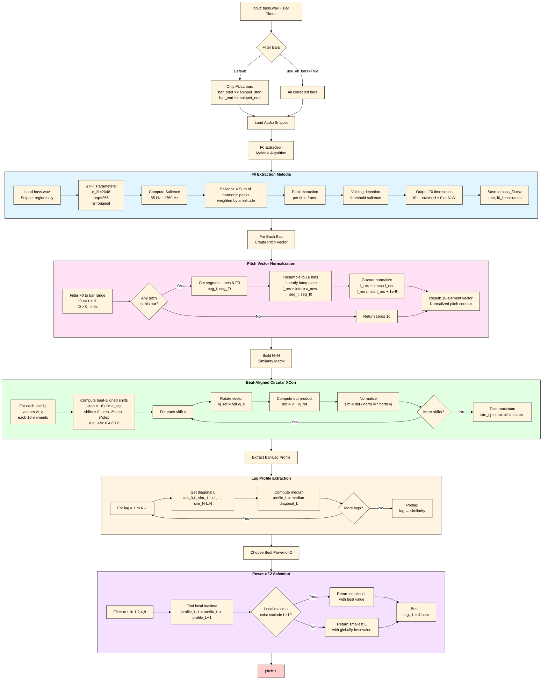
```mermaid
%%{init: {'theme':'base', 'themeVariables': { 'primaryTextColor':'#000','primaryBorderColor':'#000','lineColor':'#000','clusterBorder':'#000','edgeLabelBackground':'#fff'}}}%%
flowchart TD
    Start[Input: bass.wav + Bar Times] --> Filter{Filter Bars}
    Filter -->|Default| FullBars[Only FULL bars<br/>bar_start >= snippet_start<br/>bar_end <= snippet_end]
    Filter -->|use_all_bars=True| AllBars[All corrected bars]

    FullBars --> LoadAudio[Load Audio Snippet]
    AllBars --> LoadAudio

    LoadAudio --> F0Extract[F0 Extraction<br/>Melodia Algorithm]

    subgraph F0Extraction["<b>F0 Extraction Melodia</b>"]
        F1[Load bass.wav<br/>Snippet region only] --> F2[STFT Parameters:<br/>n_fft=2048<br/>hop=256<br/>sr=original]
        F2 --> F3[Compute Salience<br/>55 Hz - 1760 Hz]
        F3 --> F4[Salience = Sum of harmonic peaks<br/>weighted by amplitude]
        F4 --> F5[Peak extraction<br/>per time frame]
        F5 --> F6[Voicing detection<br/>threshold salience]
        F6 --> F7[Output F0 time series<br/>f0 t, unvoiced = 0 or NaN]
        F7 --> F8[Save to bass_f0.csv<br/>time, f0_hz columns]
    end

    F0Extract --> F0Extraction
    F0Extraction --> CreateVectors[For Each Bar:<br/>Create Pitch Vector]

    subgraph VectorCreation["<b>Pitch Vector Normalization</b>"]
        VC1[Filter F0 to bar range<br/>t0 <= t < t1<br/>f0 > 0, finite] --> VC2{Any pitch<br/>in this bar?}
        VC2 -->|No| VC3[Return zeros 16]
        VC2 -->|Yes| VC4[Get segment times & F0<br/>seg_t, seg_f0]
        VC4 --> VC5[Resample to 16 bins<br/>Linearly interpolate<br/>f_res = interp x_new, seg_t, seg_f0]
        VC5 --> VC6[Z-score normalize<br/>f_res -= mean f_res<br/>f_res /= std f_res + 1e-9]
        VC6 --> VC7[Result: 16-element vector<br/>Normalized pitch contour]
        VC3 --> VC7
    end

    CreateVectors --> VectorCreation
    VectorCreation --> SimMatrix[Build N×N<br/>Similarity Matrix]

    subgraph Similarity["<b>Beat-Aligned Circular XCorr</b>"]
        S1[For each pair i,j:<br/>vectors vi, vj<br/>each 16 elements] --> S2[Compute beat-aligned shifts<br/>step = 16 / time_sig<br/>shifts = 0, step, 2*step, 3*step<br/>e.g., 4/4: 0,4,8,12]
        S2 --> S3[For each shift s]
        S3 --> S4[Rotate vector<br/>vj_rot = roll vj, s]
        S4 --> S5[Compute dot product<br/>dot = vi · vj_rot]
        S5 --> S6[Normalize<br/>sim = dot / norm vi * norm vj]
        S6 --> S7{More shifts?}
        S7 -->|Yes| S3
        S7 -->|No| S8[Take maximum<br/>sim_i,j = max all shifts sim]
    end

    SimMatrix --> Similarity
    Similarity --> LagProfile[Extract Bar-Lag Profile]

    subgraph LagExtraction["<b>Lag Profile Extraction</b>"]
        L1[For lag = 1 to N-1] --> L2[Get diagonal L<br/>sim_0,L, sim_1,L+1, ..., sim_N-L,N]
        L2 --> L3[Compute median<br/>profile_L = median diagonal_L]
        L3 --> L4{More lags?}
        L4 -->|Yes| L1
        L4 -->|No| L5[Profile:<br/>lag → similarity]
    end

    LagProfile --> LagExtraction
    LagExtraction --> Choose[Choose Best Power-of-2]

    subgraph PowerOf2["<b>Power-of-2 Selection</b>"]
        P1[Filter to L in 1,2,4,8] --> P2[Find local maxima<br/>profile_L-1 < profile_L > profile_L+1]
        P2 --> P3{Local maxima<br/>exist exclude L=1?}
        P3 -->|Yes| P4[Return smallest L<br/>with best value]
        P3 -->|No| P5[Return smallest L<br/>with globally best value]
        P4 --> P6[Best L<br/>e.g., L = 4 bars]
        P5 --> P6
    end

    Choose --> PowerOf2
    PowerOf2 --> Output[pitch: L]

    style F0Extraction fill:#e1f5ff,stroke:#000,color:#000
    style VectorCreation fill:#ffe1f5,stroke:#000,color:#000
    style Similarity fill:#e1ffe1,stroke:#000,color:#000
    style LagExtraction fill:#fff4e1,stroke:#000,color:#000
    style PowerOf2 fill:#f5e1ff,stroke:#000,color:#000
    style Output fill:#ffcccc,stroke:#000,color:#000
```

---

## Pattern Detection: Similarity Matrix Visualization

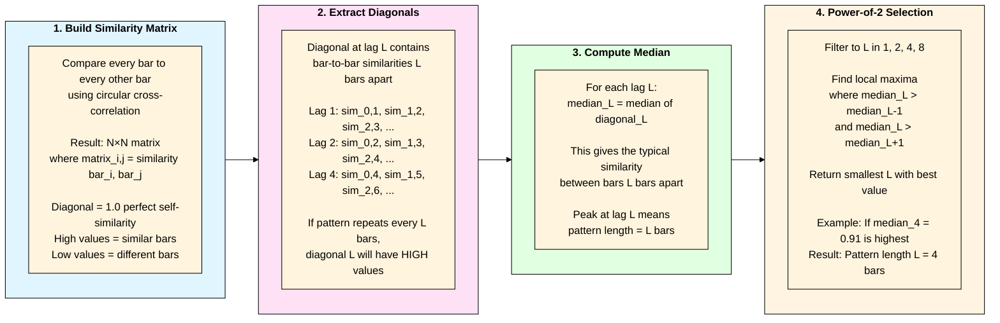
```mermaid
%%{init: {'theme':'base', 'themeVariables': { 'primaryTextColor':'#000','primaryBorderColor':'#000','lineColor':'#000','clusterBorder':'#000','edgeLabelBackground':'#fff'}}}%%
flowchart LR
    subgraph Step1["<b>1. Build Similarity Matrix</b>"]
        S1["Compare every bar to every other bar<br/>using circular cross-correlation<br/><br/>Result: N×N matrix<br/>where matrix_i,j = similarity bar_i, bar_j<br/><br/>Diagonal = 1.0 perfect self-similarity<br/>High values = similar bars<br/>Low values = different bars"]
    end

    subgraph Step2["<b>2. Extract Diagonals</b>"]
        S2["Diagonal at lag L contains<br/>bar-to-bar similarities L bars apart<br/><br/>Lag 1: sim_0,1, sim_1,2, sim_2,3, ...<br/>Lag 2: sim_0,2, sim_1,3, sim_2,4, ...<br/>Lag 4: sim_0,4, sim_1,5, sim_2,6, ...<br/><br/>If pattern repeats every L bars,<br/>diagonal L will have HIGH values"]
    end

    subgraph Step3["<b>3. Compute Median</b>"]
        S3["For each lag L:<br/>median_L = median of diagonal_L<br/><br/>This gives the typical similarity<br/>between bars L bars apart<br/><br/>Peak at lag L means<br/>pattern length = L bars"]
    end

    subgraph Step4["<b>4. Power-of-2 Selection</b>"]
        S4["Filter to L in 1, 2, 4, 8<br/><br/>Find local maxima<br/>where median_L > median_L-1<br/>and median_L > median_L+1<br/><br/>Return smallest L with best value<br/><br/>Example: If median_4 = 0.91 is highest<br/>Result: Pattern length L = 4 bars"]
    end

    Step1 --> Step2
    Step2 --> Step3
    Step3 --> Step4

    style Step1 fill:#e1f5ff,stroke:#000,color:#000
    style Step2 fill:#ffe1f5,stroke:#000,color:#000
    style Step3 fill:#e1ffe1,stroke:#000,color:#000
    style Step4 fill:#fff4e1,stroke:#000,color:#000
```

### Example: 8-Bar Pattern with L=4 Repetition

**Similarity Matrix (8×8):**
```
       Bar0  Bar1  Bar2  Bar3  Bar4  Bar5  Bar6  Bar7
Bar0 │ 1.00  0.45  0.32  0.28  0.92  0.41  0.29  0.25 │
Bar1 │ 0.45  1.00  0.43  0.31  0.44  0.89  0.40  0.28 │
Bar2 │ 0.32  0.43  1.00  0.42  0.31  0.43  0.87  0.39 │
Bar3 │ 0.28  0.31  0.42  1.00  0.27  0.30  0.41  0.85 │
Bar4 │ 0.92  0.44  0.31  0.27  1.00  0.43  0.30  0.26 │
Bar5 │ 0.41  0.89  0.43  0.30  0.43  1.00  0.42  0.29 │
Bar6 │ 0.29  0.40  0.87  0.41  0.30  0.42  1.00  0.40 │
Bar7 │ 0.25  0.28  0.39  0.85  0.26  0.29  0.40  1.00 │
```

**Diagonal Extraction:**
- **Lag 1:** [0.45, 0.43, 0.42, 0.27, 0.43, 0.42, 0.40] → median = **0.42**
- **Lag 2:** [0.32, 0.31, 0.42, 0.31, 0.43, 0.87] → median = **0.37**
- **Lag 3:** [0.28, 0.31, 0.42, 0.27, 0.30, 0.41] → median = **0.31**
- **Lag 4:** [**0.92**, 0.89, **0.87**, **0.85**] → median = **0.88** ⭐ **PEAK!**
- **Lag 5:** [0.41, 0.43, 0.41] → median = **0.41**

**Result:** L = 4 bars (highest median at lag 4)

**Interpretation:**
- Bar 0 and Bar 4 are very similar (0.92)
- Bar 1 and Bar 5 are very similar (0.89)
- Bar 2 and Bar 6 are very similar (0.87)
- Bar 3 and Bar 7 are very similar (0.85)
- This indicates a **4-bar repeating pattern**

---

## Detailed Step 6: Grid Correction Methods

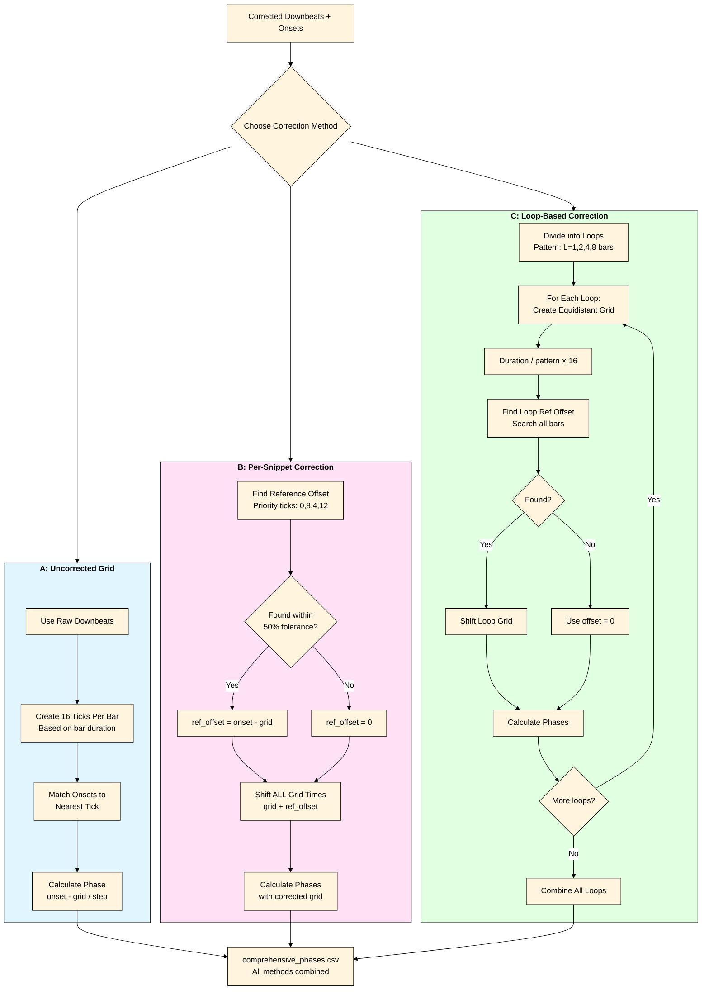
```mermaid
%%{init: {'theme':'base', 'themeVariables': { 'primaryTextColor':'#000','primaryBorderColor':'#000','lineColor':'#000','clusterBorder':'#000','edgeLabelBackground':'#fff'}}}%%
flowchart TD
    Input[Corrected Downbeats + Onsets] --> Split{Choose Correction Method}

    Split --> Uncorrected
    Split --> PerSnippet
    Split --> LoopBased

    subgraph Uncorrected["<b>A: Uncorrected Grid</b>"]
        U1[Use Raw Downbeats] --> U2[Create 16 Ticks Per Bar<br/>Based on bar duration]
        U2 --> U3[Match Onsets to<br/>Nearest Tick]
        U3 --> U4[Calculate Phase<br/>onset - grid / step]
    end

    subgraph PerSnippet["<b>B: Per-Snippet Correction</b>"]
        PS1[Find Reference Offset<br/>Priority ticks: 0,8,4,12] --> PS2{Found within<br/>50% tolerance?}
        PS2 -->|Yes| PS3[ref_offset = onset - grid]
        PS2 -->|No| PS4[ref_offset = 0]
        PS3 --> PS5[Shift ALL Grid Times<br/>grid + ref_offset]
        PS4 --> PS5
        PS5 --> PS6[Calculate Phases<br/>with corrected grid]
    end

    subgraph LoopBased["<b>C: Loop-Based Correction</b>"]
        LB1[Divide into Loops<br/>Pattern: L=1,2,4,8 bars] --> LB2[For Each Loop:<br/>Create Equidistant Grid]
        LB2 --> LB3[Duration / pattern × 16]
        LB3 --> LB4[Find Loop Ref Offset<br/>Search all bars]
        LB4 --> LB5{Found?}
        LB5 -->|Yes| LB6[Shift Loop Grid]
        LB5 -->|No| LB7[Use offset = 0]
        LB6 --> LB8[Calculate Phases]
        LB7 --> LB8
        LB8 --> LB9{More loops?}
        LB9 -->|Yes| LB2
        LB9 -->|No| LB10[Combine All Loops]
    end

    U4 --> Output
    PS6 --> Output
    LB10 --> Output[comprehensive_phases.csv<br/>All methods combined]

    style Uncorrected fill:#e1f5ff,stroke:#000,color:#000
    style PerSnippet fill:#ffe1f5,stroke:#000,color:#000
    style LoopBased fill:#e1ffe1,stroke:#000,color:#000
```

---

## Detailed Step 6: Grid Correction - Data Preparation & Method Details

### Overview: Four Correction Methods

The grid correction system now implements **4 distinct methods** to align the 16th-note grid with actual drum onsets:

1. **Uncorrected**: Raw downbeat grid (baseline)
2. **Per-Snippet**: Single global offset for entire snippet
3. **4-bar Loop**: Equidistant grid with offset per loop
4. **4-bar Pattern FlexStart**: Flexible start, finds independent reference every 4 bars

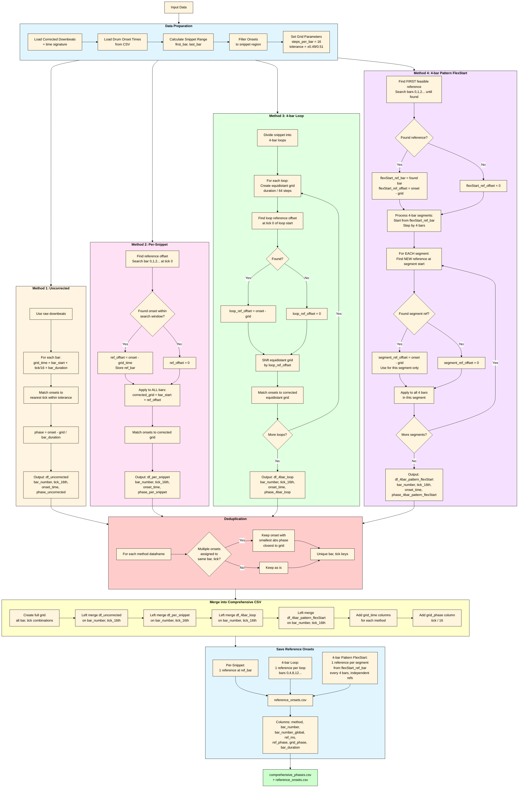
```mermaid
%%{init: {'theme':'base', 'themeVariables': { 'primaryTextColor':'#000','primaryBorderColor':'#000','lineColor':'#000','clusterBorder':'#000','edgeLabelBackground':'#fff'}}}%%
flowchart TD
    Start[Input Data] --> PrepData

    subgraph PrepData["<b>Data Preparation</b>"]
        D1[Load Corrected Downbeats<br/>+ time signature] --> D2[Load Drum Onset Times<br/>from CSV]
        D2 --> D3[Calculate Snippet Range<br/>first_bar, last_bar]
        D3 --> D4[Filter Onsets<br/>to snippet region]
        D4 --> D5[Set Grid Parameters<br/>steps_per_bar = 16<br/>tolerance = ±0.49/0.51]
    end

    PrepData --> Method1
    PrepData --> Method2
    PrepData --> Method3
    PrepData --> Method4

    subgraph Method1["<b>Method 1: Uncorrected</b>"]
        M1A[Use raw downbeats] --> M1B[For each bar:<br/>grid_time = bar_start + tick/16 × bar_duration]
        M1B --> M1C[Match onsets to<br/>nearest tick within tolerance]
        M1C --> M1D[phase = onset - grid / bar_duration]
        M1D --> M1E[Output: df_uncorrected<br/>bar_number, tick_16th,<br/>onset_time, phase_uncorrected]
    end

    subgraph Method2["<b>Method 2: Per-Snippet</b>"]
        M2A[Find reference offset<br/>Search bar 0,1,2... at tick 0] --> M2B{Found onset within<br/>search window?}
        M2B -->|Yes| M2C[ref_offset = onset - grid_time<br/>Store ref_bar]
        M2B -->|No| M2D[ref_offset = 0]
        M2C --> M2E[Apply to ALL bars:<br/>corrected_grid = bar_start + ref_offset]
        M2D --> M2E
        M2E --> M2F[Match onsets to corrected grid]
        M2F --> M2G[Output: df_per_snippet<br/>bar_number, tick_16th,<br/>onset_time, phase_per_snippet]
    end

    subgraph Method3["<b>Method 3: 4-bar Loop</b>"]
        M3A[Divide snippet into<br/>4-bar loops] --> M3B[For each loop:<br/>Create equidistant grid<br/>duration / 64 steps]
        M3B --> M3C[Find loop reference offset<br/>at tick 0 of loop start]
        M3C --> M3D{Found?}
        M3D -->|Yes| M3E[loop_ref_offset = onset - grid]
        M3D -->|No| M3F[loop_ref_offset = 0]
        M3E --> M3G[Shift equidistant grid<br/>by loop_ref_offset]
        M3F --> M3G
        M3G --> M3H[Match onsets to corrected<br/>equidistant grid]
        M3H --> M3I{More loops?}
        M3I -->|Yes| M3B
        M3I -->|No| M3J[Output: df_4bar_loop<br/>bar_number, tick_16th,<br/>onset_time, phase_4bar_loop]
    end

    subgraph Method4["<b>Method 4: 4-bar Pattern FlexStart</b>"]
        M4A[Find FIRST feasible reference<br/>Search bars 0,1,2... until found] --> M4B{Found reference?}
        M4B -->|Yes| M4C[flexStart_ref_bar = found bar<br/>flexStart_ref_offset = onset - grid]
        M4B -->|No| M4D[flexStart_ref_offset = 0]
        M4C --> M4E[Process 4-bar segments:<br/>Start from flexStart_ref_bar<br/>Step by 4 bars]
        M4D --> M4E
        M4E --> M4F[For EACH segment:<br/>Find NEW reference at segment start]
        M4F --> M4G{Found segment ref?}
        M4G -->|Yes| M4H[segment_ref_offset = onset - grid<br/>Use for this segment only]
        M4G -->|No| M4I[segment_ref_offset = 0]
        M4H --> M4J[Apply to all 4 bars<br/>in this segment]
        M4I --> M4J
        M4J --> M4K{More segments?}
        M4K -->|Yes| M4F
        M4K -->|No| M4L[Output: df_4bar_pattern_flexStart<br/>bar_number, tick_16th,<br/>onset_time, phase_4bar_pattern_flexStart]
    end

    M1E --> Dedupe
    M2G --> Dedupe
    M3J --> Dedupe
    M4L --> Dedupe

    subgraph Dedupe["<b>Deduplication</b>"]
        DD1[For each method dataframe] --> DD2{Multiple onsets<br/>assigned to<br/>same bar, tick?}
        DD2 -->|Yes| DD3[Keep onset with<br/>smallest abs phase<br/>closest to grid]
        DD2 -->|No| DD4[Keep as is]
        DD3 --> DD5[Unique bar, tick keys]
        DD4 --> DD5
    end

    Dedupe --> Merge

    subgraph Merge["<b>Merge into Comprehensive CSV</b>"]
        MG1[Create full grid<br/>all bar, tick combinations] --> MG2[Left merge df_uncorrected<br/>on bar_number, tick_16th]
        MG2 --> MG3[Left merge df_per_snippet<br/>on bar_number, tick_16th]
        MG3 --> MG4[Left merge df_4bar_loop<br/>on bar_number, tick_16th]
        MG4 --> MG5[Left merge df_4bar_pattern_flexStart<br/>on bar_number, tick_16th]
        MG5 --> MG6[Add grid_time columns<br/>for each method]
        MG6 --> MG7[Add grid_phase column<br/>tick / 16]
    end

    Merge --> RefOnsets

    subgraph RefOnsets["<b>Save Reference Onsets</b>"]
        RO1[Per-Snippet:<br/>1 reference at ref_bar] --> RO4[reference_onsets.csv]
        RO2[4-bar Loop:<br/>1 reference per loop<br/>bars 0,4,8,12...] --> RO4
        RO3[4-bar Pattern FlexStart:<br/>1 reference per segment<br/>from flexStart_ref_bar<br/>every 4 bars, independent refs] --> RO4
        RO4 --> RO5[Columns: method, bar_number,<br/>bar_number_global, ref_ms,<br/>ref_phase, grid_phase, bar_duration]
    end

    RO5 --> Output[comprehensive_phases.csv<br/>+ reference_onsets.csv]

    style PrepData fill:#e1f5ff,stroke:#000,color:#000
    style Method1 fill:#fff4e1,stroke:#000,color:#000
    style Method2 fill:#ffe1f5,stroke:#000,color:#000
    style Method3 fill:#e1ffe1,stroke:#000,color:#000
    style Method4 fill:#f5e1ff,stroke:#000,color:#000
    style Dedupe fill:#ffcccc,stroke:#000,color:#000
    style Merge fill:#ffffcc,stroke:#000,color:#000
    style RefOnsets fill:#e1f5ff,stroke:#000,color:#000
    style Output fill:#ccffcc,stroke:#000,color:#000
```

### Key Concepts

**Reference Onset Finding:**
- Search window: `[grid_time - 0.5×step, grid_time + 0.75×step]`
- Finds closest onset to tick 0 (downbeat = 1/16th position)
- Returns offset in milliseconds: `ref_offset_ms = (onset_time - grid_time) × 1000`

**Asymmetric Tolerance Boundaries:**
- Before grid: `±0.49 × step_duration`
- After grid: `±0.51 × step_duration`
- Prevents overlaps at boundaries between ticks
- Multiple onsets can still match same tick (resolved by deduplication)

**Deduplication Logic:**
- **Why necessary**: With slower tempos (larger step durations), multiple onsets can fall within tolerance of the same tick
- **Example at 70 BPM (4/4)**:
  - Bar duration: ~3.43 seconds
  - Step duration: 3430ms / 16 = 214ms per 16th note
  - Tolerance window: 0.49 + 0.51 = 1.0 step = 214ms total
  - Grid position for tick 3: 85.420 seconds
  - Onset A at 85.403s (-17ms): rounds to tick 3, within tolerance ✓
  - Onset B at 85.449s (+29ms): rounds to tick 3, within tolerance ✓
  - **Result**: Both onsets match tick 3! Without deduplication, merge creates cartesian product
- **Solution**: Keep onset with smallest `abs(phase)` (closest to grid position)
- Ensures unique `(bar_number, tick_16th)` keys for merge
- Prevents cartesian product (duplicate rows) in comprehensive dataframe
- With faster tempos (120+ BPM), step duration < 125ms, so duplicate assignments are rare

**Grid Correction Strategies:**
1. **Uncorrected**: No shift, baseline for comparison
2. **Per-Snippet**: One global correction for entire snippet
3. **4-bar Loop**: Each loop has own equidistant grid + independent offset
4. **4-bar Pattern FlexStart**: Flexible starting point + independent offset per segment

---

## Output Generation Flow

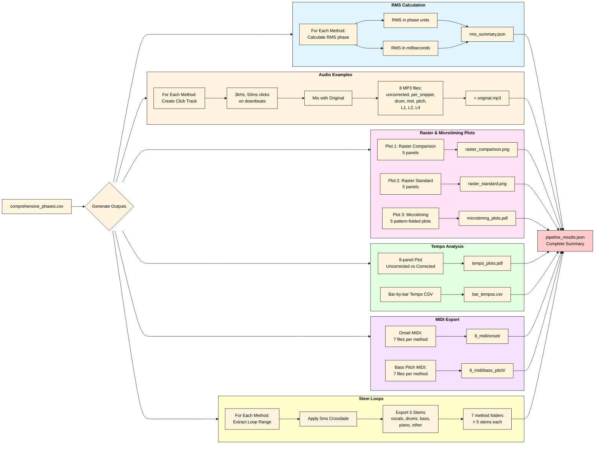
```mermaid
%%{init: {'theme':'base', 'themeVariables': { 'primaryTextColor':'#000','primaryBorderColor':'#000','lineColor':'#000','clusterBorder':'#000','edgeLabelBackground':'#fff'}}}%%
flowchart LR
    Input[comprehensive_phases.csv] --> Split{Generate Outputs}

    Split --> RMS
    Split --> Audio
    Split --> Plots
    Split --> Tempo
    Split --> MIDI
    Split --> Loops

    subgraph RMS["<b>RMS Calculation</b>"]
        R1[For Each Method:<br/>Calculate RMS phase] --> R2[RMS in phase units]
        R1 --> R3[RMS in milliseconds]
        R2 --> R4[rms_summary.json]
        R3 --> R4
    end

    subgraph Audio["<b>Audio Examples</b>"]
        A1[For Each Method:<br/>Create Click Track] --> A2[3kHz, 50ms clicks<br/>on downbeats]
        A2 --> A3[Mix with Original]
        A3 --> A4[8 MP3 files:<br/>uncorrected, per_snippet,<br/>drum, mel, pitch,<br/>L1, L2, L4]
        A4 --> A5[+ original.mp3]
    end

    subgraph Plots["<b>Raster & Microtiming Plots</b>"]
        P1[Plot 1: Raster Comparison<br/>5 panels] --> P4[raster_comparison.png]
        P2[Plot 2: Raster Standard<br/>5 panels] --> P5[raster_standard.png]
        P3[Plot 3: Microtiming<br/>5 pattern-folded plots] --> P6[microtiming_plots.pdf]
    end

    subgraph Tempo["<b>Tempo Analysis</b>"]
        T1[8-panel Plot<br/>Uncorrected vs Corrected] --> T3[tempo_plots.pdf]
        T2[Bar-by-bar Tempo CSV] --> T4[bar_tempos.csv]
    end

    subgraph MIDI["<b>MIDI Export</b>"]
        M1[Onset MIDI:<br/>7 files per method] --> M3[8_midi/onset/]
        M2[Bass Pitch MIDI:<br/>7 files per method] --> M4[8_midi/bass_pitch/]
    end

    subgraph Loops["<b>Stem Loops</b>"]
        L1[For Each Method:<br/>Extract Loop Range] --> L2[Apply 5ms Crossfade]
        L2 --> L3[Export 5 Stems<br/>vocals, drums, bass,<br/>piano, other]
        L3 --> L4[7 method folders<br/>× 5 stems each]
    end

    R4 --> Final
    A5 --> Final
    P4 --> Final
    P5 --> Final
    P6 --> Final
    T3 --> Final
    T4 --> Final
    M3 --> Final
    M4 --> Final
    L4 --> Final[pipeline_results.json<br/>Complete Summary]

    style RMS fill:#e1f5ff,stroke:#000,color:#000
    style Audio fill:#fff4e1,stroke:#000,color:#000
    style Plots fill:#ffe1f5,stroke:#000,color:#000
    style Tempo fill:#e1ffe1,stroke:#000,color:#000
    style MIDI fill:#f5e1ff,stroke:#000,color:#000
    style Loops fill:#ffffcc,stroke:#000,color:#000
    style Final fill:#ffcccc,stroke:#000,color:#000
```

---

## Rhythm Histogram Visualizations

The pipeline generates **three types** of rhythm histogram visualizations, each providing different analytical perspectives:

### 1. Rhythm Histograms with Style (Basic)
**File**: `{track_id}_rhythm_histograms_with_style.pdf/png/csv`
**Purpose**: Basic onset count distribution across 16th-note grid positions

### 2. Rhythm Histograms with Median Phase & IQR
**File**: `{track_id}_rhythm_histograms_with_medians_and_iqr.pdf/png/csv`
**Purpose**: Onset timing precision analysis with phase shifts and error bars

### 3. Groove Pulse Histograms (Filtered)
**File**: `{track_id}_groove_pulse_histograms_filtered.pdf/png/csv`
**Purpose**: Perceptually significant rhythmic positions (filtered by strength threshold)

All three visualizations use **hybrid filtering** for FlexStart patterns:
- **Running Mean Method**: Used when patterns ≤ 2 (keeps first pattern as reference)
- **Tukey's Method**: Used when patterns > 2 (IQR-based outlier detection)

---

### Rhythm Histogram Processing Flow

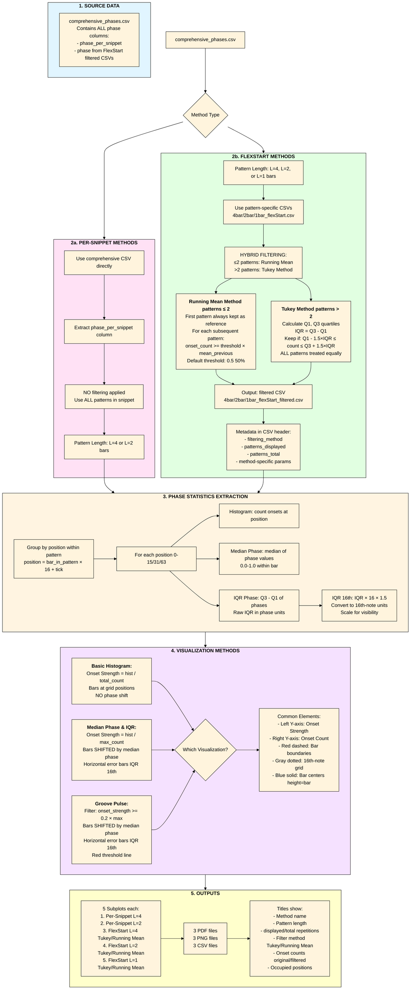
```mermaid
%%{init: {'theme':'base', 'themeVariables': { 'primaryTextColor':'#000','primaryBorderColor':'#000','lineColor':'#000','clusterBorder':'#000','edgeLabelBackground':'#fff'}}}%%
flowchart TD
    Start[comprehensive_phases.csv] --> Split{Method Type}

    subgraph SourceData["<b>1. SOURCE DATA</b>"]
        SD1[comprehensive_phases.csv<br/>Contains ALL phase columns:<br/>- phase_per_snippet<br/>- phase from FlexStart filtered CSVs]
    end

    Split --> PerSnippet
    Split --> FlexStart

    subgraph PerSnippet["<b>2a. PER-SNIPPET METHODS</b>"]
        PS1[Use comprehensive CSV directly] --> PS2[Extract phase_per_snippet column]
        PS2 --> PS3[NO filtering applied<br/>Use ALL patterns in snippet]
        PS3 --> PS4[Pattern Length: L=4 or L=2 bars]
    end

    subgraph FlexStart["<b>2b. FLEXSTART METHODS</b>"]
        FS1[Pattern Length: L=4, L=2, or L=1 bars] --> FS1A[Use pattern-specific CSVs<br/>4bar/2bar/1bar_flexStart.csv]
        FS1A --> FS2[HYBRID FILTERING:<br/>≤2 patterns: Running Mean<br/>>2 patterns: Tukey Method]
        FS2 --> FS2A[<b>Running Mean Method patterns ≤ 2</b><br/>First pattern always kept as reference<br/>For each subsequent pattern:<br/>onset_count >= threshold × mean_previous<br/>Default threshold: 0.5 50%]
        FS2 --> FS2B[<b>Tukey Method patterns > 2</b><br/>Calculate Q1, Q3 quartiles<br/>IQR = Q3 - Q1<br/>Keep if: Q1 - 1.5×IQR ≤ count ≤ Q3 + 1.5×IQR<br/>ALL patterns treated equally]
        FS2A --> FS3[Output: filtered CSV<br/>4bar/2bar/1bar_flexStart_filtered.csv]
        FS2B --> FS3
        FS3 --> FS4[Metadata in CSV header:<br/>- filtering_method<br/>- patterns_displayed<br/>- patterns_total<br/>- method-specific params]
    end

    PS4 --> Extract
    FS4 --> Extract

    subgraph Extract["<b>3. PHASE STATISTICS EXTRACTION</b>"]
        E1[Group by position within pattern<br/>position = bar_in_pattern × 16 + tick] --> E2[For each position 0-15/31/63]
        E2 --> E3[Histogram: count onsets at position]
        E2 --> E4[Median Phase: median of phase values<br/>0.0-1.0 within bar]
        E2 --> E5[IQR Phase: Q3 - Q1 of phases<br/>Raw IQR in phase units]
        E5 --> E6[IQR 16th: IQR × 16 × 1.5<br/>Convert to 16th-note units<br/>Scale for visibility]
    end

    Extract --> Vis

    subgraph Vis["<b>4. VISUALIZATION METHODS</b>"]
        V1[<b>Basic Histogram:</b><br/>Onset Strength = hist / total_count<br/>Bars at grid positions<br/>NO phase shift] --> V8{Which Visualization?}
        V2[<b>Median Phase & IQR:</b><br/>Onset Strength = hist / max_count<br/>Bars SHIFTED by median phase<br/>Horizontal error bars IQR 16th] --> V8
        V3[<b>Groove Pulse:</b><br/>Filter: onset_strength >= 0.2 × max<br/>Bars SHIFTED by median phase<br/>Horizontal error bars IQR 16th<br/>Red threshold line] --> V8
        V8 --> V9[Common Elements:<br/>- Left Y-axis: Onset Strength<br/>- Right Y-axis: Onset Count<br/>- Red dashed: Bar boundaries<br/>- Gray dotted: 16th-note grid<br/>- Blue solid: Bar centers height=bar]
    end

    Vis --> Output

    subgraph Output["<b>5. OUTPUTS</b>"]
        O1[5 Subplots each:<br/>1. Per-Snippet L=4<br/>2. Per-Snippet L=2<br/>3. FlexStart L=4 Tukey/Running Mean<br/>4. FlexStart L=2 Tukey/Running Mean<br/>5. FlexStart L=1 Tukey/Running Mean] --> O2[3 PDF files<br/>3 PNG files<br/>3 CSV files]
        O2 --> O3[Titles show:<br/>- Method name<br/>- Pattern length<br/>- displayed/total repetitions<br/>- Filter method Tukey/Running Mean<br/>- Onset counts original/filtered<br/>- Occupied positions]
    end

    style SourceData fill:#e1f5ff,stroke:#000,color:#000
    style PerSnippet fill:#ffe1f5,stroke:#000,color:#000
    style FlexStart fill:#e1ffe1,stroke:#000,color:#000
    style Extract fill:#fff4e1,stroke:#000,color:#000
    style Vis fill:#f5e1ff,stroke:#000,color:#000
    style Output fill:#ffffcc,stroke:#000,color:#000
```

---

### Key Concepts

#### Phase Values
- **Definition**: Timing position within a bar, normalized to 0.0-1.0
- **Range**: 0.0 (bar start) to 1.0 (bar end = next bar start)
- **Per-bar**: Phase resets at each bar boundary
- **Example**: phase = 0.125 → 12.5% through bar (2nd 16th note position)

#### Grid Phase (Expected Position)
```python
tick_within_bar = position % 16  # 0-15
grid_phase = tick_within_bar / 16.0  # Expected phase (0.0-1.0)
```

#### Relative Phase (Swing/Timing Offset)
```python
relative_phase = (median_phase - grid_phase) / (1.0 / 16)
# Range: -1.0 to +1.0 in units of 16th-note steps
# 0.0 = on grid, +0.5 = halfway to next tick (late), -0.5 = halfway to previous (early)
```

#### X-Position Shift Calculation (Median & Groove Pulse Plots)
```python
# Base position (1-based for display)
base_position = position_index + 1

# Calculate shift based on median phase
bar_number = position_index // 16
tick_within_bar = position_index % 16
grid_phase = tick_within_bar / 16.0

# Median phase is 0.0-1.0 within current bar
# Convert to 16th-note units: multiply by 16
phase_offset_in_16ths = (median_phase - grid_phase) * 16

# Final shifted position
shifted_position = base_position + phase_offset_in_16ths
```

**Visual Effect**: Bars move left/right from expected grid lines, showing swing/shuffle

**Example (position 3 in 4-bar pattern)**:
- Grid position: bar 0, tick 3 → grid_phase = 3/16 = 0.1875
- Median phase: 0.2 (onsets are late by 2% of bar)
- Shift: (0.2 - 0.1875) × 16 = 0.2 16th notes
- Final x-position: 4 + 0.2 = 4.2 (bar appears right of grid line)

#### IQR (Inter-Quartile Range) Error Bars
**Calculation**:
```python
# Get all phases for this position across all patterns
phases_at_pos = [phase values from all patterns]

# Calculate IQR
q75, q25 = np.percentile(phases_at_pos, [75, 25])
iqr_phase = q75 - q25  # Raw IQR in phase units (0.0-1.0)

# Convert to 16th-note units for visualization
iqr_16th = iqr_phase * 16 * 1.5
# × 16: converts from phase to 16th notes
# × 1.5: scaling factor for visibility
```

**Interpretation**:
- **Small IQR**: Tight, consistent timing (e.g., iqr_16th = 0.5)
- **Large IQR**: Loose, variable timing (e.g., iqr_16th = 3.0)
- **Displayed as**: Horizontal error bars at 90% of bar height

#### Groove Pulse Threshold Filtering
**Definition**: Minimum onset strength for perceptual significance
**Default**: 0.2 (20% of maximum onset strength)

**Process**:
```python
# Calculate original onset strength
onset_strength_original = histogram / max(histogram)

# Apply threshold
threshold_value = 0.2 * max(onset_strength_original)
filtered_mask = onset_strength_original >= threshold_value

# Filter data
filtered_histogram = histogram where filtered_mask
filtered_median_phases = median_phases where filtered_mask (else NaN)
filtered_iqr = iqr_16th where filtered_mask (else NaN)

# Recalculate onset strength from filtered data
onset_strength_filtered = filtered_histogram / max(filtered_histogram)
```

**Effect**:
- Weak positions (< 20% strength) are removed
- Only "strong" rhythmic positions remain
- Median phase and IQR set to NaN for filtered-out positions
- Red dashed horizontal line shows threshold level

---

### Hybrid Pattern Filtering Strategy

**Configurable Parameters** (in `raster.py`):
```python
NO_OF_REPETITIONS_TH = 2        # Switch point (≤2: Running Mean, >2: Tukey)
RUNNING_MEAN_THRESHOLD = 0.5    # 50% of running mean
IQR_MULTIPLIER_TUKEY = 1.5      # Standard outlier detection
```

#### Running Mean Method (≤2 patterns)
**Used when**: `total_patterns ≤ 2`

**Algorithm**:
1. First pattern (loop 0) **always kept** as reference
2. For each subsequent pattern:
   - Calculate mean of previous patterns (excluding loop 0)
   - Keep if: `onset_count >= 0.5 × mean_previous`
   - Add current to history for next iteration

**Example**:
- Pattern 0: 48 onsets → **KEPT** (reference)
- Pattern 1: 45 onsets, mean = 48 → 45/48 = 0.94 → **KEPT** ✓
- Pattern 2: 20 onsets, mean = 45 → 20/45 = 0.44 → **REMOVED** ✗

**Metadata** (CSV header):
```
# filtering_method=running mean (threshold=0.5)
# patterns_displayed=2
# patterns_total=3
# threshold=0.5
# no_of_repetitions_TH=2
```

#### Tukey's Method (>2 patterns)
**Used when**: `total_patterns > 2`

**Algorithm** (IQR-based outlier detection):
1. Collect onset counts from ALL patterns
2. Calculate quartiles: Q1 (25th percentile), Q3 (75th percentile)
3. Calculate IQR = Q3 - Q1
4. Set bounds:
   - Lower: Q1 - (1.5 × IQR)
   - Upper: Q3 + (1.5 × IQR)
5. Keep patterns where: `lower_bound ≤ onset_count ≤ upper_bound`
6. ALL patterns treated equally (no special reference)

**Example**:
- Onset counts: [45, 48, 47, 46, 49, 15, 50, 48]
- Q1 = 45.75, Q3 = 48.5, IQR = 2.75
- Bounds: [41.625, 52.625]
- Pattern 6 (15 onsets) → **REMOVED** ✗
- All others → **KEPT** ✓

**Metadata** (CSV header):
```
# filtering_method=Tukey (IQR multiplier=1.5)
# patterns_displayed=7
# patterns_total=8
# iqr_multiplier=1.5
# no_of_repetitions_TH=2
# q1=45.75
# q3=48.5
# iqr=2.75
# lower_bound=41.62
# upper_bound=52.62
# removed_pattern_indices=6
```

---

### Visualization Comparison Table

| Feature | Basic Histogram | Median & IQR | Groove Pulse |
|---------|----------------|--------------|--------------|
| **File Suffix** | `with_style` | `with_medians_and_iqr` | `groove_pulse_histograms_filtered` |
| **Bar Position** | Fixed at grid | Shifted by median phase | Shifted by median phase (filtered) |
| **Normalization** | Total count | Max count | Max count (filtered data) |
| **Error Bars** | None | Horizontal IQR | Horizontal IQR (filtered) |
| **Phase Labels** | None | Relative phase on bars | Relative phase on bars (filtered) |
| **Threshold Line** | None | None | Red dashed (20% strength) |
| **Filtering** | Pattern only | Pattern only | Pattern + groove pulse |
| **Blue Lines** | Bar height | Shifted position, bar height | Shifted position, bar height (filtered) |
| **Title Info** | Repetitions | Repetitions, Onsets, Positions | Filtered/Total Onsets, Filter method |

---

### Output File Structure

**Location**: `{output_dir}/{track_id}/7_plots/`

**Files Generated**:
1. `{track_id}_rhythm_histograms_with_style.pdf/png/csv`
2. `{track_id}_rhythm_histograms_with_medians_and_iqr.pdf/png/csv`
3. `{track_id}_groove_pulse_histograms_filtered.pdf/png/csv`

**CSV Columns**:

**Basic Histogram**:
- `method`, `pattern_length`, `num_patterns_displayed`, `num_patterns_total`
- `position`, `count`, `onset_strength`

**Median & IQR**:
- `method`, `pattern_length`, `num_patterns_displayed`, `num_patterns_total`
- `position`, `count`, `onset_strength`
- `median_phase`, `relative_median_phase`, `iqr_phase`, `iqr_16th`

**Groove Pulse**:
- `method`, `pattern_length`, `num_patterns_displayed`, `num_patterns_total`
- `position`, `count_original`, `count_filtered`
- `onset_strength_original`, `onset_strength_filtered`
- `median_phase`, `relative_median_phase`, `iqr_phase`, `iqr_16th`
- `threshold`

**Title Format Example**:
```
FlexStart Pattern Length 4 (L=4, 64 positions) — 8/10 repetitions (Tukey) — 124/156 Onsets — Time Signature 4/4 — Pos 18/64
```

Indicates:
- 8 out of 10 patterns kept using Tukey method
- 124 out of 156 onsets passed groove pulse threshold
- 18 out of 64 positions have onsets above threshold

---

## Groove Pulse Filtering

The **Groove Pulse** visualization applies perceptual filtering to identify rhythmically significant positions based on onset strength.

### Purpose

While rhythm histograms show all onset positions, the groove pulse filtering focuses on positions that are **perceptually salient** - the rhythmic "skeleton" that defines the groove. This helps identify which positions contribute most to the perceived rhythm pattern.

### Filtering Process

**Threshold-Based Filtering**:
```python
# Default threshold: 0.2 (20% of maximum strength)
GROOVE_PULSE_THRESHOLD = 0.2

# Calculate original onset strength (normalized to max)
onset_strength_original = histogram / max(histogram)

# Apply threshold filter
threshold_value = GROOVE_PULSE_THRESHOLD * max(onset_strength_original)
filtered_mask = onset_strength_original >= threshold_value

# Filter data
filtered_histogram = histogram where filtered_mask
filtered_median_phases = median_phases where filtered_mask (else NaN)
filtered_iqr = iqr_16th where filtered_mask (else NaN)

# Recalculate strength from filtered data
onset_strength_filtered = filtered_histogram / max(filtered_histogram)
```

**Effect**: Only positions with onset strength ≥ 20% of the maximum are retained. Weaker positions are removed.

### Visual Elements

**Groove Pulse Plots Include**:
1. **Filtered Bars**: Only bars meeting the threshold are displayed
2. **Shifted Positions**: Bars shifted by median phase (like Median & IQR plots)
3. **Error Bars**: Horizontal IQR bars showing timing variability (filtered positions only)
4. **Threshold Line**: Red dashed horizontal line at 20% strength level
5. **Blue Lines**: Vertical lines at bar centers (filtered positions only)
6. **Relative Phase Labels**: Timing offset labels on bars (filtered positions only)

**Dual Y-Axes**:
- **Left**: Onset Strength (Filtered) - normalized to 0-1 from filtered data
- **Right**: Onset Count (Filtered) - actual count of onsets

### Title Information

Groove pulse plot titles show comprehensive filtering statistics:

**Example**:
```
FlexStart Pattern Length 4 (L=4, 64 positions) — 8/10 repetitions (Tukey) — 124/156 Onsets — Time Signature 4/4 — Pos 18/64
```

**Breakdown**:
- `8/10 repetitions (Tukey)`: 8 of 10 patterns kept using Tukey filtering method
- `124/156 Onsets`: 124 onsets passed groove pulse threshold out of 156 total
- `Pos 18/64`: 18 of 64 positions have onsets above threshold

This shows **two levels of filtering**:
1. **Pattern filtering**: Removes outlier patterns (hybrid Tukey/running mean)
2. **Groove pulse filtering**: Removes weak onset positions (threshold-based)

### CSV Output Structure

**File**: `{track_id}_groove_pulse_histograms_filtered.csv`

**Columns**:
- `method`: Method name (e.g., "FlexStart Pattern Length 4")
- `pattern_length`: Pattern length in bars (1, 2, or 4)
- `num_patterns_displayed`: Number of patterns after filtering
- `num_patterns_total`: Total number of patterns before filtering
- `position`: 16th-note position within pattern (1-based)
- `count_original`: Onset count before groove pulse filtering
- `count_filtered`: Onset count after groove pulse filtering (0 if below threshold)
- `onset_strength_original`: Normalized strength before filtering (0-1)
- `onset_strength_filtered`: Normalized strength after filtering (0-1, recalculated from filtered data)
- `median_phase`: Median phase value (0-1) at this position, NaN if filtered out
- `relative_median_phase`: Relative phase in 16th-note units (-1 to +1), NaN if filtered out
- `iqr_phase`: Raw IQR of phases (0-1 range), NaN if filtered out
- `iqr_16th`: IQR in 16th-note units (× 16 × 1.5), NaN if filtered out
- `threshold`: The threshold value used for filtering

### Interpretation

**High Groove Pulse Strength** (≥ 0.2):
- Core rhythmic positions that define the groove
- Strong, consistent onset placements
- Perceptually salient in the rhythm pattern

**Low Groove Pulse Strength** (< 0.2):
- Ornamental or fill positions
- Inconsistent or weak onset placements
- Less perceptually significant

**Comparison Across Pattern Lengths**:
- **L=1 (1-bar)**: Shows micro-level groove variations bar-by-bar
- **L=2 (2-bar)**: Captures common two-bar rhythmic phrases
- **L=4 (4-bar)**: Reveals larger structural patterns and repetition

**FlexStart vs Per-Snippet**:
- **FlexStart**: Pattern-aligned, shows cyclic groove structure with hybrid filtering
- **Per-Snippet**: Continuous through snippet, no pattern filtering applied

### Use Cases

1. **Rhythm Analysis**: Identify the core rhythmic "skeleton" without ornamental notes
2. **Groove Comparison**: Compare groove structures across different songs or sections
3. **Perceptual Relevance**: Focus on positions that listeners are most likely to perceive
4. **Pattern Validation**: Verify that detected patterns contain meaningful rhythmic content
5. **Microtiming Studies**: Analyze timing deviations for perceptually important positions only

### Groove Pulse Audio Export

The pipeline generates **groove pulse click tracks** that sonify the filtered groove pulse positions, allowing you to hear the perceptually salient rhythmic skeleton with median timing.

#### Purpose

While standard click tracks mark all grid positions or all detected onsets, groove pulse click tracks focus only on the **strongest rhythmic positions** (those passing the 0.2 threshold) and place clicks at the **median timing** across all repetitions. This provides an audible representation of the core groove pattern.

#### Generation Process

For each FlexStart pattern length (4-bar, 2-bar, 1-bar):

1. **Load Groove Pulse Data**: Read `{track_id}_groove_pulse_histograms_filtered.csv` to identify positions with `onset_strength_filtered > 0` and extract their `relative_median_phase` values
2. **Load FlexStart Grid Data**: Read `{track_id}_comprehensive_phases_{L}bar_flexStart_filtered.csv` containing grid times for all positions across all repetitions
3. **Identify Reference Pattern**: Extract the first pattern (bars 0 to L-1) to determine which positions have onsets
4. **Build Groove Pattern**: For each strong groove position, create clicks across all loop repetitions:
   - Check if position has onset in reference pattern
   - For each repetition, get grid_time from flexStart CSV
   - Calculate step_duration from consecutive grid positions
   - Apply relative_median_phase to get click time
5. **Generate Click Track**: Create click sounds at the calculated times
6. **Mix with Audio**: Combine click track with original audio snippet at 0 dB

#### Implementation Details

**Key Logic** (`audio_export.py`):
```python
# 1. Load groove pulse data: positions with strong onsets
df_filtered = df_groove[
    (df_groove['method'].str.contains('FlexStart', case=False)) &
    (df_groove['pattern_length'] == pattern_length) &
    (df_groove['onset_strength_filtered'] > 0)
]

groove_positions = df_filtered['position'].values  # 1-based (1-64 for L=4)
relative_phases = df_filtered['relative_median_phase'].values  # In 16th-note units

# 2. Load flexStart grid data (all repetitions)
df_pattern = pd.read_csv(f'{track_id}_comprehensive_phases_{pattern_length}bar_flexStart_filtered.csv')

# 3. Identify reference onsets (first pattern only)
first_pattern = df_pattern[df_pattern['bar_number'] < pattern_length]
reference_onsets = set()
for _, row in first_pattern.iterrows():
    if pd.notna(row['onset_time']):
        reference_onsets.add((row['bar_number'], row['tick_16th']))

# 4. Build clicks for all repetitions
for position, relative_phase in zip(groove_positions, relative_phases):
    bar_in_pattern = (position - 1) // 16  # Which bar (0-3 for L=4)
    tick_16th = (position - 1) % 16         # Which 16th note (0-15)

    # Skip if no onset in reference pattern
    if (bar_in_pattern, tick_16th) not in reference_onsets:
        continue

    # Find all occurrences across repetitions (using modulo)
    matching_rows = df_pattern[
        (df_pattern['bar_number'] % pattern_length == bar_in_pattern) &
        (df_pattern['tick_16th'] == tick_16th)
    ]

    for _, row in matching_rows:
        grid_time = row['grid_time']
        current_bar = row['bar_number']

        # Calculate step_duration from next grid position
        next_tick = tick_16th + 1 if tick_16th < 15 else 0
        next_bar = current_bar if tick_16th < 15 else current_bar + 1

        next_row = df_pattern[
            (df_pattern['bar_number'] == next_bar) &
            (df_pattern['tick_16th'] == next_tick)
        ]

        if next_row.empty:
            continue  # Skip if no next position (last bar)

        step_duration = next_row.iloc[0]['grid_time'] - grid_time

        # Calculate click time: grid_time + (relative_phase × step_duration)
        click_time = grid_time + (relative_phase * step_duration)
        groove_times.append(click_time)
```

#### Output Files

**Location**: `{track_dir}/7_audio_examples/`

**Files Generated**:
- `groove_pulse_4bar.wav` - Clicks for 4-bar pattern groove positions
- `groove_pulse_2bar.wav` - Clicks for 2-bar pattern groove positions
- `groove_pulse_1bar.wav` - Clicks for 1-bar pattern groove positions

Each file contains:
- Original audio snippet (30 seconds)
- Click track with clicks only at strong groove positions
- Clicks placed at median timing (not individual onset times)

#### Key Features

**Reference Pattern Filtering**: Only positions with onsets in the first pattern (reference) are included, ensuring the same groove pattern repeats across all loop cycles

**Relative Median Phase**: Uses `relative_median_phase` from groove pulse CSV (in 16th-note units, e.g., 0.2 = 20% of a 16th note late), not absolute phase

**Adaptive Step Duration**: Calculates step_duration dynamically from consecutive grid positions in the flexStart CSV:
- For tick 0-14: uses next tick in same bar
- For tick 15: uses tick 0 in next bar
- Skips click if next position unavailable (last bar in snippet)

**Tempo-Adaptive Timing**: Each repetition uses its own grid_time (adapts to tempo fluctuations) but applies the same relative_median_phase, maintaining consistent groove feel

**Pattern Repetition**: The groove pattern defined in bars 0 to L-1 repeats for every L-bar cycle throughout the snippet

#### Interpretation

**Comparing Click Tracks**:
- **Standard clicks** (per_snippet, flexStart): All onsets or all grid positions → full rhythmic detail
- **Groove pulse clicks**: Only strong positions with median timing → perceptually salient skeleton

**Pattern Length Comparison**:
- **4-bar**: Fewest clicks, shows only positions strong across all 4 bars
- **2-bar**: Medium density, shows positions strong in 2-bar phrases
- **1-bar**: Most clicks, shows positions strong within single bars

**Listening Strategy**:
1. Listen to `original.wav` to hear the unprocessed audio
2. Listen to groove pulse click tracks to hear the rhythmic skeleton
3. Compare across pattern lengths to understand hierarchical groove structure
4. Note which positions are emphasized as perceptually salient

#### Use Cases

1. **Groove Verification**: Confirm that detected groove positions match perceptual experience
2. **Pattern Validation**: Verify pattern lengths by hearing which clicks align with musical structure
3. **Timing Analysis**: Compare median timing (groove pulse) vs individual timings (standard clicks)
4. **Teaching/Demonstration**: Illustrate rhythmic skeletons for music education or analysis
5. **Quality Control**: Quickly audit pipeline output by listening to groove structure

### Parameters

**Configurable in code** (`groove_pulse_and_statistics.py`):
```python
groove_pulse_threshold = 0.2  # Default: 20% of max strength
```

**Lower threshold** (e.g., 0.1): Retains more positions, includes subtle rhythmic details
**Higher threshold** (e.g., 0.3): More selective, focuses on strongest positions only

---

## Aggregate Rhythm Statistics

After generating rhythm histograms and groove pulse visualizations, the pipeline calculates **aggregate statistics** that summarize the rhythmic characteristics of each track. These statistics provide quantitative metrics for microtiming analysis and groove characterization.

### Purpose

The aggregate statistics distill the detailed rhythm histogram data into four key metrics that capture:
1. **Timing deviations** from the grid (microtiming degree)
2. **Timing consistency** across repetitions (microtiming complexity)
3. **Rhythmic strength** at beat positions (pulse strength)
4. **Perceptual salience** of groove positions (groove pulse strength)

These metrics enable cross-track comparisons, statistical analysis, and machine learning applications.

### Output Structure

**Location**: `{track_root}/5.6_statistics/`

**Files Generated**:
- `{track_id}_rhythm_statistics_L2.csv` - Statistics for 2-bar patterns
- `{track_id}_rhythm_statistics_L4.csv` - Statistics for 4-bar patterns

**CSV Format**:
```csv
Metric,Value
Microtiming Degree,0.123456
Microtiming Complexity,0.234567
Pulse Strength,0.345678
Groove Pulse Strength,0.456789
```

Each CSV contains exactly **4 rows** (one per metric) with two columns (Metric name and Value).

### Metrics Calculated

All statistics are calculated separately for **L=2** (2-bar patterns) and **L=4** (4-bar patterns), using **FlexStart filtered data only**.

#### 1. Microtiming Degree

**Definition**: Mean absolute timing deviation from the grid across all 16th-note positions.

**Formula**:
```python
microtiming_degree = mean(|relative_median_phase|)
```

**Data Source**: `{track_id}_rhythm_histograms_with_medians_and_iqr.csv`
- Column: `relative_median_phase` (timing offset in 16th-note units, range: -1.0 to +1.0)
- Method filter: FlexStart only
- Pattern length filter: Matching L=2 or L=4

**Calculation Rules**:
- Use **absolute values** of `relative_median_phase`
- **Include** values equal to 0 (exactly on-grid positions)
- **Exclude** NaN (missing data / empty cells)
- Calculate mean of all valid values

**Interpretation**:
- **Higher values** (e.g., 0.3-0.5): Strong microtiming, rhythmic "push" or "pull"
- **Lower values** (e.g., 0.05-0.15): Tight to the grid, minimal microtiming
- **Range**: Typically 0.0-0.5 (0-50% of a 16th note deviation)

**Example**: A value of 0.25 means onsets are on average 25% of a 16th-note off the grid (equivalent to a 32nd note deviation).

---

#### 2. Microtiming Complexity

**Definition**: Mean timing variability (IQR) across all 16th-note positions.

**Formula**:
```python
microtiming_complexity = mean(iqr_16th)
```

**Data Source**: `{track_id}_rhythm_histograms_with_medians_and_iqr.csv`
- Column: `iqr_16th` (Inter-Quartile Range in 16th-note units)
- Method filter: FlexStart only
- Pattern length filter: Matching L=2 or L=4

**Calculation Rules**:
- Use `iqr_16th` values directly (already scaled to 16th-note units)
- **Exclude** NaN (missing data)
- Calculate mean of remaining values

**Interpretation**:
- **Higher values** (e.g., 0.3-0.5): High timing variability, "loose" feel or expressive timing
- **Lower values** (e.g., 0.05-0.15): Consistent timing, "tight" or quantized performance
- **Range**: Typically 0.0-0.5 (IQR spread in 16th-note units)

**IQR Calculation** (for reference):
```python
iqr_16th = (IQR of phases in 0-1 range) × 16 × 1.5
# × 16: convert from phase (0-1) to 16th-notes (0-16)
# × 1.5: standard Tukey outlier factor
```

**Example**: A value of 0.2 means the middle 50% of onset timings (IQR) span 20% of a 16th note.

---

#### 3. Pulse Strength

**Definition**: Mean onset strength (normalized onset frequency) at beat positions only.

**Formula**:
```python
pulse_strength = mean(onset_strength at beat positions)
```

**Data Source**: `{track_id}_rhythm_histograms_with_medians_and_iqr.csv`
- Column: `onset_strength` (normalized onset count, range: 0-1)
- Column: `position` (16th-note position within pattern, 1-based)
- Method filter: FlexStart only
- Pattern length filter: Matching L=2 or L=4

**Beat Positions** (where quarter notes fall):
- **L=2 (2-bar pattern, 32 positions)**: positions 1, 5, 9, 13, 17, 21, 25, 29
  - Bar 1: positions 1, 5, 9, 13 (beats 1, 2, 3, 4)
  - Bar 2: positions 17, 21, 25, 29 (beats 1, 2, 3, 4)

- **L=4 (4-bar pattern, 64 positions)**: positions 1, 5, 9, 13, 17, 21, 25, 29, 33, 37, 41, 45, 49, 53, 57, 61
  - Bar 1: positions 1, 5, 9, 13
  - Bar 2: positions 17, 21, 25, 29
  - Bar 3: positions 33, 37, 41, 45
  - Bar 4: positions 49, 53, 57, 61

**Calculation Rules**:
- Filter to beat positions only (see above)
- **Exclude** NaN (missing data)
- Calculate mean of remaining values

**Interpretation**:
- **Higher values** (e.g., 0.7-1.0): Strong, consistent beat accents
- **Lower values** (e.g., 0.3-0.5): Weak beat emphasis, syncopated rhythm
- **Range**: 0.0-1.0 (normalized onset strength)

**Example**: A value of 0.85 means beat positions have on average 85% of the maximum onset strength, indicating strong beat emphasis.

---

#### 4. Groove Pulse Strength

**Definition**: Mean onset strength of perceptually salient positions (after groove pulse filtering).

**Formula**:
```python
groove_pulse_strength = mean(onset_strength_filtered for onset_strength_filtered > 0)
```

**Data Source**: `{track_id}_groove_pulse_histograms_filtered.csv`
- Column: `onset_strength_filtered` (normalized strength after threshold filtering)
- Method filter: FlexStart only
- Pattern length filter: Matching L=2 or L=4

**Calculation Rules**:
- Use only values where `onset_strength_filtered > 0` (positions that passed the 20% threshold)
- **Exclude** values equal to 0 (filtered out positions)
- **Exclude** NaN (missing data)
- Calculate mean of remaining values

**Groove Pulse Threshold** (for reference):
```python
# Positions with onset_strength < 0.2 are filtered out (set to 0)
GROOVE_PULSE_THRESHOLD = 0.2  # 20% of maximum
```

**Interpretation**:
- **Higher values** (e.g., 0.6-1.0): Strong groove positions, clear rhythmic skeleton
- **Lower values** (e.g., 0.3-0.5): More evenly distributed rhythm, less pronounced groove
- **Range**: 0.0-1.0 (normalized strength of filtered positions)

**Relationship to Pulse Strength**:
- **Pulse Strength**: Focuses on quarter-note beat positions
- **Groove Pulse Strength**: Includes all perceptually salient positions (beats + strong syncopations)
- Groove pulse typically captures more positions than just beats

**Example**: A value of 0.75 means the perceptually salient groove positions have an average strength of 75% of the maximum (after filtering).

---

### Data Flow

```
Input CSVs (from 7_plots/):
├── {track_id}_rhythm_histograms_with_medians_and_iqr.csv
│   ├── relative_median_phase → Microtiming Degree
│   ├── iqr_16th → Microtiming Complexity
│   └── onset_strength (at beat positions) → Pulse Strength
│
└── {track_id}_groove_pulse_histograms_filtered.csv
    └── onset_strength_filtered (> 0 only) → Groove Pulse Strength

Filtering:
├── Method: FlexStart only
├── Pattern Length: L=2 or L=4 (separate calculations)
└── Data Quality: Exclude NaN, apply metric-specific rules

Output CSVs (to 5.6_statistics/):
├── {track_id}_rhythm_statistics_L2.csv
└── {track_id}_rhythm_statistics_L4.csv
```

### Implementation Details

**Script**: `loop_extractor/batch_analysis/aggregate_statistics_rhythm_hist.py`

**Key Function**:
```python
def calculate_rhythm_statistics(
    medians_iqr_csv: Path,
    groove_pulse_csv: Path,
    pattern_length: int
) -> dict:
    """Calculate 4 aggregate metrics for a given pattern length."""
    # Returns:
    # {
    #     'Microtiming Degree': float or None,
    #     'Microtiming Complexity': float or None,
    #     'Pulse Strength': float or None,
    #     'Groove Pulse Strength': float or None
    # }
```

**Execution**:
- **Standalone**: `python aggregate_statistics_rhythm_hist.py <track_root_folder> <track_id>`
- **Integrated**: Automatically runs after rhythm histogram generation in main pipeline

**Pipeline Integration** (in `main.py`):
```python
# After groove pulse histograms
from batch_analysis import aggregate_statistics_rhythm_hist
aggregate_statistics_rhythm_hist.aggregate_statistics_for_track(track_root, track_id)
```

### Use Cases

1. **Cross-Track Comparison**: Compare microtiming characteristics across different songs
2. **Genre Analysis**: Identify rhythmic signatures of different musical genres
3. **Performance Analysis**: Quantify timing precision and expressive timing
4. **Machine Learning**: Use as features for rhythm classification or similarity measures
5. **Quality Assessment**: Validate that detected patterns have strong rhythmic content

### Missing Data Handling

If no valid data is available for a metric (e.g., all values are NaN or filtered out), the metric value is set to `None` in the CSV output.

**Common Reasons for Missing Data**:
- No FlexStart patterns detected for the pattern length
- All onsets exactly on-grid (for Microtiming Degree)
- No positions passed groove pulse threshold (for Groove Pulse Strength)
- Insufficient repetitions for robust statistics

### Statistical Considerations

**Sample Size**:
- Statistics calculated from filtered FlexStart patterns only
- Minimum repetitions: 1 pattern (but 2+ recommended for Tukey filtering)
- More repetitions → more reliable statistics

**Filtering Effects**:
- **Pattern filtering** (hybrid Tukey/running mean) removes outlier loops
- **Groove pulse filtering** (threshold-based) focuses on salient positions
- Statistics represent "typical" behavior, not extreme cases

**Outlier Handling**:
- Pattern outliers already removed by FlexStart filtering
- No additional outlier removal applied to aggregate statistics
- Metrics are means (not medians), so sensitive to extreme values

### Example Output

**Track**: `401_1-800-273-8255 - LogicAlessia CaraKhalid`

**L=2 Statistics** (`401_1-800-273-8255 - LogicAlessia CaraKhalid_rhythm_statistics_L2.csv`):
```csv
Metric,Value
Microtiming Degree,0.156789
Microtiming Complexity,0.234567
Pulse Strength,0.823456
Groove Pulse Strength,0.756789
```

**Interpretation**:
- Moderate microtiming (0.16 ≈ 16% of a 16th note deviation)
- Low timing variability (0.23 ≈ tight, consistent performance)
- Strong beat emphasis (0.82 ≈ beats are well-defined)
- Strong groove positions (0.76 ≈ clear rhythmic skeleton)

---

## Complete Pipeline Architecture

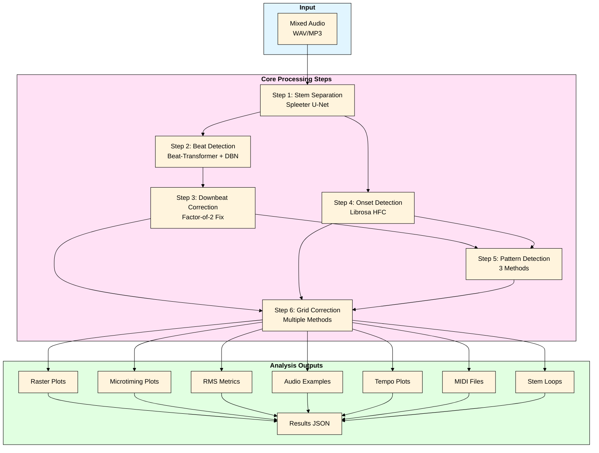
```mermaid
%%{init: {'theme':'base', 'themeVariables': { 'primaryTextColor':'#000','primaryBorderColor':'#000','lineColor':'#000','clusterBorder':'#000','edgeLabelBackground':'#fff'}}}%%
graph TB
    subgraph Input["<b>Input</b>"]
        I1[Mixed Audio<br/>WAV/MP3]
    end

    subgraph Processing["<b>Core Processing Steps</b>"]
        S1[Step 1: Stem Separation<br/>Spleeter U-Net]
        S2[Step 2: Beat Detection<br/>Beat-Transformer + DBN]
        S3[Step 3: Downbeat Correction<br/>Factor-of-2 Fix]
        S4[Step 4: Onset Detection<br/>Librosa HFC]
        S5[Step 5: Pattern Detection<br/>3 Methods]
        S6[Step 6: Grid Correction<br/>Multiple Methods]
    end

    subgraph Outputs["<b>Analysis Outputs</b>"]
        O1[Raster Plots]
        O2[Microtiming Plots]
        O3[RMS Metrics]
        O4[Audio Examples]
        O5[Tempo Plots]
        O6[MIDI Files]
        O7[Stem Loops]
        O8[Results JSON]
    end

    I1 --> S1
    S1 --> S2
    S1 --> S4
    S2 --> S3
    S3 --> S5
    S3 --> S6
    S4 --> S5
    S4 --> S6
    S5 --> S6

    S6 --> O1
    S6 --> O2
    S6 --> O3
    S6 --> O4
    S6 --> O5
    S6 --> O6
    S6 --> O7

    O1 --> O8
    O2 --> O8
    O3 --> O8
    O4 --> O8
    O5 --> O8
    O6 --> O8
    O7 --> O8

    style Input fill:#e1f5ff,stroke:#000,color:#000
    style Processing fill:#ffe1f5,stroke:#000,color:#000
    style Outputs fill:#e1ffe1,stroke:#000,color:#000
```

---

## Data Dependencies

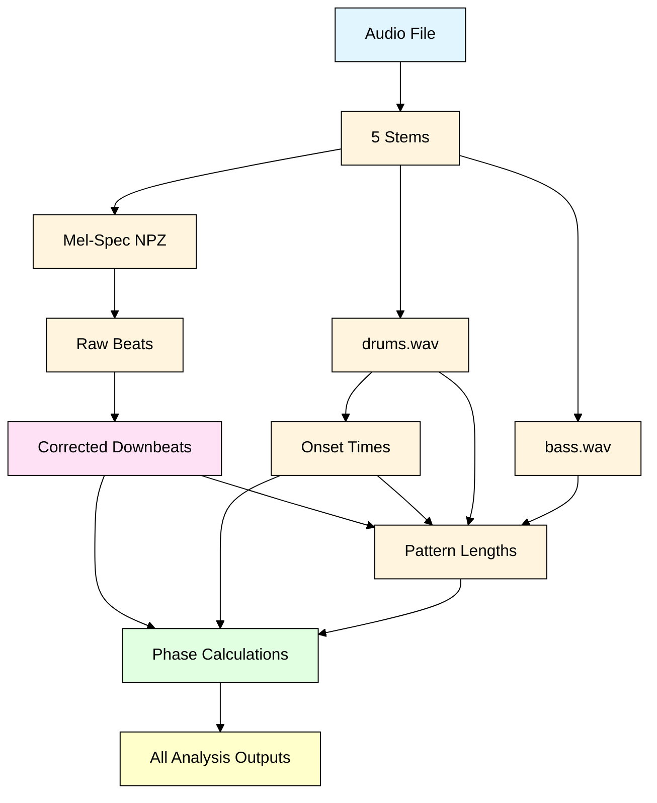
```mermaid
%%{init: {'theme':'base', 'themeVariables': { 'primaryTextColor':'#000','primaryBorderColor':'#000','lineColor':'#000','clusterBorder':'#000','edgeLabelBackground':'#fff'}}}%%
graph TD
    Audio[Audio File] --> Stems[5 Stems]
    Stems --> NPZ[Mel-Spec NPZ]
    Stems --> Drums[drums.wav]
    Stems --> Bass[bass.wav]

    NPZ --> Beats[Raw Beats]
    Beats --> CorrectedBeats[Corrected Downbeats]

    Drums --> Onsets[Onset Times]

    CorrectedBeats --> Patterns[Pattern Lengths]
    Onsets --> Patterns
    Drums --> Patterns
    Bass --> Patterns

    CorrectedBeats --> Phases[Phase Calculations]
    Onsets --> Phases
    Patterns --> Phases

    Phases --> Outputs[All Analysis Outputs]

    style Audio fill:#e1f5ff
    style CorrectedBeats fill:#ffe1f5
    style Phases fill:#e1ffe1
    style Outputs fill:#ffffcc
```

---

## Legend

- **Blue boxes**: Input/intermediate audio data
- **Pink boxes**: Beat/rhythm detection
- **Green boxes**: Pattern/timing analysis
- **Purple boxes**: Grid correction
- **Yellow boxes**: Final outputs
- **Red boxes**: Summary/results files

---

## Notes

- Steps 2 and 4 can run in parallel
- Step 6 produces the most important output: `comprehensive_phases.csv`
- All correction methods are calculated simultaneously and stored in one CSV
- Users can compare methods using RMS metrics or by listening to audio examples
