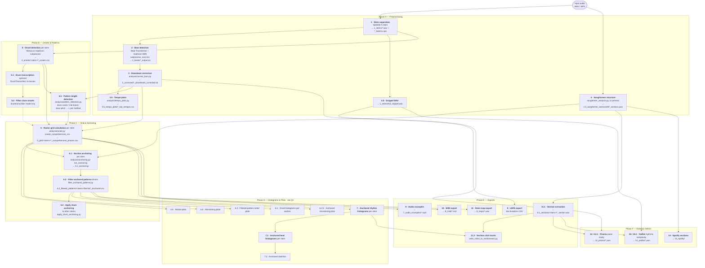
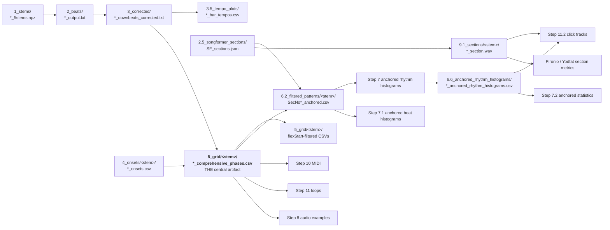
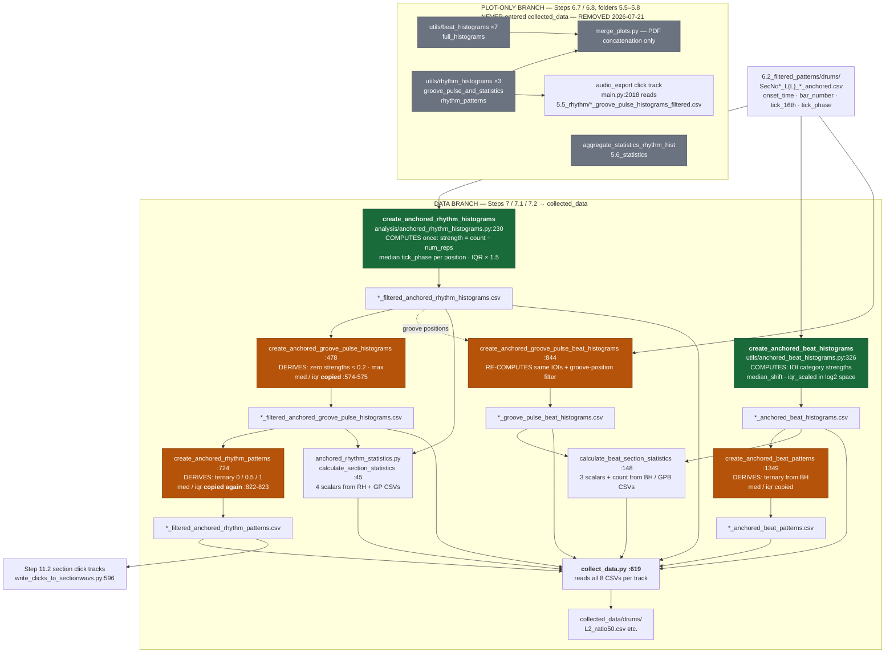

# Loop Extractor — Pipeline Workflow & Redundancy Audit

**Generated:** 2026-07-21, from the current state of `loop_extractor/main.py` (branch `new-pattern-thresholds`).
**Note:** the older `PIPELINE_DIAGRAM.md` uses outdated step numbers (e.g. "Step 2.5 SongFormer" — the code now labels it Step 4). This document reflects the code as it is today.

> **Cleanup 2026-07-21:** the snippet-level plot-only branch — **Steps 6.7 (rhythm histograms) and 6.8 (full-song IOI histogram)**, output folders `5.5_rhythm` / `5.6_statistics` / `5.7_beat_histograms` / `5.8_full_histograms` — has been **removed** (the lineage trace in §5 showed it contributed nothing to `collected_data`). Deleted: `utils/rhythm_histograms.py`, `utils/beat_histograms.py`, `utils/full_histograms.py`, `utils/rhythm_patterns.py`, `batch_analysis/groove_pulse_and_statistics.py`, `batch_analysis/aggregate_statistics_rhythm_hist.py`, the two step blocks in `main.py`, and 13 merge sections in `merge_plots.py` (~4,300 lines). Side effect: Step 8 audio examples no longer receive the snippet-level groove-pulse click CSV (the section click tracks in Step 11.2, fed by the anchored branch, are unaffected).

---

## Table of Contents

1. [Main Pipeline Flow](#1-main-pipeline-flow)
2. [Step → Module → Output Map](#2-step--module--output-map)
3. [Central Data Artifacts](#3-central-data-artifacts)
4. [The Histogram Fan-Out (Steps 6.4–7.2)](#4-the-histogram-fan-out-steps-6472)
5. [Data Lineage: collected_data traced to source](#5-data-lineage-collected_data-traced-to-source)
6. [Redundancy Audit](#6-redundancy-audit)
7. [Dead Code](#7-dead-code)
8. [Consolidation Recommendations](#8-consolidation-recommendations)
9. [Entry Points](#9-entry-points)

---

## 1. Main Pipeline Flow

Orchestrator: `run_complete_pipeline()` in `loop_extractor/main.py:92`.

> There is no Step 12 in the code; numbering jumps 11.2 → 13. Output-folder numbers do **not** match step numbers (see table below).

---

## 2. Step → Module → Output Map

| Step | main.py | Module / function | Output folder |
|---|---|---|---|
| 1 | :209 | `stem_separation/spleeter_interface.process_audio_to_stems_and_npz` | `1_stems/` |
| 2 | :245 | `beat_detection/transformer.detect_beats_and_downbeats` → subprocess `run_transformer.py` (Beat-Transformer + madmom DBN) | `2_beats/` |
| 3 | :280 | `analysis/correct_bars.correct_downbeats` | `3_corrected/` |
| 3.5 | :315 | `analysis/tempo_plots.create_tempo_plots` | `3.5_tempo_plots/` |
| 4 | :403 | `songformer_analysis.run_songformer` + `create_songformer_plots` | `2.5_songformer_sections/` |
| 4.5 | :480 | `spleeter_interface.create_snippet_wav` | `1_stems/full_snippet.wav` |
| 5 | :521 | `analysis/onset_detection.detect_and_save_onsets` (librosa) **or** `analysis/onset_detection_madmom.py` (subprocess) | `4_onsets/<stem>/` |
| 5.1 | :637 | `utils/drumtranscriber_interface.transcribe_drums` | `11_drumtranscriber/` |
| 5.2 | :704 | `drumtranscriber_interface.filter_close_onsets` | overwrites `4_onsets/` |
| 5.5 | :762 | `analysis/pattern_detection.detect_pattern_lengths` (drum / mel / pitch methods, BIC/AICc) | pattern lengths in memory + CSV |
| 6 | :882, :943 | `analysis/raster.create_comprehensive_csv` (drums, then other stems) | `5_grid/<stem>/` |
| 6.1 | :1006 | `analysis/anchoring.run_anchoring` + `plots_anchoring` | `6.1_anchoring/` |
| 6.2 | :1098 | `filter_anchored_patterns.filter_all_anchored_patterns` (drums), `apply_drum_anchoring_to_stem` (others) | `6.2_filtered_patterns/<stem>/` |
| 6.3 | :1158 | `plots_anchoring.create_all_anchoring_plots` | `6.2_filtered_patterns/` |
| 6.4 | :1173 | `anchored_onset_histograms.create_combined_onset_histograms` | `6.2_filtered_patterns/` |
| 6.2.5 | :1218 | `utils/anchored_microtiming_plots` | `6.2_filtered_patterns/` |
| 6.5 | :1270 | `utils/raster_plots.create_all_plots` | `5_grid/<stem>/` |
| 6.6 | :1326 | `utils/microtiming_plots.create_microtiming_plots` | `5_grid/` |
| ~~6.7~~ | — | ~~12 snippet-level histogram calls~~ — **removed 2026-07-21** (plot-only, never fed `collected_data`) | ~~`5.5_rhythm/`, `5.6_statistics/`, `5.7_beat_histograms/`~~ |
| ~~6.8~~ | — | ~~`full_histograms.create_full_song_ioi_histogram`~~ — **removed 2026-07-21** | ~~`5.8_full_histograms/`~~ |
| 7 | :1374 | `analysis/anchored_rhythm_histograms` ×4 (per stem) | `6.6_anchored_rhythm_histograms/<stem>/` |
| 7.1 | :1457 | `utils/anchored_beat_histograms` ×5 (per stem) | `6.7_anchored_beat_histograms/<stem>/` |
| 7.2 | :1548 | `batch_analysis/anchored_rhythm_statistics` ×2 (per stem) | `6.8_anchored_statistics/<stem>/` |
| 8 | :1673 | `utils/audio_export.create_audio_examples` | `7_audio_examples/` |
| 9 | :1734 | `utils/lepa_export.export_bar_durations` | LEPA CSV |
| 10 | :1782 | `utils/midi_export` (onset + pitch MIDI) | `8_midi[_drum]/` |
| 11 | :1918 | `utils/audio_export.export_stem_loops` | `9_loops[_drum]/` |
| 11.1 | :2016 | `analysis/extract_sections.extract_all_sections` | `9.1_sections/<stem>/` |
| 11.2 | :2083 | `analysis/write_clicks_to_sectionwavs` | `9.1_sections/<stem>/` |
| 13 / 13.1 | :2124, :2170 | `main_pironio.run_pironio_analysis` + `run_pironio.py` subprocess | `12_pironio/` |
| 14 | :2229 | `spotify_analysis.run_spotify_sections_analysis` (API path commented out) | `13_spotify/` |
| 15 / 15.1 | :2303, :2345 | `yodfat_analysis.run_yodfat_analysis` / `run_yodfat_section_analysis` | `14_yodfat/` |

Batch mode (`--analyse-all`) additionally runs `batch_analysis/`: `collect_data`, `merge_plots`, `pattern_length_summary`, `loop_statistics`, `lepa_data_export`, `snippet_ratio_diagrams`, `repetitions_per_section` (`main.py:3008–3097`).

---

## 3. Central Data Artifacts

`comprehensive_phases.csv` is the hub of the pipeline — nearly every downstream step reads it.

---

## 4. The Histogram Fan-Out (Steps 6.4–7.2)

> **Historical snapshot (pre-cleanup).** The diagram below shows the state *before* 2026-07-21. Everything in the POS/IOI/STAT clusters that reads from `comprehensive_phases.csv`/flexStart CSVs or raw onsets (`RH1-3`, `GP`, `RP`, `BH1-2`, `SI1-2`, `SN1-2`, `SB`, `FH`, `AGG`) has been **removed**; the anchored family (`ARH`, `AGP`, `ARP`, `ABH*`, `AGB*`, `ABP`, `AST`) is what remains and is what feeds `collected_data`.

This is where the redundancy lived. Every box below re-bins (or re-plots) onsets that were **already quantized to the 16th grid in Step 6**. Red = dead code, orange = near-verbatim copy of another live function.

```mermaid
flowchart TD
    COMP["5_grid comprehensive_phases.csv<br/>+ flexStart CSVs"]
    ANCH["6.2_filtered_patterns<br/>SecNo*_anchored.csv"]
    RAWON["4_onsets raw onsets.csv"]

    subgraph POS["Position histograms — onsets on L×16 grid"]
        RH1["create_rhythm_histograms<br/>utils/rhythm_histograms.py:101<br/>raw counts"]
        RH2["create_rhythm_histograms_with_style<br/>utils/rhythm_histograms.py:351<br/>same plot, normalized"]
        RH3["create_rhythm_histograms_with_medians_and_iqr<br/>utils/rhythm_histograms.py:736<br/>+ median shift + IQR"]
        GP["create_groove_pulse_histograms<br/>batch_analysis/groove_pulse_and_statistics.py:25<br/>≈ RH3 + threshold mask · ~90% copy"]
        RP["create_rhythm_pattern_histograms<br/>utils/rhythm_patterns.py:40<br/>binarize GP output · reuses same plot block"]
        ARH["create_anchored_rhythm_histograms<br/>analysis/anchored_rhythm_histograms.py:230<br/>same grid formula, per section, ÷ repetitions"]
        AGP["create_anchored_groove_pulse_histograms<br/>:478 · threshold filter of ARH CSV"]
        ARP["create_anchored_rhythm_patterns<br/>:724 · same binarization as RP"]
        DEADRH["lines 990–1799 of<br/>anchored_rhythm_histograms.py<br/>byte-identical dead copy of<br/>utils/rhythm_histograms.py"]
    end

    subgraph IOI["IOI histograms — inter-onset intervals"]
        BH1["create_beat_histograms<br/>utils/beat_histograms.py:231<br/>bars, per pattern length"]
        BH2["create_beat_histograms_all_onsets<br/>:479 · same data, scatter render"]
        SI1["create_simple_ioi_histogram :630<br/>whole song, ms, 50 bins"]
        SI2["create_simple_ioi_all_crosses :779<br/>same data, scatter"]
        SN1["create_snippet_ioi_histogram :1084<br/>≡ SI1 + time filter"]
        SN2["create_snippet_ioi_all_crosses :927<br/>≡ SI2 + time filter"]
        SB["create_simple_beat_histograms :1241<br/>re-reads BH1 CSVs, re-plots"]
        FH["create_full_song_ioi_histogram<br/>utils/full_histograms.py:102<br/>≡ SI1, cosmetic diffs"]
        ABH1["create_anchored_beat_histograms<br/>utils/anchored_beat_histograms.py:326<br/>= BH1 per section"]
        ABH2["create_anchored_beat_histograms_all_onsets<br/>:670 · scatter twin"]
        AGB1["create_anchored_groove_pulse_beat_histograms<br/>:844 · ≈ ABH1 + groove filter · ~95% copy"]
        AGB2["…groove_pulse_…_all_onsets<br/>:1176 · ≈ ABH2 + groove filter"]
        ABP["create_anchored_beat_patterns<br/>:1349 · binarize, analogue of RP"]
    end

    subgraph STAT["Aggregate statistics — same 4 metrics twice"]
        AGG["aggregate_statistics_rhythm_hist.py:22<br/>track level"]
        AST["anchored_rhythm_statistics.py:45<br/>section level, same metrics"]
        ASTD["_stem driver variants :386 :457<br/>verbatim copies of :238 :312"]
    end

    COMP --> RH1
    COMP --> RH2
    COMP --> RH3
    COMP --> GP
    GP --> RP
    ANCH --> ARH --> AGP --> ARP
    COMP --> BH1
    COMP --> BH2
    RAWON --> SI1
    RAWON --> SI2
    RAWON --> SN1
    RAWON --> SN2
    RAWON --> FH
    BH1 --> SB
    ANCH --> ABH1
    ANCH --> ABH2
    ANCH --> AGB1
    ANCH --> AGB2
    ABH1 --> ABP
    RH3 --> AGG
    GP --> AGG
    ARH --> AST
    AGP --> AST

    classDef dead fill:#8b1a1a,stroke:#5c0f0f,color:#fff
    classDef dup fill:#b45309,stroke:#7c3a06,color:#fff
    class DEADRH dead
    class GP,SN1,SN2,FH,AGB1,AGB2,ASTD,RH2,BH2,SB dup
```

**Reading the diagram:** ~29 histogram functions run per track, but there are only about **6 genuinely distinct computations**:

1. Position histogram on the L×16 grid (count / normalized / median-shifted — one computation, three renders)
2. Its section-anchored variant (adds ÷ num_repetitions)
3. Groove-pulse threshold + binarization (post-processing of 1 and 2, duplicated for both)
4. Pattern-based IOI histogram (bars / scatter — one computation, two renders; plain and per-section; plain and groove-filtered)
5. Raw-onset IOI histogram (whole-song / snippet-windowed / "full-song" — one computation, three near-verbatim functions, plus two scatter twins)
6. Four aggregate scalar metrics (computed at track level and again at section level)

**Crucially, these two families are not equal in importance:** only the section-anchored family (Steps 7/7.1/7.2) feeds the final research dataset — see the lineage trace in §5.

---

## 5. Data Lineage: collected_data traced to source

Traced backwards from `collected_data/drums/L2_ratio50.csv` (built by `batch_analysis/collect_data.py`, `collect_section_data` at `:619`). This is the ground truth for what is *actually used* vs. what is only plotted.

### 5.1 The two branches — only one feeds the dataset

**Green = a genuine computation. Orange = a derived view (threshold / quantize / copy). Grey = never reaches the dataset.**

### 5.2 Column-by-column lineage of `L{L}_ratio*.csv`

| Column block | Immediate source CSV | Where the numbers are actually computed | Nature |
|---|---|---|---|
| `song_id`, `song_name` | — | folder-name parse, `collect_data.py:101,107` | metadata |
| `sec_no`, `section_label`, `num_repetitions`, `ratio_in_snippet`, `mean_section_tempo` | RH CSV header rows | written by `create_anchored_rhythm_histograms` (`:439` block); sections originate from `SF_sections.json` (Step 4) + anchoring (6.1/6.2); tempo from `3.5_tempo_plots/*_bar_tempos.csv` | metadata |
| `time_signature` | `3_corrected` header | `collect_data.py:113` | metadata |
| `RH_str_i` | RH CSV `onset_strength` | **`extract_rhythm_histogram_from_anchored`** `analysis/anchored_rhythm_histograms.py:141-222`: `count ÷ num_repetitions` at position `(bar % L)·16 + tick_16th` | ✅ computed |
| `RH_med_i` | RH CSV `median_tick_phase` | same function: median of `tick_phase` per position | ✅ computed |
| `RH_iqr_i` | RH CSV `iqr_16th` | same function — **stored as IQR × 1.5** (`:217`, "scale for visibility") ⚠️ plot scaling baked into research data | ✅ computed |
| `GP_str_i` | GP CSV `onset_strength_filtered` | `create_anchored_groove_pulse_histograms:478` — RH strength, zeroed below `0.2 · max` | 🔶 derived from RH_str |
| `GP_med_i`, `GP_iqr_i` | GP CSV | **verbatim copy** of RH columns (`:574-575`) | 🔶 duplicate of RH_med/iqr |
| `RP_str_i` | RP CSV `pattern_value` | `create_anchored_rhythm_patterns:724` — count-based ternary 0 / 0.5 / 1 | 🔶 derived from GP_str |
| `RP_med_i`, `RP_iqr_i` | RP CSV | **verbatim copy again** (`:822-823`) | 🔶 duplicate of RH_med/iqr |
| `BH_str_cat` | BH CSV `onset_strength` | **`process_section_ioi`** + `create_anchored_beat_histograms` `utils/anchored_beat_histograms.py:236,326` — IOIs between consecutive onsets of the *same* SecNo CSVs, binned to 7 note-value categories | ✅ computed |
| `BH_med_cat`, `BH_iqr_cat` | BH CSV `median_shift`, `iqr_scaled` | same — log2-space shift/IQR | ✅ computed |
| `GPB_*` | GPB CSV | `create_anchored_groove_pulse_beat_histograms:844` — **re-runs the full IOI computation** keeping only IOIs whose both endpoints sit on groove-pulse positions (needs onset-level data, so not a pure table-derivation — but ~95% duplicated code) | 🔶 recomputed with filter |
| `BP_*` | BP CSV `pattern_level` | `create_anchored_beat_patterns:1349` — ternary from BH; med/iqr copied | 🔶 derived from BH |
| `microtiming_degree`, `microtiming_complexity`, `pulse_strength`, `groove_pulse_strength` | `6.8_anchored_statistics/*_anchored_rhythm_statistics.csv` | `anchored_rhythm_statistics.py:45` — mean&#124;median_tick_phase&#124;, mean iqr, mean strength at beat positions, mean filtered strength — **all recomputable from the RH/GP columns already in the same row** | 🔶 derivable |
| `ioi_microtiming_degree`, `ioi_microtiming_complexity`, `groove_ioi_pulse_strength`, `total_ioi_count` | `*_anchored_beat_statistics.csv` | `anchored_rhythm_statistics.py:148` — same pattern over BH/GPB categories | 🔶 derivable |

### 5.3 What this means

Of the **~380 numeric columns** per row in `L2_ratio50.csv`:

- **~103 are original computations** (RH_str/med/iqr = 96, BH 21 minus overlap, metadata) — everything else is a threshold, quantization, or verbatim copy of those.
- `GP_med/iqr` and `RP_med/iqr` (128 columns in L2) are **byte-identical copies** of `RH_med/iqr` — visible directly in the data.
- `BP_med/iqr` duplicates `BH_med/iqr`; `GPB_med/iqr` is `BH_med/iqr` masked to surviving categories.
- The 8 scalar statistics are re-derived by a separate module from the same CSVs whose contents sit in the same row.
- ⚠️ `*_iqr_*` values carry the **×1.5 visual scaling** from the plotting code (`anchored_rhythm_histograms.py:217`) — anyone using these as statistical IQRs must divide by 1.5.

And the branch distinction: **Steps 6.7/6.8 (folders `5.5_rhythm`–`5.8_full_histograms`) contributed nothing to this dataset** — their outputs were consumed only by `merge_plots.py` (batch PDF report) and one click-track CSV for Step 8 audio examples. **This entire branch was removed on 2026-07-21** (~4,300 lines): the two step blocks in `main.py`, six modules (`utils/rhythm_histograms.py`, `utils/beat_histograms.py`, `utils/full_histograms.py`, `utils/rhythm_patterns.py`, `batch_analysis/groove_pulse_and_statistics.py`, `batch_analysis/aggregate_statistics_rhythm_hist.py`), and 13 sections of `merge_plots.py`.

---

## 6. Redundancy Audit

### 6.1 Exact duplicates (byte- or near-byte-identical, both present in the repo)

| What | Dead copy | Live copy | Notes |
|---|---|---|---|
| `extract_rhythm_histogram_from_flexstart_csv` | `analysis/anchored_rhythm_histograms.py:990` | `utils/rhythm_histograms.py:300` | differs by one blank line |
| `create_rhythm_histograms_with_style` | `analysis/anchored_rhythm_histograms.py:1041` | `utils/rhythm_histograms.py:351` | `main.py:1377` imports only the `utils` copy |
| `extract_phase_statistics_from_csv` | `analysis/anchored_rhythm_histograms.py:1344` | `utils/rhythm_histograms.py:654` | |
| `create_rhythm_histograms_with_medians_and_iqr` | `analysis/anchored_rhythm_histograms.py:1426` | `utils/rhythm_histograms.py:736` | |

➡ **The entire lower half of `analysis/anchored_rhythm_histograms.py` (~lines 990–1799, ~810 lines) is a dead duplicate of `utils/rhythm_histograms.py`.**

### 6.2 `raster.py` vs `anchoring.py` — both live, ~1200 shared lines

`analysis/anchoring.py` = `analysis/raster.py` + section-anchoring functions. Duplicated in both (same functions, same relative structure):

- `parse_corrected_downbeats`, `load_onsets`, `find_nearest_onset`, `calculate_snippet_bars`
- all five `calculate_phases_*` variants (uncorrected / per_snippet / 4bar_loop / 4bar_pattern_flexStart / pattern_flexStart), each containing the same `round(phase * 16)` quantizer
- `create_raster_csv` (raster:1190 vs anchoring:1202 — **differ by exactly one line**, `bar_number_global`)
- `create_flexstart_patterns_csv`, `create_comprehensive_csv`, nested `deduplicate_by_closest_to_grid`

`main.py` calls **both**: `raster.create_comprehensive_csv` (:919, :983) and `anchoring.run_anchoring` (:1072). Any grid-logic fix must currently be made twice.

### 6.3 Near-verbatim function pairs (~90–95% copy-paste, all live)

| Group | Functions | Actual difference |
|---|---|---|
| Raw-onset IOI histogram ×3 | `beat_histograms.py:630` `create_simple_ioi_histogram` ≡ `:1084` `create_snippet_ioi_histogram` ≡ `full_histograms.py:102` `create_full_song_ioi_histogram` | snippet time-window filter; title/CSV cosmetics |
| IOI scatter ×2 | `beat_histograms.py:779` ≡ `:927` | snippet time-window filter |
| Median-phase histogram ×3 | `rhythm_histograms.py:736` ≡ `groove_pulse_and_statistics.py:25` ≡ plot block reused in `rhythm_patterns.py:40` | threshold mask; binarization. Same extractor, same method list, same ~120-line plot block |
| Anchored beat histograms ×2 pairs | `anchored_beat_histograms.py:326` ≡ `:844`, and `:670` ≡ `:1176` | groove-position filter only; stats/plot block lines 998–1141 ≡ 472–630 |
| Statistics drivers ×2 pairs | `anchored_rhythm_statistics.py:312` ≡ `:457` (`_stem`), `:238` ≡ `:386` (`_stem`) | input path/filename only |
| Binarization ×2 | `rhythm_patterns.py:40` ≡ `anchored_rhythm_histograms.py:724` | identical 1.0 / 0.5 / 0 threshold logic on two anchoring stages |
| Track vs section metrics | `aggregate_statistics_rhythm_hist.py:22` ≡ `anchored_rhythm_statistics.py:45` | same 4 metrics (microtiming degree, complexity, pulse strength, groove pulse strength), same beat-position lists |

### 6.4 Copy-pasted helpers

| Snippet | Copies | Locations |
|---|---|---|
| `categorize_ioi()` — identical 7-tier table | 3 | `beat_histograms.py:23`, `full_histograms.py:68`, `anchored_beat_histograms.py:153` |
| Tempo read loop (`# avg_kept_corrected=` parser) | 5 | `beat_histograms.py:689, :836, :992, :1150`, `full_histograms.py:157` |
| `category_to_ticks` + log2 tick-label block | ~9 | `beat_histograms.py` ×3, `anchored_beat_histograms.py` ×5+ |
| Grid-position formula `(bar % L)*16 + tick` | 4+ | `rhythm_histograms.py:89, :335, :700`, `anchored_beat_histograms.py:131` |
| `loop_counts` / `time_signature` JSON+txt loader | 4 | `rhythm_histograms.py` ×2, `groove_pulse_and_statistics.py:62`, `rhythm_patterns.py:82` |
| Median-shift + IQR-errorbar + label plot block (~120 lines) | 3 | `rhythm_histograms.py:899`, `groove_pulse_and_statistics.py:195`, `rhythm_patterns.py:239` |

### 6.5 Three independent grid-snapping implementations

The onset → 16th-grid assignment exists three times with **different rounding behavior** — a potential source of subtle inconsistencies, not just duplication:

| Where | Method | Purpose |
|---|---|---|
| `raster.py` / `anchoring.py` (`calculate_phases_*`) | `round(phase * 16)` | the canonical grid (Step 6) |
| `rms_grid_histograms.py:45` | `argmin` vs `np.arange(16)/16` | RMS deviation metric (currently dormant, `main.py:1951` commented out) |
| `pattern_detection.py:171` `drum_bar_vector` | `floor(rel * bins)`, bins from time signature | pattern-length xcorr (Step 5.5) |

---

## 7. Dead Code

Verified unreferenced by any live import/call path:

| File | Lines | What it is |
|---|---|---|
| `analysis/anchored_rhythm_histograms.py:990–1799` | ~810 | dead duplicate of `utils/rhythm_histograms.py` (inside a live file!) |
| `analysis/anchored_rhythm_histograms_backup.py` | 559 | backup |
| `analysis/anchoring_backup.py` | 638 | backup |
| `analysis/plots_anchoring_backup.py` | 356 | backup |
| `analysis/raster_old5-1-2026.py` | 1861 | dated copy |
| `utils/raster_plots_old5-1-2026.py` | 848 | dated copy of `raster_plots.py` |
| `analysis/rms_grid_histograms.py` | 381 | live import in `main.py:84` but its only call site is commented out (`main.py:1932–1980`, "STEP 7 OLD") |
| `featuresets_exploration_report_backup.md` | — | doc backup |

Total: **~5,400 lines of dead Python** on live paths' directories. (The lower half of `anchored_rhythm_histograms.py` duplicated `utils/rhythm_histograms.py`, which was deleted in the 2026-07-21 cleanup — the dead copy is now the *only* copy, and still unreferenced.)

---

## 8. Consolidation Recommendations

Ordered by payoff / risk, informed by the lineage trace in §5:

1. ✅ **DONE 2026-07-21 — Plot-only branch removed**: Steps 6.7/6.8, six modules, 13 merge sections (~4,300 lines). This also resolved the 5-function IOI family, the `create_rhythm_histograms*` triplet, the snippet-level `categorize_ioi`/tempo-parser copies, and the track-level statistics duplicate.
2. **Delete remaining dead code** (zero risk): the 5 backup/old files, and lines ~990–1799 of `analysis/anchored_rhythm_histograms.py` (dead duplicate of the now-deleted `utils/rhythm_histograms.py`). ~5,400 lines.
3. **Fix the ×1.5 IQR scaling in the dataset** (data-quality, small change): store raw IQR in the CSVs and apply ×1.5 only in the plotting code (`anchored_rhythm_histograms.py:217`). Anyone analysing `RH_iqr_*` today gets inflated values.
4. **Stop storing derived views as independent data** (medium): in the anchored chain, GP = threshold(RH), RP = quantize(GP), BP = quantize(BH), and the 8 scalar statistics are means over columns already in the table. Computing them once in `collect_data.py` (or at analysis time in pandas) would shrink the table by ~200 duplicated columns and eliminate drift risk between the copies.
5. **Parameterize the remaining anchored pairs** (medium): `create_anchored_groove_pulse_beat_histograms` → `create_anchored_beat_histograms(..., groove_filter=True)` (and the scatter twin); `_stem` statistics drivers → one driver with an input-path parameter.
6. **Unify `raster.py` / `anchoring.py`** (higher effort): make `anchoring.py` import the shared ~1200 lines from `raster.py` (or a common module) so grid math exists once. The single-line `bar_number_global` difference becomes a parameter.
7. **Decide on one grid-snapping rule** (design question): `round` (raster) vs `floor` (pattern_detection) — document intentionality or unify.

---

## 9. Entry Points

| Entry | What it does |
|---|---|
| `python loop_extractor/main.py --audio … --track-id … --output-dir …` | single track pipeline |
| `python loop_extractor/main.py --analyse-all --audio-dir … --output-dir …` | batch mode + `batch_analysis/` aggregation |
| `python gui.py` | Tkinter GUI; builds and shells out the `main.py` CLI (`gui.py:961–1046`) |
| `python batch_process_results.py` | standalone post-hoc PDF/CSV report over an output dir |
| Subprocess (own envs) | `beat_detection/run_transformer.py`, `run_pironio.py`, `analysis/onset_detection_madmom.py` |
| Standalone module CLIs | `songformer_analysis.py`, `spotify_analysis.py`, `yodfat_analysis.py`, `main_pironio.py` |
