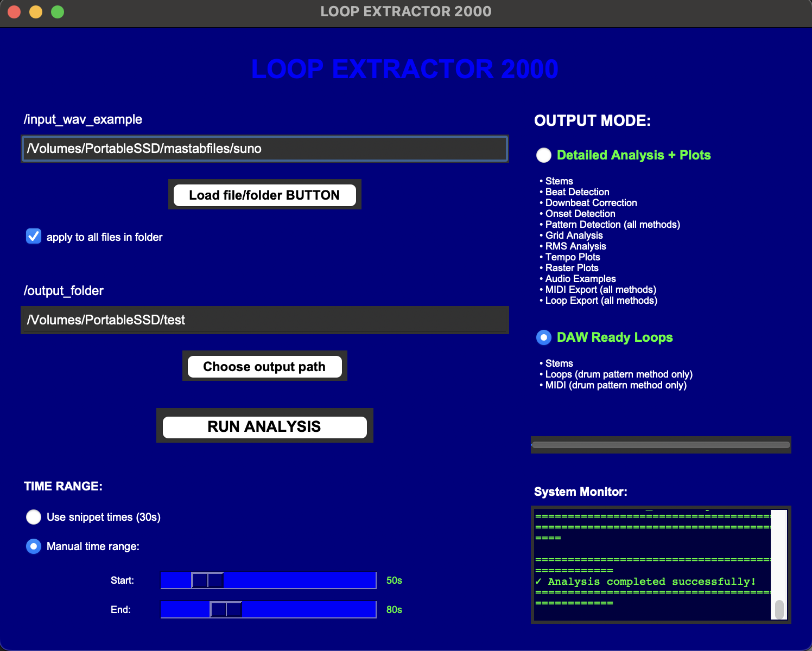

# Loop Extractor Python

Standalone loop extraction tool based on the AP_2 pipeline.

## Directory Structure

```
loop_extractor_python/
├── loop_extractor/         # Main pipeline code
│   ├── main.py             # Entry point
│   ├── config.py           # Configuration
│   ├── beat_detection/     # Beat detection module
│   ├── stem_separation/    # Spleeter integration
│   ├── analysis/           # Pattern detection
│   └── utils/              # Utilities
│
└── Beat-Transformer/       # Beat detection model
    ├── code/               # Model code (DilatedTransformer)
    └── checkpoint/         # Pre-trained weights (36MB)
        └── fold_4_trf_param.pt
```

## Setup

1. Create conda environments (see main_project/ENVIRONMENTS.md)
2. Activate main environment: `conda activate loop_extractor_main`
3. Run pipeline: `cd loop_extractor && python main.py --audio input.wav --track-id 1 --output-dir output/`

## GUI Application

A graphical interface is available for easy operation:

```bash
python gui.py
```



The GUI supports:
- Single file or batch folder processing
- Visual output mode selection (Detailed Analysis or DAW Ready)
- Manual time range selection with sliders
- Real-time progress monitoring
- All command-line features in a user-friendly interface

## Supported Audio Formats

The pipeline supports both **WAV** and **MP3** audio files:
- WAV files: `*.wav`
- MP3 files: `*.mp3`

When using batch processing (`--analyse-all`), the pipeline automatically detects and processes both formats. macOS resource fork files (`._*`) are automatically filtered out.

## Usage Examples

### Single File Processing

```bash
# Process a WAV file
python main.py --audio track.wav --track-id 123 --output-dir output/

# Process an MP3 file
python main.py --audio track.mp3 --track-id 123 --output-dir output/

# With manual time range
python main.py --audio track.mp3 --track-id 123 --output-dir output/ \
    --manual-start 50.0 --manual-duration 71.0

# DAW-ready mode (stems, loops, and MIDI only)
python main.py --audio track.mp3 --track-id 123 --output-dir output/ --daw-ready
```

### Batch Processing

```bash
# Process all WAV and MP3 files in a directory
python main.py --audio-dir /path/to/audio/files --analyse-all --output-dir output/

# Batch processing with manual time range
python main.py --audio-dir /path/to/audio/files --analyse-all --output-dir output/ \
    --manual-start 52.0 --manual-duration 36.0

# Batch processing in DAW-ready mode
python main.py --audio-dir /path/to/audio/files --analyse-all --output-dir output/ --daw-ready
```

## Configuration

All paths have been updated to use the new location:
- `/Users/alexk/mastab/loop_extractor_python/`

Check `loop_extractor/config.py` for all configuration options.

## Requirements

- Beat-Transformer checkpoint (36MB) - already included
- Two conda environments:
  - loop_extractor_main (main pipeline)
  - new_beatnet_env (beat detection subprocess)

## Citation

If you use this tool in your research, please cite the following papers:

### Groove Affordances and Rhythm Perception
```bibtex
@article{lepa2025groove,
  title={Dimensions of Groove Affordances (DGA) When Listening to Popular Music: A New Measurement Instrument and a Comparative Validation Study},
  author={Lepa, Steffen and Ahrens, Luzie and Pfleiderer, Martin},
  journal={Jahrbuch Musikpsychologie},
  volume={33},
  year={2025},
  doi={10.5964/jbdgm.217}
}
```
- Paper: https://jbdgm.psychopen.eu/index.php/jbdgm/article/view/217

### Beat-Transformer (Downbeat Detection)
```bibtex
@inproceedings{zhao2022beat,
  title={Beat Transformer: Demixed Beat and Downbeat Tracking with Dilated Self-Attention},
  author={Zhao, Jingwei and Xia, Gus and Wang, Ye},
  booktitle={Proceedings of the 23rd International Society for Music Information Retrieval Conference (ISMIR)},
  year={2022}
}
```
- Paper: https://arxiv.org/abs/2209.07140

### Spleeter (Stem Separation)
```bibtex
@article{spleeter2020,
  title={Spleeter: a fast and efficient music source separation tool with pre-trained models},
  author={Hennequin, Romain and Khlif, Anis and Voituret, Felix and Moussallam, Manuel},
  journal={Journal of Open Source Software},
  volume={5},
  number={50},
  pages={2154},
  year={2020}
}
```
- Website: https://research.deezer.com/projects/spleeter.html

### libf0 (Pitch Detection)
```bibtex
@inproceedings{rosenzweig2022libf0,
  title={libf0: A Python Library for Fundamental Frequency Estimation in Music Recordings},
  author={Rosenzweig, Sebastian and Schw{\"a}r, Simon and M{\"u}ller, Meinard},
  booktitle={Late-Breaking/Demo Session, International Society for Music Information Retrieval Conference (ISMIR)},
  year={2022},
  address={Bengaluru, India}
}
```
- Paper: https://archives.ismir.net/ismir2022/latebreaking/000003.pdf
- GitHub: https://github.com/groupmm/libf0

### Microtiming Analysis
```bibtex
@article{ainsworth2025microtiming,
  title={Microtiming in Early Funk: A Microrhythmic Analysis of Fourteen Influential Funk Grooves},
  author={Ainsworth, Patrick},
  journal={Zeitschrift der Gesellschaft f{\"u}r Musiktheorie},
  volume={22},
  number={1},
  pages={123--173},
  year={2025},
  doi={10.31751/1224}
}
```
- Paper: https://www.gmth.de/zeitschrift/artikel/1224.aspx

**Note:** If you publish research using this pipeline, please also cite any relevant papers describing the microtiming analysis methods and loop extraction techniques specific to your use case.
