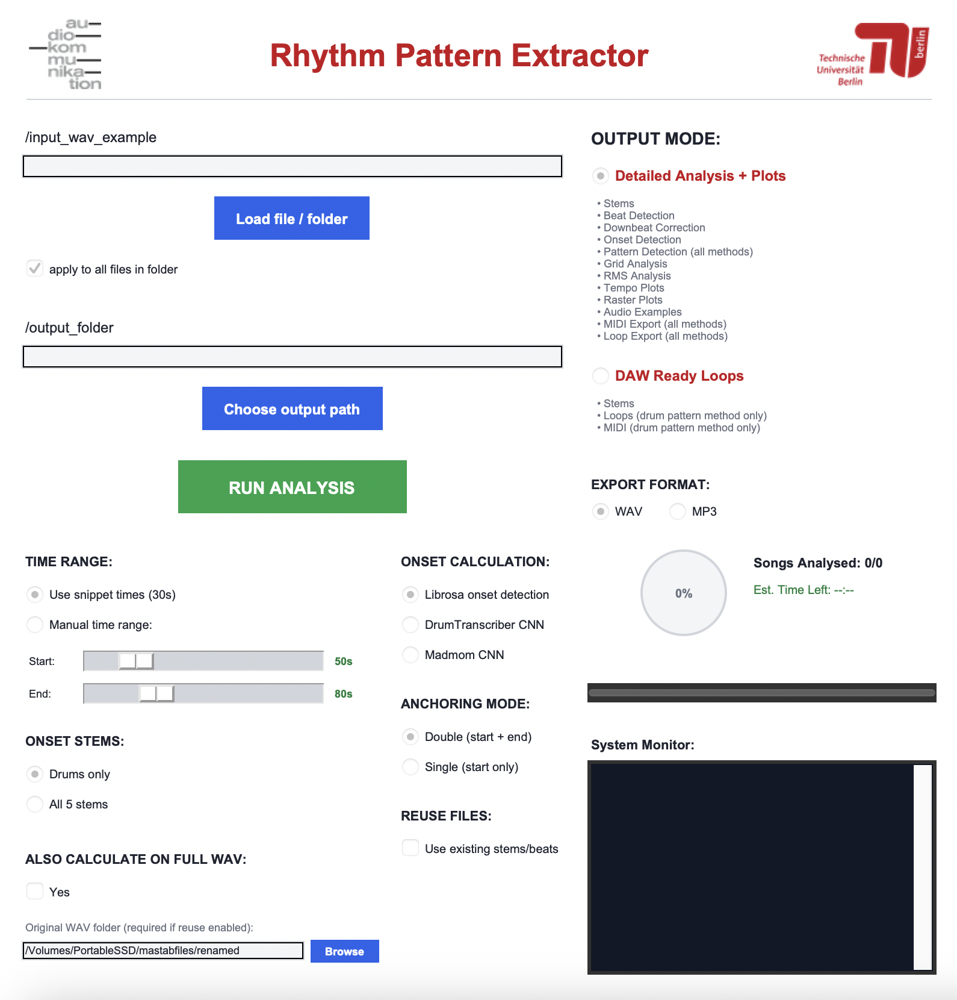

# Rhythm Pattern Extractor

Standalone rhythm pattern extraction and microtiming analysis tool
(formerly "Loop Extractor").

**Author:** Alexander Krause, TU Berlin
**Co-Author:** Claude Code (Anthropic)

## Introduction

This is the preprocessing pipeline prototype developed for my ongoing Master's thesis investigating the relationship between rhythm science, machine learning, and groove affordances as predictors of musical perception. The pipeline combines automated music analysis (beat/downbeat detection, structure segmentation, onset detection, section anchoring) with rhythm pattern extraction to support both research and creative applications.

**Research Focus:**
- **Rhythm Science**: Quantitative analysis of microtiming, tempo variations, and rhythmic patterns in music
- **Machine Learning**: Feature extraction from audio to support predictive modeling of groove characteristics
- **Groove Affordances**: Understanding how timing deviations and rhythmic patterns influence listener perception and movement

**What the pipeline produces per track:**
- **Anchored rhythm patterns**: per song section (verse, chorus, ...) the drum onsets of the first 1/2/4 bars and their repetitions, anchored to a corrected metrical grid (`6.1_anchoring`, `6.2_filtered_patterns`)
- **Rhythm & beat histograms + statistics**: position histograms, IOI histograms, and microtiming statistics per section (`6.6`–`6.8`)
- **MIDI export**: per section, the L2 pattern (first 2 bars) and the full section as drum MIDI — single-note and GM drum-mapped (kick/snare/hihat/ride/crash/tom via CNN drum classification) — plus a bass-pitch MIDI for the same windows, all aligned so drum and bass line up in a DAW (`8_midi`)
- **Section WAVs with click tracks**: extracted section audio with the detected rhythm pattern rendered as clicks (`9.1_sections`)
- **Diagnostics**: tempo plots, raster/microtiming plots, structure timelines, pulse-clarity (Pironio) and rhythmic-complexity (Yodfat) metrics

See the [OUTPUT_EXAMPLES](OUTPUT_EXAMPLES/) directory for sample outputs
(note: these examples are from an earlier pipeline version; the current output
layout is described below).

## Directory Structure

```
loop_extractor_python/
├── gui.py                  # GUI application (Rhythm Pattern Extractor)
├── loop_extractor/         # Main pipeline code
│   ├── main.py             # Entry point
│   ├── config.py           # Configuration
│   ├── beat_detection/     # Beat-Transformer integration
│   ├── stem_separation/    # Spleeter integration
│   ├── analysis/           # Anchoring, filtering, classification, histograms
│   ├── batch_analysis/     # Plot merging, data collection across tracks
│   └── utils/              # MIDI export, raster plots, ...
│
└── Beat-Transformer/       # Beat detection model
    ├── code/               # Model code (DilatedTransformer)
    └── checkpoint/         # Pre-trained weights (36MB)
        └── fold_4_trf_param.pt
```

## Setup

1. Create conda environments (see main_project/ENVIRONMENTS.md)
2. Activate loop extractor environment: `conda activate loop_extractor_main`
3. Run pipeline: `cd loop_extractor && python main.py --audio input.wav --track-id 1 --output-dir output/`

## GUI Application

A graphical interface is available for easy operation:

```bash
python gui.py
```



The GUI supports:
- Single file or batch folder processing
- Manual time range selection with sliders
- Onset detection method selection (librosa / DrumTranscriber / madmom)
- Real-time progress monitoring
- All command-line features in a user-friendly interface

The pipeline always runs the full detailed analysis and exports everything as WAV.

## Supported Audio Formats

The pipeline supports both **WAV** and **MP3** audio files:
- WAV files: `*.wav`
- MP3 files: `*.mp3`

When using batch processing (`--analyse-all`), the pipeline automatically detects and processes both formats. macOS resource fork files (`._*`) are automatically filtered out.

## Usage Examples

### Single File Processing

```bash
# Process a WAV file
python main.py --audio track.wav --track-id 123 --output-dir output/

# Process an MP3 file
python main.py --audio track.mp3 --track-id 123 --output-dir output/

# With manual time range
python main.py --audio track.mp3 --track-id 123 --output-dir output/ \
    --manual-start 50.0 --manual-duration 71.0

# With madmom CNN onset detection
python main.py --audio track.wav --track-id 123 --output-dir output/ \
    --onset-mode madmom
```

### Batch Processing

```bash
# Process all WAV and MP3 files in a directory
python main.py --audio-dir /path/to/audio/files --analyse-all --output-dir output/

# Batch processing with manual time range
python main.py --audio-dir /path/to/audio/files --analyse-all --output-dir output/ \
    --manual-start 52.0 --manual-duration 36.0

# Re-run analysis reusing existing stems/beats/SongFormer results
python main.py --audio-dir /path/to/audio/files --analyse-all --output-dir output/ \
    --reuse-existing
```

**Batch Analysis Outputs**

When using `--analyse-all`, the pipeline additionally:
- merges the per-track plots into combined PDFs in `output/batch_analysis/` (tempo plots, raster plots, anchored rhythm/beat histograms per stem, ...)
- collects the per-section histogram and statistics data across all tracks into `output/collected_data/` (one CSV per pattern length × section-ratio threshold)

Individual plots remain in each track's own folders (e.g. `3.5_tempo_plots/`).

**Dependencies**

PDF merging requires PyPDF2:

```bash
pip install PyPDF2
```

If PyPDF2 is not installed, batch processing will still complete successfully, but PDF merging will be skipped.

## Output Structure (per track)

```
output/<track>/
├── 1_stems/                          # Spleeter stems + full_snippet.wav + bass F0
├── 2_beats/                          # Beat-Transformer beats/downbeats
├── 2.5_songformer_sections/          # SongFormer structure segmentation
├── 3_corrected/                      # Corrected downbeats
├── 3.5_tempo_plots/                  # Tempo plots + bar tempo CSV
├── 4_onsets/<stem>/                  # Detected onsets
├── 5_grid/<stem>/                    # Comprehensive phase grid + reference onsets (CSV)
├── 6.1_anchoring/<stem>/             # Section-anchored patterns (L1/L2/L4, unfiltered)
├── 6.2_filtered_patterns/<stem>/     # Tukey-filtered patterns + drum classes (kick/snare/...)
├── 6.6_anchored_rhythm_histograms/   # Position histograms + groove pulse + rhythm patterns
├── 6.7_anchored_beat_histograms/     # IOI histograms + beat patterns
├── 6.8_anchored_statistics/          # Microtiming degree/complexity statistics
├── 8_midi/
│   ├── onset/                        # SecNoX_L2 / SecNoX_full (.mid + _gm.mid)
│   └── bass_pitch/                   # Same windows as bass MIDI (_bass.mid)
├── 9.1_sections/<stem>/              # Section WAVs + rhythm-pattern click tracks
├── 12_pironio/  13_spotify/  14_yodfat/   # Pulse clarity / Spotify / rhythmic complexity
└── pipeline_results.json             # Steps completed + errors
```

In batch mode, corpus-level outputs are written next to the track folders:

```
output/
├── batch_analysis/                   # Merged plots (+ per-stem anchored merges)
├── collected_data/<stem>/            # Collected per-song grid CSVs (L1/L2/L4 x ratio)
├── feature_sets/
│   ├── calculated_features/          # 52 candidate features in 8 set CSVs
│   ├── final_features/               # our_features.csv (25) + spotify_features.csv
│   └── spearman_matrix_*.png         # Correlation matrices (full + reduced)
├── snippet_ratio_batch_analysis/     # Section-coverage diagrams
└── batch_results.json                # Batch processing log
```

## Configuration

The pipeline can be customized through various configuration options. Check [loop_extractor/config.py](loop_extractor/config.py) for:
- Model paths and parameters
- Audio processing settings
- Output directory structure
- Tempo and beat detection parameters

## Requirements

- Beat-Transformer checkpoint (36MB) - already included
- Two conda environments:
  - loop_extractor_main (main pipeline)
  - new_beatnet_env (beat detection subprocess)

## Citation

If you use this tool in your research, please cite the following papers:

### Groove Affordances and Rhythm Perception
```bibtex
@article{lepa2025groove,
  title={Dimensions of Groove Affordances (DGA) When Listening to Popular Music: A New Measurement Instrument and a Comparative Validation Study},
  author={Lepa, Steffen and Ahrens, Luzie and Pfleiderer, Martin},
  journal={Jahrbuch Musikpsychologie},
  volume={33},
  year={2025},
  doi={10.5964/jbdgm.217}
}
```
- Paper: https://jbdgm.psychopen.eu/index.php/jbdgm/article/view/217

### Beat-Transformer (Downbeat Detection)
```bibtex
@inproceedings{zhao2022beat,
  title={Beat Transformer: Demixed Beat and Downbeat Tracking with Dilated Self-Attention},
  author={Zhao, Jingwei and Xia, Gus and Wang, Ye},
  booktitle={Proceedings of the 23rd International Society for Music Information Retrieval Conference (ISMIR)},
  year={2022}
}
```
- Paper: https://arxiv.org/abs/2209.07140

### Spleeter (Stem Separation)
```bibtex
@article{spleeter2020,
  title={Spleeter: a fast and efficient music source separation tool with pre-trained models},
  author={Hennequin, Romain and Khlif, Anis and Voituret, Felix and Moussallam, Manuel},
  journal={Journal of Open Source Software},
  volume={5},
  number={50},
  pages={2154},
  year={2020}
}
```
- Website: https://research.deezer.com/projects/spleeter.html

### libf0 (Pitch Detection)
```bibtex
@inproceedings{rosenzweig2022libf0,
  title={libf0: A Python Library for Fundamental Frequency Estimation in Music Recordings},
  author={Rosenzweig, Sebastian and Schw{\"a}r, Simon and M{\"u}ller, Meinard},
  booktitle={Late-Breaking/Demo Session, International Society for Music Information Retrieval Conference (ISMIR)},
  year={2022},
  address={Bengaluru, India}
}
```
- Paper: https://archives.ismir.net/ismir2022/latebreaking/000003.pdf
- GitHub: https://github.com/groupmm/libf0

### SongFormer (Music Structure Analysis)
```bibtex
@inproceedings{liu2024songformer,
  title={SongFormer: A Time-Frequency Transformer for Music Structure Segmentation},
  author={Liu, Zhenyu and others},
  booktitle={Proceedings of the International Society for Music Information Retrieval Conference (ISMIR)},
  year={2024}
}
```
- GitHub: https://github.com/ASLP-lab/SongFormer/
- State-of-the-art music structure analysis (~70% boundary detection at 0.5s tolerance)

### Microtiming Analysis
```bibtex
@article{ainsworth2025microtiming,
  title={Microtiming in Early Funk: A Microrhythmic Analysis of Fourteen Influential Funk Grooves},
  author={Ainsworth, Patrick},
  journal={Zeitschrift der Gesellschaft f{\"u}r Musiktheorie},
  volume={22},
  number={1},
  pages={123--173},
  year={2025},
  doi={10.31751/1224}
}
```
- Paper: https://www.gmth.de/zeitschrift/artikel/1224.aspx

### Yodfat (Rhythmic Complexity / Autocorrelation Features)
```bibtex
@phdthesis{yodfat2020thousand,
  title={A Thousand Songs and a Song: Five Decades of Mizrahit and Rock Songs in Israel - Musical Analysis},
  author={Yodfat, A.},
  school={The Hebrew University of Jerusalem},
  year={2020},
  type={PhD Dissertation},
  address={Jerusalem}
}
```

### Spotify Web API (Audio Features)
The Spotify audio features (danceability, energy, valence, ...) are retrieved
via the Spotify Web API:
- Documentation: https://developer.spotify.com/documentation/web-api

### DrumTranscriber (Drum-Hit Classification)
CNN-based drum-hit classifier by yoshi-man, used for the optional
`drumtranscriber` onset mode and the GM drum mapping (not redistributed here,
see `drumtranscriber/README.md`):
- GitHub: https://github.com/yoshi-man/DrumTranscriber

**Note:** If you publish research using this pipeline, please also cite any relevant papers describing the microtiming analysis methods and loop extraction techniques specific to your use case.

## License

This project's own code is released under the MIT License (see `LICENSE`).

### Third-party components

| Component | Location | License |
|---|---|---|
| Beat Transformer (Zhao Jingwei) | `Beat-Transformer/` | MIT (`Beat-Transformer/LICENSE`) |
| Pironio pulse-clarity (nPironio) | `pironio-python/` | BSD-3-Clause (`pironio-python/LICENSE`) |
| SongFormer | `songformer/` | CC-BY-4.0 (`songformer/LICENSE`) |
| DrumTranscriber (yoshi-man) | `drumtranscriber/` | no upstream license — **not redistributed**; see `drumtranscriber/README.md` |

Spleeter, madmom, librosa and all other dependencies are installed via pip
(see `requirements_main.txt` / `requirements_beat_detection.txt`) and keep
their own licenses.
