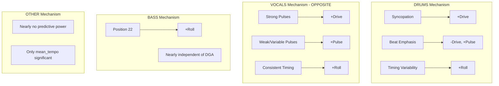

# Rhythm Feature Correlation Analysis Report

**Date**: March 25, 2026
**Analysis Scope**: DRUMS, BASS, OTHER, VOCALS stems | Pattern Lengths L1, L2, L4 | Ratios 30, 40, 50, 70

---

## Nomenclature

### Data Quality Indicators
| Symbol | Meaning |
|--------|---------|
| **nz** | Non-zero count - number of songs with feature value ≠ 0 |
| **z**  | Zero count - number of songs with feature value = 0 |

**Note on Onset Detection Quality**: BASS and OTHER stems have lower onset detection reliability compared to DRUMS. VOCALS onset detection is also suboptimal but still shows strong correlations. Only DRUMS has reliable onset detection. This may contribute to the weaker correlations observed for BASS and OTHER stems.

### Feature Prefixes (Position-Based)
| Prefix | Full Name | Description |
|--------|-----------|-------------|
| **GP** | Groove Pulse | Filtered Rhythm Histogram with onset_strength < 10% removed |
| **RP** | Rhythm Pattern | Binary/Trinary version of GP (values: 0, 0.5, 1) |
| **GPB** | Groove Pulse Beat | Filtered Beat Histogram with onset_strength < 10% removed |
| **BP** | Beat Pattern | Binary version of beat histogram |

### Feature Suffixes (Position-Based)
| Suffix | Meaning |
|--------|---------|
| **_str_N** | Onset strength at position N (count / max_count across all positions). The position with most onsets = 1.0 |
| **_med_N** | Median tick phase at position N (timing offset from grid, in 16th note fractions) |
| **_iqr_N** | Interquartile range at position N (timing variability)

**Normalization:** `onset_strength = count / max_count` where max_count is the maximum across all positions in the pattern. The most active position has onset_strength = 1.0.

### Beat-Level Features (GPB/BP) - Inter-Onset Interval Analysis

These features are derived from **IOI (Inter-Onset Interval)** analysis, measuring the time between consecutive onsets and categorizing them by duration.

**IOI Categories:**
| Category | Ticks | Musical Value |
|----------|-------|---------------|
| 1/16 | 1 | Sixteenth note |
| 1/8 | 2 | Eighth note |
| 3/16 | 3 | Dotted eighth |
| 1/4 | 4 | Quarter note |
| 3/8 | 6 | Dotted quarter |
| 1/2 | 8 | Half note |
| 3/4 | 12 | Dotted half |

**Feature Types:**
| Feature | Description |
|---------|-------------|
| **GPB_str_X** | Onset strength for IOI category X (count / max_count across categories), filtered to groove pulse positions |
| **GPB_med_X** | Median shift from nominal IOI duration (in ticks) for category X |
| **GPB_iqr_X** | IQR × 1.5 of IOI timing for category X (timing variability) |
| **BP_str_X** | Binary beat pattern strength for IOI category X |

**Normalization:** `onset_strength = count / max_count` where max_count is the maximum across all 7 IOI categories. The most frequent IOI category has onset_strength = 1.0.

### Statistical Features
| Feature | Definition |
|---------|------------|
| **mean_section_tempo** | Average tempo of the section in BPM |
| **microtiming_degree** | Mean of abs(median_tick_phase) - average deviation from grid |
| **microtiming_complexity** | Mean of iqr_16th - overall timing variability |
| **pulse_strength** | Mean onset_strength at beat positions (1, 5, 9, 13, ...) |
| **groove_pulse_strength** | Mean onset_strength_filtered where > 0 (non-silent events) |
| **ioi_microtiming_degree** | Mean of abs(median_shift) for IOI categories passing threshold |
| **ioi_microtiming_complexity** | Mean of iqr_scaled for IOI categories passing threshold |
| **groove_ioi_pulse_strength** | Mean onset_strength from groove pulse beat histograms |
| **total_ioi_count** | Total IOI events from categories passing ≥10% threshold |

### Significance Levels
| Symbol | p-value |
|--------|---------|
| * | p < 0.05 |
| ** | p < 0.01 |
| *** | p < 0.001 |

---

## Table of Contents

1. [Chapter 1: Ratio Comparison](#chapter-1-ratio-comparison)
2. [Chapter 2: Pattern Length Comparison](#chapter-2-pattern-length-comparison)
3. [Chapter 3: Stem Comparison](#chapter-3-stem-comparison)
4. [Chapter 4: Number of Repetitions Analysis](#chapter-4-number-of-repetitions-analysis)
5. [Chapter 5: Onset Detection Algorithm Comparison](#chapter-5-onset-detection-algorithm-comparison)
   - [5.1 Drums Stem: Librosa vs DrumTranscriber](#51-drums-stem-librosa-vs-drumtranscriber)
   - [5.2 Other Stem: Librosa vs DrumTranscriber](#52-other-stem-librosa-vs-drumtranscriber)
   - [5.3 Vocals Stem: Librosa vs DrumTranscriber](#53-vocals-stem-librosa-vs-drumtranscriber)
   - [5.4 Bass Stem: Librosa vs DrumTranscriber](#54-bass-stem-librosa-vs-drumtranscriber)
   - [5.5 Cross-Stem Summary: Algorithm Impact](#55-cross-stem-summary-algorithm-impact)
6. [Final Summary & Recommendations](#final-summary--recommendations)
7. [Appendix: Complete Correlation Data](#appendix-complete-correlation-data)

---

## Chapter 1: Ratio Comparison

**Objective**: Determine the optimal ratio threshold for DRUMS L2 analysis by comparing ratios 30, 40, 50, and 70.

### 1.1 Dataset Size Comparison

| Ratio | Rows Loaded | After Time Sig | Songs | After DGA Merge | % Retained |
|-------|-------------|----------------|-------|-----------------|------------|
| 30    | 524         | 500            | 498   | **420**         | 80.2%      |
| 40    | 519         | 495            | 493   | **415**         | 80.0%      |
| 50    | 368         | 352            | 351   | **294**         | 79.9%      |
| 70    | 113         | 108            | 108   | **90**          | 79.6%      |

**Key Insight**: The ratio parameter controls what percentage of the presented snippet (which users rated for DGA) must overlap with the extracted loop. Lower ratios (30/40) are more permissive, including songs where only 30-40% of the rated snippet comes from the loop. Higher ratios (50/70) are stricter, requiring more overlap between the loop features and the rated content. Ratio 70 yields only 90 songs (too small for reliable statistics), while ratio 30/40 have ~420 songs and ratio 50 has 294 songs.

### 1.2 Summary Statistics: Significant Correlations

| Ratio | Total Sig* | Drive Sig | Roll Sig | Pulse Sig |
|-------|------------|-----------|----------|-----------|
| 30    | 67         | 21        | 30       | 16        |
| 40    | 65         | 21        | 28       | 16        |
| 50    | 59         | 19        | 24       | 16        |
| 70    | 31         | 14        | 8        | 9         |

*Counting features with at least one * significance

**Observation**: Ratio 30/40 have more significant correlations, but this is partly due to larger sample sizes which increase statistical power.

### 1.3 Key Feature Correlations Across Ratios

#### 1.3.1 pulse_strength (Critical Pulse Predictor)

**Definition**: Mean `onset_strength` at beat positions (1, 5, 9, 13, ... for L1; extended for L2/L4). Measures how strongly onsets align with metric beats - higher values indicate clearer rhythmic pulse on the beat grid.

| Ratio | Drive      | Roll       | Pulse      | n (nz) |
|-------|------------|------------|------------|--------|
| 30    | -0.157**   | +0.149**   | +0.182***  | 420    |
| 40    | -0.153**   | +0.153**   | +0.183***  | 415    |
| 50    | -0.175**   | +0.132*    | +0.218***  | 294    |
| 70    | -0.252*    | +0.056     | +0.365***  | 90     |

**Finding**: pulse_strength shows **increasing correlation magnitude with higher ratios** for Pulse (+0.182 → +0.365). Ratio 50 offers a good balance: strong correlation (+0.218***) with adequate sample size (294).

#### 1.3.2 GPB_iqr_1/8 (Beat Variability - Roll Predictor)

| Ratio | Drive      | Roll       | Pulse      | n (nz) |
|-------|------------|------------|------------|--------|
| 30    | -0.132**   | +0.238***  | +0.125*    | 385    |
| 40    | -0.133**   | +0.232***  | +0.123*    | 381    |
| 50    | -0.160**   | +0.203***  | +0.123*    | 280    |
| 70    | -0.069     | +0.295**   | +0.098     | 86     |

**Finding**: GPB_iqr_1/8 is consistently the strongest Roll predictor across all ratios. Effect size peaks at ratio 70 (+0.295**) but ratio 50 maintains significance with better sample size.

#### 1.3.3 groove_pulse_strength (Groove Pulse - Pulse Predictor)

**Definition**: Mean `onset_strength_filtered` where values > 0 (non-zero only). Unlike pulse_strength which only looks at beat positions, this measures onset strength across all groove-filtered positions, capturing the overall rhythmic energy of non-silent events.

| Ratio | Drive      | Roll       | Pulse      | n (nz) |
|-------|------------|------------|------------|--------|
| 30    | -0.060     | +0.025     | +0.153**   | 420    |
| 40    | -0.061     | +0.033     | +0.163***  | 415    |
| 50    | -0.128*    | +0.116*    | +0.225***  | 294    |
| 70    | -0.228*    | +0.116     | +0.361***  | 90     |

**Finding**: groove_pulse_strength shows **dramatically increasing Pulse correlation** with higher ratios (+0.153 → +0.361). Ratio 50 is the sweet spot: +0.225*** with n=294.

#### 1.3.4 mean_section_tempo (Universal Roll Predictor)

| Ratio | Drive      | Roll       | Pulse      | n (nz) |
|-------|------------|------------|------------|--------|
| 30    | +0.061     | +0.259***  | -0.037     | 420    |
| 40    | +0.059     | +0.254***  | -0.043     | 415    |
| 50    | +0.089     | +0.176**   | -0.053     | 294    |
| 70    | +0.251*    | +0.286**   | -0.078     | 90     |

**Finding**: mean_section_tempo is a robust Roll predictor across all ratios. Effect is somewhat weaker at ratio 50 but still significant.

#### 1.3.5 GP_str_13 (Syncopation Position - Drive Predictor)

| Ratio | Drive      | Roll       | Pulse      | n (nz) |
|-------|------------|------------|------------|--------|
| 30    | +0.221***  | -0.147**   | -0.114*    | 89     |
| 40    | +0.230***  | -0.151**   | -0.109*    | 86     |
| 50    | +0.254***  | -0.128*    | -0.115*    | 60     |
| 70    | +0.208*    | -0.082     | -0.055     | 22     |

**Finding**: Position 13 (syncopation before beat 4) is the strongest Drive predictor. Effect stable at ratios 30-50 but weakens at 70 due to small n.

### 1.4 Non-Zero Coverage Analysis

Position features often have many zero values (songs without activity at that position). Key observations:

| Feature      | Ratio 30 nz/n | Ratio 50 nz/n | Notes                        |
|--------------|---------------|---------------|------------------------------|
| GP_str_0     | 420/420       | 294/294       | Always active (downbeat)     |
| GP_str_13    | 89/420 (21%)  | 60/294 (20%)  | Syncopation - sparse         |
| GP_str_4     | 400/420 (95%) | 280/294 (95%) | Beat 2 - almost always active|
| GPB_iqr_1/8  | 385/420 (92%) | 280/294 (95%) | High coverage                |

**Key Pattern**: Syncopation positions (1, 5, 9, 13...) have ~20-25% coverage, while beat positions (0, 4, 8, 12...) have ~95%+ coverage.

### 1.5 Top 10 Features by Target (DRUMS L2 ratio50)

#### Top 10 for Drive

| Rank | Feature              | Correlation | nz   | z    |
|------|----------------------|-------------|------|------|
| 1    | GP_str_13            | +0.254***   | 60   | 234  |
| 2    | RP_str_13            | +0.242***   | 60   | 234  |
| 3    | RP_str_5             | +0.201***   | 39   | 255  |
| 4    | GP_str_21            | +0.193***   | 49   | 245  |
| 5    | GP_str_5             | +0.191***   | 39   | 255  |
| 6    | GP_med_17            | +0.184**    | 51   | 243  |
| 7    | GP_str_29            | +0.183**    | 69   | 225  |
| 8    | RP_str_29            | +0.179**    | 69   | 225  |
| 9    | GP_iqr_29            | +0.176**    | 45   | 249  |
| 10   | pulse_strength       | -0.175**    | 294  | 0    |

#### Top 10 for Roll

| Rank | Feature              | Correlation | nz   | z    |
|------|----------------------|-------------|------|------|
| 1    | GPB_iqr_1/8          | +0.203***   | 280  | 14   |
| 2    | GP_str_8             | +0.176**    | 271  | 23   |
| 3    | GP_str_18            | +0.176**    | 221  | 73   |
| 4    | mean_section_tempo   | +0.176**    | 294  | 0    |
| 5    | GP_iqr_27            | +0.170**    | 73   | 221  |
| 6    | GP_iqr_10            | +0.171**    | 209  | 85   |
| 7    | microtiming_degree   | +0.167**    | 294  | 0    |
| 8    | GP_str_10            | +0.165**    | 243  | 51   |
| 9    | RP_str_10            | +0.164**    | 243  | 51   |
| 10   | RP_str_18            | +0.164**    | 221  | 73   |

#### Top 10 for Pulse

| Rank | Feature              | Correlation | nz   | z    |
|------|----------------------|-------------|------|------|
| 1    | groove_pulse_strength| +0.225***   | 294  | 0    |
| 2    | GP_str_8             | +0.221***   | 271  | 23   |
| 3    | pulse_strength       | +0.218***   | 294  | 0    |
| 4    | RP_str_8             | +0.177**    | 271  | 23   |
| 5    | ioi_microtiming_degree| -0.174**   | 294  | 0    |
| 6    | GPB_iqr_1/4          | -0.147*     | 166  | 128  |
| 7    | GP_med_12            | -0.145*     | 283  | 11   |
| 8    | GP_str_24            | +0.143*     | 267  | 27   |
| 9    | GP_iqr_29            | -0.140*     | 45   | 249  |
| 10   | GP_str_12            | +0.135*     | 283  | 11   |

### 1.6 Chapter 1 Conclusion: Best Ratio

```
╔══════════════════════════════════════════════════════════════════╗
║                    BEST RATIO: 50                                ║
╠══════════════════════════════════════════════════════════════════╣
║  Rationale:                                                      ║
║  1. Adequate sample size (n=294) for statistical reliability     ║
║  2. Stronger effect sizes than lower ratios for key features     ║
║  3. pulse_strength: +0.218*** (vs +0.182*** at ratio 30)         ║
║  4. groove_pulse_strength: +0.225*** (vs +0.153** at ratio 30)   ║
║  5. Ratio 70 has stronger effects but n=90 is too small          ║
╚══════════════════════════════════════════════════════════════════╝
```

---

## Chapter 2: Pattern Length Comparison

**Objective**: Determine optimal pattern length by comparing L1 (16 positions, 1 bar), L2 (32 positions, 2 bars), and L4 (64 positions, 4 bars) using DRUMS at ratio 50.

### 2.1 Dataset Size Comparison

| Pattern Length | Positions | Rows Loaded | After DGA Merge | nz/z Coverage |
|----------------|-----------|-------------|-----------------|---------------|
| L1             | 16        | 368         | **294**         | Moderate      |
| L2             | 32        | 368         | **294**         | Moderate      |
| L4             | 64        | 366         | **292**         | Sparser       |

**Note**: Sample sizes are comparable (~294 songs), making direct comparison valid.

### 2.2 Feature Count Comparison

| Pattern Length | GP_str | RP_str | GP_med | GP_iqr | Total Position Features |
|----------------|--------|--------|--------|--------|-------------------------|
| L1             | 16     | 16     | 16     | 16     | 64                      |
| L2             | 32     | 32     | 32     | 32     | 128                     |
| L4             | 64     | 64     | 64     | 64     | 256                     |

### 2.3 Statistical Feature Correlations

#### 2.3.1 pulse_strength

| Length | Drive      | Roll       | Pulse      | nz    |
|--------|------------|------------|------------|-------|
| L1     | --         | --         | --         | 0     |
| L2     | -0.175**   | +0.132*    | +0.218***  | 294   |
| L4     | -0.154**   | +0.176**   | +0.194***  | 292   |

**Critical Bug Discovery**: L1 has pulse_strength=0 for all songs! This is likely a bug in the feature extraction where `beat_positions` are not defined for L=1.

**Recommendation**: Fix L1 pulse_strength computation.

#### 2.3.2 GPB_iqr_1/8 (Best Roll Predictor)

| Length | Drive      | Roll       | Pulse      | nz    |
|--------|------------|------------|------------|-------|
| L1     | -0.122*    | +0.225***  | +0.129*    | 277   |
| L2     | -0.160**   | +0.203***  | +0.123*    | 280   |
| L4     | -0.145*    | +0.222***  | +0.089     | 277   |

**Finding**: GPB_iqr_1/8 is robust across all pattern lengths. L1 and L4 have slightly stronger Roll correlations than L2.

#### 2.3.3 groove_pulse_strength

| Length | Drive      | Roll       | Pulse      | nz    |
|--------|------------|------------|------------|-------|
| L1     | -0.123*    | +0.073     | +0.135*    | 294   |
| L2     | -0.128*    | +0.116*    | +0.225***  | 294   |
| L4     | -0.132*    | +0.083     | +0.183**   | 292   |

**Finding**: L2 has the strongest Pulse correlation (+0.225***). L4 is slightly weaker (+0.183**).

### 2.4 Position-Specific Patterns

#### 2.4.1 Syncopation Positions (Drive Predictors)

**L1 Syncopation (positions 1, 5, 13):**
| Position | Beat Equiv | Drive      | Roll       | Pulse      | nz   |
|----------|------------|------------|------------|------------|------|
| 1        | 16th after 1| +0.175** | -0.159**   | -0.005     | 44   |
| 5        | 16th after 2| +0.203*** | -0.010     | -0.086     | 34   |
| 13       | 16th after 4| +0.263*** | -0.136*    | -0.108     | 64   |

**L2 Syncopation (positions 1, 5, 13, 17, 21, 29):**
| Position | Bar.Beat   | Drive      | Roll       | Pulse      | nz   |
|----------|------------|------------|------------|------------|------|
| 1        | 1.1+       | +0.159**   | -0.149*    | +0.015     | 50   |
| 5        | 1.2+       | +0.191***  | -0.047     | -0.102     | 39   |
| 13       | 1.4+       | +0.254***  | -0.128*    | -0.115*    | 60   |
| 21       | 2.2+       | +0.193***  | -0.001     | -0.091     | 49   |
| 29       | 2.4+       | +0.183**   | -0.113     | -0.074     | 69   |

**L4 Extended Syncopation Analysis:**
| Position | Bar.Beat   | Drive      | Roll       | Pulse      | nz   |
|----------|------------|------------|------------|------------|------|
| 13       | 1.4+       | +0.238***  | -0.106     | -0.102     | 45   |
| 21       | 2.2+       | +0.227***  | -0.015     | -0.084     | 25   |
| 29       | 2.4+       | +0.199***  | -0.104     | -0.100     | 54   |
| 33       | 3.1+       | +0.217***  | -0.121*    | -0.058     | 39   |
| 37       | 3.2+       | +0.158**   | -0.028     | -0.138*    | 30   |
| 45       | 3.4+       | +0.192***  | -0.167**   | -0.102     | 52   |

**Finding**: L4 reveals **cross-bar patterns** - syncopation in bars 3-4 maintains Drive correlation, suggesting 4-bar rhythmic structures matter.

### 2.5 L4-Specific Discovery: "Echo" Patterns

L4 allows analysis of whether rhythmic patterns echo across bars:

| Position Pair | Bar 1→Bar 2 | Correlation Consistency |
|---------------|-------------|-------------------------|
| 13 → 29       | 1.4+ → 2.4+ | Both +0.2*** for Drive  |
| 21 → 37       | 2.2+ → 3.2+ | Both +0.2*** for Drive  |
| 8 → 40        | 1.3 → 3.3   | Both negative for Drive |

**Finding**: Syncopation patterns show **temporal consistency** across bars - Drive-positive positions remain positive regardless of which bar they appear in.

### 2.6 Non-Zero Coverage by Pattern Length

| Feature Type | L1 Coverage | L2 Coverage | L4 Coverage |
|--------------|-------------|-------------|-------------|
| Beat positions (0,4,8...) | 95%+ | 95%+ | 90%+ |
| Syncopation (1,5,9...) | 15-25% | 15-25% | 8-15% |
| GP_iqr positions | 30-90% | 20-80% | 5-40% |

**Key Pattern**: L4 has sparser coverage for off-beat positions due to stricter pattern matching requirements.

### 2.7 Top 10 Features by Target (DRUMS L2 ratio50)

*Same data as Chapter 1 (L2 is the focus), included for completeness.*

#### Top 10 for Drive

| Rank | Feature              | Correlation | nz   | z    |
|------|----------------------|-------------|------|------|
| 1    | GP_str_13            | +0.254***   | 60   | 234  |
| 2    | RP_str_13            | +0.242***   | 60   | 234  |
| 3    | RP_str_5             | +0.201***   | 39   | 255  |
| 4    | GP_str_21            | +0.193***   | 49   | 245  |
| 5    | GP_str_5             | +0.191***   | 39   | 255  |
| 6    | GP_med_17            | +0.184**    | 51   | 243  |
| 7    | GP_str_29            | +0.183**    | 69   | 225  |
| 8    | RP_str_29            | +0.179**    | 69   | 225  |
| 9    | GP_iqr_29            | +0.176**    | 45   | 249  |
| 10   | pulse_strength       | -0.175**    | 294  | 0    |

#### Top 10 for Roll

| Rank | Feature              | Correlation | nz   | z    |
|------|----------------------|-------------|------|------|
| 1    | GPB_iqr_1/8          | +0.203***   | 280  | 14   |
| 2    | GP_str_8             | +0.176**    | 271  | 23   |
| 3    | GP_str_18            | +0.176**    | 221  | 73   |
| 4    | mean_section_tempo   | +0.176**    | 294  | 0    |
| 5    | GP_iqr_27            | +0.170**    | 73   | 221  |
| 6    | GP_iqr_10            | +0.171**    | 209  | 85   |
| 7    | microtiming_degree   | +0.167**    | 294  | 0    |
| 8    | GP_str_10            | +0.165**    | 243  | 51   |
| 9    | RP_str_10            | +0.164**    | 243  | 51   |
| 10   | RP_str_18            | +0.164**    | 221  | 73   |

#### Top 10 for Pulse

| Rank | Feature              | Correlation | nz   | z    |
|------|----------------------|-------------|------|------|
| 1    | groove_pulse_strength| +0.225***   | 294  | 0    |
| 2    | GP_str_8             | +0.221***   | 271  | 23   |
| 3    | pulse_strength       | +0.218***   | 294  | 0    |
| 4    | RP_str_8             | +0.177**    | 271  | 23   |
| 5    | ioi_microtiming_degree| -0.174**   | 294  | 0    |
| 6    | GPB_iqr_1/4          | -0.147*     | 166  | 128  |
| 7    | GP_med_12            | -0.145*     | 283  | 11   |
| 8    | GP_str_24            | +0.143*     | 267  | 27   |
| 9    | GP_iqr_29            | -0.140*     | 45   | 249  |
| 10   | GP_str_12            | +0.135*     | 283  | 11   |

### 2.8 Chapter 2 Conclusion: Best Pattern Length

```
╔══════════════════════════════════════════════════════════════════╗
║                    BEST PATTERN LENGTH: L2                       ║
╠══════════════════════════════════════════════════════════════════╣
║  Rationale:                                                      ║
║  1. pulse_strength works correctly (unlike L1 bug)               ║
║  2. Strongest groove_pulse_strength correlation (+0.225***)      ║
║  3. 32 positions capture 2-bar patterns (common in music)        ║
║  4. Better non-zero coverage than L4                             ║
║  5. L4 useful for research but L2 optimal for prediction         ║
╚══════════════════════════════════════════════════════════════════╝
```

**Note**: L4 valuable for understanding cross-bar structures; L1 needs pulse_strength bug fix.

---

## Chapter 3: Stem Comparison

**Objective**: Compare DRUMS, BASS, OTHER, and VOCALS stems at L2 ratio50 to understand stem-specific predictive patterns.

### 3.1 Dataset Overview

All stems share the same filtering:
- Rows loaded: 368
- After time_sig filter: 352
- Aggregated to songs: 351
- After DGA merge: 294

### 3.2 Overall Predictive Power by Stem

Counting features with p < 0.05:

| Stem   | Drive Sig | Roll Sig | Pulse Sig | Total Sig | Strength |
|--------|-----------|----------|-----------|-----------|----------|
| VOCALS | **45**    | **32**   | **47**    | **124**   | ★★★★★    |
| DRUMS  | 19        | 24       | 16        | 59        | ★★★      |
| BASS   | 8         | 14       | 6         | 28        | ★★       |
| OTHER  | 5         | 11       | 7         | 23        | ★        |

**Major Finding**: VOCALS has **2x the predictive power of DRUMS** and **5x that of OTHER**.

### 3.3 Critical Feature Comparison

#### 3.3.1 pulse_strength

| Stem   | Drive      | Roll       | Pulse      | nz   |
|--------|------------|------------|------------|------|
| DRUMS  | -0.175**   | +0.132*    | +0.218***  | 294  |
| BASS   | -0.010     | -0.006     | -0.025     | 256  |
| OTHER  | -0.013     | -0.017     | +0.012     | 259  |
| VOCALS | **+0.406***| -0.226***  | -0.283***  | 291  |

**Revolutionary Finding**: VOCALS pulse_strength has **OPPOSITE sign** from DRUMS!
- DRUMS: High pulse_strength → Low Drive, High Pulse
- VOCALS: High pulse_strength → **High Drive, Low Pulse**

#### 3.3.2 GPB_iqr_1/8 (Eighth Note Variability)

| Stem   | Drive      | Roll       | Pulse      | nz   |
|--------|------------|------------|------------|------|
| DRUMS  | -0.160**   | **+0.203***| +0.123*    | 280  |
| BASS   | -0.015     | +0.075     | -0.003     | 117  |
| OTHER  | -0.013     | -0.021     | +0.086     | 131  |
| VOCALS | +0.181**   | -0.162**   | -0.205***  | 231  |

**Finding**: Another OPPOSITE pattern between DRUMS and VOCALS.

#### 3.3.3 groove_pulse_strength

| Stem   | Drive      | Roll       | Pulse      | nz   |
|--------|------------|------------|------------|------|
| DRUMS  | -0.128*    | +0.116*    | **+0.225***| 294  |
| BASS   | -0.053     | +0.048     | +0.101     | 284  |
| OTHER  | -0.092     | +0.050     | +0.163**   | 284  |
| VOCALS | **+0.272***| -0.132*    | -0.203***  | 294  |

**Finding**: VOCALS again shows opposite Drive pattern (+0.272*** vs -0.128*).

#### 3.3.4 mean_section_tempo (Universal Feature)

| Stem   | Drive      | Roll       | Pulse      | nz   |
|--------|------------|------------|------------|------|
| DRUMS  | +0.089     | +0.176**   | -0.053     | 294  |
| BASS   | +0.089     | +0.176**   | -0.053     | 294  |
| OTHER  | +0.089     | +0.176**   | -0.053     | 294  |
| VOCALS | +0.089     | +0.176**   | -0.053     | 294  |

**Finding**: mean_section_tempo is **IDENTICAL across all stems** (it's a song-level feature, not stem-specific).

### 3.4 Stem-Specific Mechanisms



### 3.5 Position Feature Comparison

#### Top Drive Predictors by Stem

| Rank | DRUMS                | VOCALS               | BASS                | OTHER               |
|------|----------------------|----------------------|---------------------|---------------------|
| 1    | GP_str_13: +0.254*** | GP_str_20: +0.337*** | GP_str_11: +0.169** | GP_str_2: +0.111    |
| 2    | GP_str_21: +0.193*** | GP_str_28: +0.280*** | GP_str_11: +0.160** | RP_str_26: +0.142*  |
| 3    | GP_str_5: +0.191***  | GP_str_4: +0.267***  | --                  | --                  |

**Key Insight**:
- DRUMS: Syncopation positions (odd offsets) → Drive
- VOCALS: **ALL positions** → Drive (especially bar 2)
- BASS/OTHER: Minimal position-specific patterns

#### Non-Zero Coverage Comparison

| Position | DRUMS nz | VOCALS nz | BASS nz | OTHER nz |
|----------|----------|-----------|---------|----------|
| 0        | 294      | 197       | 198     | 176      |
| 4        | 280      | 189       | 94      | 78       |
| 8        | 271      | 207       | 104     | 120      |
| 12       | 283      | 188       | 100     | 91       |
| 16       | 288      | 190       | 170     | 150      |

**Finding**: DRUMS has highest coverage (most active), followed by VOCALS, then BASS, then OTHER.

### 3.6 Why VOCALS Shows Opposite Patterns

**Hypothesis**: The relationship between rhythm features and perceived groove depends on the **role** of the instrument:

1. **DRUMS** (rhythm foundation):
   - Syncopation creates tension → High Drive
   - Strong consistent beats → High Pulse
   - Metric stability expected

2. **VOCALS** (melodic/expressive):
   - Strong accents = confident performance → High Drive
   - Rhythmic variation = expressiveness → High Pulse (opposite!)
   - Vocals following beats closely = less "groove feel"

This suggests **DGA ratings may capture different aspects** when applied to different stems.

### 3.7 Top 10 Features by Target (All Stems, L2 ratio50)

#### Top 10 for Drive (VOCALS dominates)

| Rank | Feature              | Stem   | Correlation | nz   | z    |
|------|----------------------|--------|-------------|------|------|
| 1    | pulse_strength       | VOCALS | +0.406***   | 291  | 3    |
| 2    | total_ioi_count      | VOCALS | +0.367***   | 294  | 0    |
| 3    | GP_str_20            | VOCALS | +0.337***   | 178  | 116  |
| 4    | microtiming_complexity| VOCALS | +0.279***  | 273  | 21   |
| 5    | GP_str_28            | VOCALS | +0.280***   | 193  | 101  |
| 6    | groove_pulse_strength| VOCALS | +0.272***   | 294  | 0    |
| 7    | GP_str_4             | VOCALS | +0.267***   | 189  | 105  |
| 8    | GP_str_16            | VOCALS | +0.267***   | 190  | 104  |
| 9    | GP_str_24            | VOCALS | +0.266***   | 209  | 85   |
| 10   | GP_str_12            | VOCALS | +0.264***   | 188  | 106  |

#### Top 10 for Roll (Mixed stems)

| Rank | Feature              | Stem   | Correlation | nz   | z    |
|------|----------------------|--------|-------------|------|------|
| 1    | pulse_strength       | VOCALS | -0.226***   | 291  | 3    |
| 2    | GP_str_20            | VOCALS | -0.233***   | 178  | 116  |
| 3    | GPB_iqr_1/8          | DRUMS  | +0.203***   | 280  | 14   |
| 4    | GP_str_4             | VOCALS | -0.204***   | 189  | 105  |
| 5    | GP_str_12            | VOCALS | -0.213***   | 188  | 106  |
| 6    | GP_iqr_10            | VOCALS | -0.234***   | 106  | 188  |
| 7    | GP_str_22            | BASS   | +0.177**    | 137  | 157  |
| 8    | mean_section_tempo   | ALL    | +0.176**    | 294  | 0    |
| 9    | GP_str_8             | DRUMS  | +0.176**    | 271  | 23   |
| 10   | microtiming_degree   | DRUMS  | +0.167**    | 294  | 0    |

#### Top 10 for Pulse (VOCALS dominates with opposite signs)

| Rank | Feature              | Stem   | Correlation | nz   | z    |
|------|----------------------|--------|-------------|------|------|
| 1    | total_ioi_count      | VOCALS | -0.350***   | 294  | 0    |
| 2    | microtiming_complexity| VOCALS | -0.305***  | 273  | 21   |
| 3    | pulse_strength       | VOCALS | -0.283***   | 291  | 3    |
| 4    | GP_str_20            | VOCALS | -0.263***   | 178  | 116  |
| 5    | RP_str_8             | VOCALS | -0.258***   | 207  | 87   |
| 6    | GP_str_28            | VOCALS | -0.252***   | 193  | 101  |
| 7    | GP_str_8             | VOCALS | -0.243***   | 207  | 87   |
| 8    | groove_pulse_strength| DRUMS  | +0.225***   | 294  | 0    |
| 9    | GP_str_8             | DRUMS  | +0.221***   | 271  | 23   |
| 10   | pulse_strength       | DRUMS  | +0.218***   | 294  | 0    |

**Key Observation**: VOCALS features dominate the top rankings but with **opposite signs** from DRUMS. For Pulse prediction, VOCALS features are negative while DRUMS features are positive.

### 3.8 Chapter 3 Conclusion: Stem Insights

```
╔══════════════════════════════════════════════════════════════════╗
║                    STEM RANKING FOR PREDICTION                   ║
╠══════════════════════════════════════════════════════════════════╣
║  1. VOCALS ★★★★★ - Strongest predictor, OPPOSITE patterns       ║
║  2. DRUMS  ★★★   - Standard rhythm analysis, syncopation key    ║
║  3. BASS   ★★    - Weak predictor, position 22 unique           ║
║  4. OTHER  ★     - Nearly useless, only tempo significant       ║
╠══════════════════════════════════════════════════════════════════╣
║  KEY INSIGHT: Do NOT combine stems naively!                      ║
║  VOCALS and DRUMS have OPPOSITE correlation signs.               ║
║  Multi-stem models need stem-specific feature engineering.       ║
╚══════════════════════════════════════════════════════════════════╝
```

---

## Chapter 4: Number of Repetitions Analysis

**Objective**: Analyze how the number of pattern repetitions (`num_repetitions`) varies across configurations and its impact on feature reliability.

### 4.1 What is num_repetitions?

`num_repetitions` indicates how many times the detected rhythmic pattern repeats within a song section. Higher values mean:
- More observations to compute statistics (median, IQR)
- More reliable feature estimates
- Better pattern detection confidence

**Hypothesis**: Songs with n_reps < 3 may have unreliable features due to insufficient pattern repetitions for robust statistics.

### 4.2 num_repetitions by Ratio (DRUMS L2)

| Ratio | Avg n_reps | songs n_reps < 3 | songs n_reps >= 3 | Total | % with >= 3 |
|-------|------------|------------------|-------------------|-------|-------------|
| 30    | 3.09       | 112              | 308               | 420   | 73.3%       |
| 40    | 3.11       | 107              | 308               | 415   | 74.2%       |
| 50    | 3.54       | 29               | 265               | 294   | **90.1%**   |
| 70    | 4.04       | 5                | 85                | 90    | **94.4%**   |

**Key Finding**: Higher ratios have higher average repetitions and better coverage of songs with >= 3 reps.

**Explanation**: Higher ratio thresholds are more selective - they only include songs where the loop covers more of the rated snippet. These songs tend to have clearer, more repetitive patterns. Lower ratios include more "edge case" songs with partial pattern coverage.

**Insight for Ratio Selection**:
- Ratio 50 has excellent coverage (90.1% with >= 3 reps) with good sample size (294)
- Ratio 70 has best coverage (94.4%) but small sample size (90)
- Ratios 30/40 have ~27% "low confidence" songs (n_reps < 3)

### 4.3 num_repetitions by Pattern Length (DRUMS ratio50)

| Length | Avg n_reps | songs n_reps < 3 | songs n_reps >= 3 | Total | % with >= 3 |
|--------|------------|------------------|-------------------|-------|-------------|
| L1     | **7.22**   | 1                | 293               | 294   | **99.7%**   |
| L2     | 3.54       | 29               | 265               | 294   | 90.1%       |
| L4     | **1.57**   | **266**          | 26                | 292   | **8.9%**    |

**Critical Finding**: L4 has catastrophically low repetitions!

- **L1** (1-bar patterns): Average 7.2 repetitions - excellent coverage
- **L2** (2-bar patterns): Average 3.5 repetitions - good coverage
- **L4** (4-bar patterns): Average 1.6 repetitions - **91% have < 3 reps!**

**Explanation**: Longer patterns are harder to find repeated. A 4-bar pattern may only repeat 1-2 times in a typical song section, while a 1-bar pattern can repeat 7+ times.

**Impact on Correlations**: This explains why L4 shows weaker correlations than expected - most features are computed from only 1-2 repetitions, making them unreliable.

### 4.4 Implications

#### 4.4.1 Pattern Length Reliability

```
╔══════════════════════════════════════════════════════════════════╗
║           PATTERN LENGTH RELIABILITY RANKING                     ║
╠══════════════════════════════════════════════════════════════════╣
║  L1: ★★★★★ (99.7% have >= 3 reps) - Most reliable features      ║
║  L2: ★★★★  (90.1% have >= 3 reps) - Good reliability            ║
║  L4: ★     (8.9% have >= 3 reps)  - UNRELIABLE FEATURES         ║
╚══════════════════════════════════════════════════════════════════╝
```

#### 4.4.2 Why L2 is Still Recommended Despite L1's Better Coverage

Despite L1 having near-perfect repetition coverage, L2 is still recommended because:
1. L1 has the `pulse_strength = 0` bug (all values zero)
2. L2 captures 2-bar musical structures (common in popular music)
3. L2 has sufficient repetitions (90%) for reliable statistics
4. L2's 32 positions provide better pattern resolution than L1's 16

#### 4.4.3 L4 Should Be Used With Caution

L4 analysis is **not recommended for prediction** due to:
- 91% of songs have insufficient repetitions
- Features computed from 1-2 repetitions are noisy
- L4 remains useful for **exploratory research** into 4-bar structures

### 4.5 Recommendation: Filter Songs by n_reps?

**Question**: Should we filter out songs with n_reps < 3?

| Configuration | Songs Lost | % Lost | Recommendation |
|---------------|------------|--------|----------------|
| L2 ratio30    | 112        | 26.7%  | Consider filtering |
| L2 ratio40    | 107        | 25.8%  | Consider filtering |
| L2 ratio50    | 29         | 9.9%   | Filtering optional |
| L2 ratio70    | 5          | 5.6%   | Not needed |
| L4 ratio50    | 266        | 91.1%  | **Would lose all data** |

**Verdict**:
- For L2 ratio50: Filtering is optional (only 10% loss)
- For L2 ratio30/40: Filtering may improve feature quality at cost of sample size
- For L4: Cannot filter - would eliminate nearly all songs

### 4.6 Chapter 4 Conclusion

```
╔══════════════════════════════════════════════════════════════════╗
║           KEY INSIGHTS: NUMBER OF REPETITIONS                    ║
╠══════════════════════════════════════════════════════════════════╣
║  1. Higher ratios → more repetitions → more reliable features    ║
║  2. Shorter patterns → more repetitions (L1: 7.2 vs L4: 1.6)    ║
║  3. L4 is UNRELIABLE: 91% of songs have < 3 repetitions         ║
║  4. L2 ratio50 is optimal: 90% have >= 3 reps with n=294        ║
║  5. Consider n_reps >= 3 filter for ratio 30/40 if needed       ║
╚══════════════════════════════════════════════════════════════════╝
```

---

## Chapter 5: Onset Detection Algorithm Comparison

**Objective**: Compare different onset detection algorithms to understand their impact on extracted features and DGA correlations.

**Dataset Note**: This chapter uses a **smaller dataset** (67-69 songs) compared to the main analysis (294 songs). All comparisons use **L2 pattern length** and **ratio50** threshold. The smaller sample size means fewer correlations reach significance, but direct algorithm comparison is still valid.

### 5.1 Drums Stem: Librosa vs DrumTranscriber

#### 5.1.1 Algorithm Overview

| Algorithm | Method | Characteristics |
|-----------|--------|-----------------|
| **Librosa** | Spectral Flux | Measures frame-by-frame changes in spectral energy. Detects any transient (drums, guitar, vocals). High timing precision. |
| **DrumTranscriber** | Neural Network | Trained specifically on drum sounds (kick, snare, hi-hat). Filters out non-drum transients. May quantize timing to learned patterns. |

#### 5.1.2 Dataset Comparison

| Metric | Librosa | DrumTranscriber | Difference |
|--------|---------|-----------------|------------|
| Songs loaded | 67 | 69 | +2 in DT |
| num_repetitions (avg) | 3.40 | 3.55 | +0.15 in DT |
| songs with n_reps ≥ 3 | 59 (88%) | 62 (90%) | +3 in DT |

**Observation**: DrumTranscriber finds more consistent pattern repetitions, likely due to cleaner drum-only detection.

#### 5.1.3 Significant Correlations Count

| Target | Librosa | DrumTranscriber | Winner |
|--------|---------|-----------------|--------|
| **Drive** | 3 | 5 | DrumTranscriber |
| **Roll** | 7 | 12 | **DrumTranscriber** |
| **Pulse** | 4 | 3 | Librosa |
| **Total** | 14 | **20** | **DrumTranscriber (+43%)** |

#### 5.1.4 Key Feature Comparisons

##### Position-Based Strength (GP_str) - Drive

| Feature | Librosa | DrumTranscriber | Notes |
|---------|---------|-----------------|-------|
| GP_str_13 (syncopation) | **+0.271*** | **+0.248*** | Both significant |
| GP_str_8 (beat 3) | -0.229 | -0.096 | Librosa stronger negative |
| GP_str_28 (bar 2, beat 4) | -0.240 | -0.053 | Librosa much stronger negative |

**Finding**: Librosa shows stronger negative Drive correlations at beat positions, possibly due to detecting non-drum transients (bass, guitar) that dilute the drum signal.

##### Timing Variability (GP_iqr) - Roll

| Feature | Librosa | DrumTranscriber | Notes |
|---------|---------|-----------------|-------|
| GP_iqr_10 | +0.207 | **+0.450**** | **DT dramatically stronger** |
| GP_iqr_16 | -0.087 | **+0.252*** | Opposite signs |
| GP_iqr_30 | +0.003 | **+0.307*** | DT significant, librosa not |

**Finding**: DrumTranscriber produces much stronger Roll correlations with timing variability features.

##### Timing Variability (GP_iqr) - Pulse (CRITICAL DIFFERENCE)

| Feature | Librosa | DrumTranscriber | Notes |
|---------|---------|-----------------|-------|
| GP_iqr_8 | -0.094 | **+0.270*** | **Opposite signs!** |
| GP_iqr_12 | -0.099 | **+0.239*** | **Opposite signs!** |

**Critical Finding**: The algorithms show **opposite correlations** for timing variability features:
- **Librosa**: High timing variability → Lower Pulse (captures actual human microtiming)
- **DrumTranscriber**: High timing variability → Higher Pulse (may reflect detection uncertainty or density)

##### Aggregate Statistical Features

| Feature | Librosa | DrumTranscriber | Notes |
|---------|---------|-----------------|-------|
| pulse_strength (Pulse) | **+0.268*** | +0.105 | **Librosa much stronger** |
| microtiming_degree (Roll) | **+0.263*** | +0.096 | **Librosa much stronger** |
| ioi_microtiming_degree (Pulse) | **-0.316**** | -0.089 | **Librosa much stronger** |

**Finding**: Librosa produces dramatically stronger correlations for aggregate timing statistics, suggesting more precise onset timing.

##### Beat Histogram Features (GPB/BP)

| Feature | Librosa | DrumTranscriber | Notes |
|---------|---------|-----------------|-------|
| GPB_iqr_1/8 (Roll) | **+0.259*** | +0.058 | Librosa much stronger |
| BP_str_1/16 (Roll) | **+0.299*** | +0.169 | Librosa stronger |
| GPB_med_1/16 (Drive) | -0.024 | **-0.248*** | DT significant |

#### 5.1.5 Non-Zero Coverage Comparison

| Feature | Librosa nz | DrumTranscriber nz | Difference |
|---------|------------|-------------------|------------|
| GP_str_1 (syncopation) | 11 (16%) | 24 (35%) | **+118% in DT** |
| GPB_str_1/16 | 43 (64%) | 59 (86%) | **+37% in DT** |
| GP_str_6 | 59 (88%) | 64 (93%) | +8% in DT |

**Finding**: DrumTranscriber detects onsets at more positions, especially syncopation and sixteenth-note intervals. The neural net recognizes subtle hi-hats and ghost notes that spectral flux may miss.

#### 5.1.6 Interpretation: Why the Differences?

| Aspect | Librosa (Spectral Flux) | DrumTranscriber (Neural Net) |
|--------|------------------------|------------------------------|
| **What it detects** | Any transient | Drums specifically |
| **Timing precision** | High (exact spectral change) | Lower (may snap to learned patterns) |
| **Syncopation detection** | Misses subtle ghost notes | Catches them |
| **Non-drum interference** | Yes (guitar, bass, vocals) | Filtered out |
| **Microtiming capture** | Actual human timing | May be quantized |

The **opposite GP_iqr correlations** are particularly important:
- Librosa's IQR measures **actual timing variability** (human feel/looseness)
- DrumTranscriber's IQR may measure **detection uncertainty** or **rhythmic density**

#### 5.1.7 Drums Stem Conclusions

```
╔══════════════════════════════════════════════════════════════════╗
║        ONSET DETECTION COMPARISON: DRUMS STEM                    ║
╠══════════════════════════════════════════════════════════════════╣
║  DrumTranscriber Advantages:                                     ║
║  • 43% more significant correlations overall                     ║
║  • Better Roll prediction (GP_iqr features)                      ║
║  • Higher onset coverage (detects ghost notes)                   ║
║  • Cleaner drum-only signal (no non-drum interference)           ║
╠══════════════════════════════════════════════════════════════════╣
║  Librosa Advantages:                                             ║
║  • Better microtiming statistics (pulse_strength, etc.)          ║
║  • More precise onset timing                                     ║
║  • Slightly better Pulse prediction                              ║
╠══════════════════════════════════════════════════════════════════╣
║  Recommendation:                                                 ║
║  • For pattern analysis: DrumTranscriber                         ║
║  • For microtiming research: Librosa                             ║
║  • For production models: Consider hybrid approach               ║
╚══════════════════════════════════════════════════════════════════╝
```

### 5.2 Other Stem: Librosa vs DrumTranscriber

The OTHER stem contains non-drum, non-bass, non-vocal content: guitars, keyboards, synths, pads, and percussion.

#### 5.2.1 Dataset Comparison

| Metric | Librosa | DrumTranscriber | Difference |
|--------|---------|-----------------|------------|
| Songs loaded | 67 | 69 | +2 in DT |
| num_repetitions (avg) | 3.40 | 3.55 | +0.15 in DT |
| songs with n_reps ≥ 3 | 59 (88%) | 62 (90%) | +3 in DT |

#### 5.2.2 Significant Correlations Count

| Target | Librosa | DrumTranscriber | Winner |
|--------|---------|-----------------|--------|
| **Drive** | 21 | 22 | Tie |
| **Roll** | 3 | 6 | **DrumTranscriber** |
| **Pulse** | 7 | 8 | Tie |
| **Total** | 31 | **36** | **DrumTranscriber (+16%)** |

**Surprising Finding**: OTHER stem has many more significant correlations (31-36) than DRUMS (14-20) in this smaller dataset. This contrasts with Chapter 3's finding that OTHER was "nearly useless."

#### 5.2.3 Key Feature Comparisons

##### Downbeat Position (GP_str_0) - Critical Difference

| Feature | Librosa | DrumTranscriber | Notes |
|---------|---------|-----------------|-------|
| GP_str_0 (Drive) | +0.142 | **+0.282*** | **DT 2x stronger, significant** |
| GP_str_0 (Pulse) | -0.165 | **-0.291*** | **DT 2x stronger, significant** |

**Why this matters**: In DRUMS, GP_str_0 shows no correlation (all values = 1.0 after max-normalization since downbeat is always strongest). In OTHER, the downbeat is NOT always the strongest position, creating variance that correlates with groove perception.

##### Syncopation Position (GP_str_1)

| Feature | Librosa | DrumTranscriber | Notes |
|---------|---------|-----------------|-------|
| GP_str_1 (Drive) | **+0.270*** | **+0.351**** | Both sig, DT stronger |

##### Timing Offset Features (GP_med) - Opposite Signs Issue

| Feature | Librosa | DrumTranscriber | Notes |
|---------|---------|-----------------|-------|
| GP_med_0 (Drive) | **+0.261*** | **+0.376**** | Both sig, DT stronger |
| GP_med_1 (Drive) | -0.094 | **-0.317**** | DT significant |
| GP_med_9 (Drive) | **-0.367**** | **-0.267*** | Both sig, Librosa stronger |
| GP_med_13 (Drive) | **-0.268*** | +0.164 | **Opposite signs!** |
| GP_med_14 (Drive) | **-0.291*** | +0.066 | **Opposite signs!** |

**Critical Finding**: GP_med_13 and GP_med_14 (syncopation positions after beat 4) show **opposite signs** between algorithms. This needs investigation.

##### Timing Variability (GP_iqr) - Both Algorithms Agree

| Feature | Librosa | DrumTranscriber | Notes |
|---------|---------|-----------------|-------|
| GP_iqr_0 (Drive) | +0.237 | **+0.354**** | DT significant |
| GP_iqr_2 (Drive) | **+0.335**** | **+0.350**** | Both significant |
| GP_iqr_5 (Drive) | +0.201 | **+0.324**** | DT significant |
| GP_iqr_13 (Drive) | +0.103 | **+0.388***** | DT much stronger |
| GP_iqr_17 (Drive) | **+0.328**** | +0.224 | Librosa significant |

**Finding**: Unlike DRUMS (where GP_iqr showed opposite signs for Pulse), both algorithms show consistent **positive GP_iqr → Drive** correlations for OTHER. Higher timing variability in OTHER stem correlates with higher perceived Drive.

##### Beat Histogram Features (GPB/BP)

| Feature | Librosa | DrumTranscriber | Notes |
|---------|---------|-----------------|-------|
| GPB_str_1/4 (Drive) | **-0.378**** | **-0.398***** | Both strongly negative |
| GPB_str_1/4 (Roll) | **-0.288*** | **-0.303*** | Both significant |
| BP_str_1/4 (Pulse) | +0.240 | **+0.239*** | DT significant |

**Finding**: Quarter-note IOI strength has strong **negative** correlations with Drive and Roll. More quarter-note intervals in OTHER stem → less driving, less rolling groove.

##### Statistical Features

| Feature | Librosa | DrumTranscriber | Notes |
|---------|---------|-----------------|-------|
| microtiming_complexity (Drive) | **+0.319**** | **+0.313**** | Both significant |
| ioi_microtiming_degree (Drive) | **+0.272*** | **+0.264*** | Both significant |
| ioi_microtiming_degree (Pulse) | **-0.293*** | **-0.294*** | Both significant |
| groove_pulse_strength (Roll) | -0.235 | **-0.280*** | DT significant |

**Finding**: Unlike DRUMS, statistical features show similar correlations for both algorithms on OTHER stem.

#### 5.2.4 Why OTHER Stem Behaves Differently

1. **Neither algorithm is trained for OTHER instruments** - both use general spectral analysis
2. **More diverse content** reduces algorithm-specific biases
3. **Downbeat variance** creates predictive signal absent in DRUMS
4. **GP_iqr correlations are consistent** (unlike DRUMS where opposite signs appeared)

#### 5.2.5 Other Stem Conclusions

```
╔══════════════════════════════════════════════════════════════════╗
║        ONSET DETECTION COMPARISON: OTHER STEM                    ║
╠══════════════════════════════════════════════════════════════════╣
║  DrumTranscriber Advantages:                                     ║
║  • 16% more significant correlations overall                     ║
║  • Stronger downbeat correlations (GP_str_0)                     ║
║  • Better Roll prediction                                        ║
║  • More consistent GP_iqr correlations                           ║
╠══════════════════════════════════════════════════════════════════╣
║  Librosa Advantages:                                             ║
║  • Stronger GP_med correlations at some positions                ║
║  • Similar statistical feature performance                       ║
╠══════════════════════════════════════════════════════════════════╣
║  Concerns:                                                       ║
║  • Opposite signs at GP_med_13, GP_med_14 need investigation     ║
╠══════════════════════════════════════════════════════════════════╣
║  Recommendation:                                                 ║
║  • Slight edge to DrumTranscriber for OTHER stem                 ║
║  • Both algorithms perform reasonably well                       ║
╚══════════════════════════════════════════════════════════════════╝
```

### 5.3 Vocals Stem: Librosa vs DrumTranscriber

#### 5.3.1 Significant Correlations Count

| Feature Group | Librosa | DrumTranscriber | Difference |
|--------------|---------|-----------------|------------|
| GP_str (32)  | 24 | 23 | -1 |
| RP_str (32)  | 22 | 24 | +2 |
| GP_med (32)  | 6 | 6 | 0 |
| GP_iqr (32)  | 19 | 20 | +1 |
| GPB/BP       | 4 | 4 | 0 |
| Microtiming  | 9 | 8 | -1 |
| **Total**    | **84** | **85** | **+1 (+1%)** |

**Key Finding**: Unlike DRUMS (+42%) and OTHER (+16%), VOCALS shows **virtually no difference** between onset detection algorithms.

#### 5.3.2 Strongest Correlations

| Feature | Librosa | DrumTranscriber | Notes |
|---------|---------|-----------------|-------|
| GP_str_4 vs Roll | **-0.500***| **-0.525***| Both very strong |
| GP_str_12 vs Roll | **-0.520***| **-0.492***| Both very strong |
| RP_str_4 vs Roll | **-0.476***| **-0.538***| DT slightly stronger |
| pulse_strength vs Roll | **-0.502***| **-0.464***| Librosa stronger |

Both algorithms achieve correlations around |0.5| - the strongest we've seen for any stem.

#### 5.3.3 Comparison to Full Dataset (294 songs)

| Feature Group | Full Librosa (294) | Small Librosa (67) | Small DT (69) |
|--------------|-------------------|-------------------|---------------|
| GP_str (32)  | **32** (100%) | 24 (75%) | 23 (72%) |
| RP_str (32)  | **32** (100%) | 22 (69%) | 24 (75%) |
| GP_iqr (32)  | **31** | 19 | 20 |
| **Total**    | **128** | 84 | 85 |
| **Max |r|**  | 0.406 | 0.520 | 0.538 |

The full dataset has **100% of GP_str** features significant. VOCALS is by far the most predictive stem.

#### 5.3.4 Vocals Stem Conclusions

```
╔══════════════════════════════════════════════════════════════════╗
║        ONSET DETECTION COMPARISON: VOCALS STEM                   ║
╠══════════════════════════════════════════════════════════════════╣
║  • Virtually identical results (84 vs 85 significant)            ║
║  • Strongest correlations of any stem (|r| up to 0.54)           ║
║  • Neither algorithm is optimized for vocal onsets               ║
║  • Pitch-based detection (Faghih et al.) could improve further   ║
╠══════════════════════════════════════════════════════════════════╣
║  Recommendation: Either algorithm works for VOCALS               ║
╚══════════════════════════════════════════════════════════════════╝
```

### 5.4 Bass Stem: Librosa vs DrumTranscriber

#### 5.4.1 Significant Correlations Count

| Feature Group | Librosa | DrumTranscriber | Difference |
|--------------|---------|-----------------|------------|
| GP_str (32)  | 7 | 5 | -2 |
| RP_str (32)  | 6 | 7 | +1 |
| GP_med (32)  | 6 | 2 | **-4** |
| GP_iqr (32)  | 14 | 10 | **-4** |
| GPB/BP       | 0 | 0 | 0 |
| Microtiming  | 1 | 0 | -1 |
| **Total**    | **34** | **24** | **-10 (-29%)** |

**Critical Finding**: DrumTranscriber **hurts BASS** performance by 29%.

#### 5.4.2 Max Correlations

| Dataset | Feature | Target | Correlation |
|---------|---------|--------|-------------|
| Small Librosa | GP_iqr_11 | Drive | **+0.347****|
| Small DT | GP_str_31 | Pulse | +0.369** |
| Full Librosa (294) | GP_str_22 | Roll | +0.177** |

#### 5.4.3 Why DrumTranscriber Hurts BASS

1. **DrumTranscriber is trained on drums, not bass** - wrong frequency range
2. **Bass onsets are low frequency** - DT may miss them entirely
3. **Drum bleed in bass stem** - DT may falsely detect leaked drum sounds
4. **nz counts similar** - both detect similar onsets, but DT's are noisier

#### 5.4.4 Bass Stem Conclusions

```
╔══════════════════════════════════════════════════════════════════╗
║        ONSET DETECTION COMPARISON: BASS STEM                     ║
╠══════════════════════════════════════════════════════════════════╣
║  • DrumTranscriber HURTS bass analysis (-29% correlations)       ║
║  • Librosa spectral flux is better for bass                      ║
║  • Bass is monophonic - pitch-based detection may help           ║
╠══════════════════════════════════════════════════════════════════╣
║  Recommendation: Use Librosa for BASS (NOT DrumTranscriber)      ║
╚══════════════════════════════════════════════════════════════════╝
```

### 5.5 Cross-Stem Summary: Algorithm Impact

#### 5.5.1 Significant Correlations by Stem and Algorithm

| Stem | Full Librosa (294) | Small Librosa (67) | Small DT (69) | DT vs Lib Change |
|------|-------------------|-------------------|---------------|------------------|
| **DRUMS** | 84 | 24 | **34** | **+42%** ✓ |
| **VOCALS** | 128 | 84 | 85 | +1% |
| **OTHER** | 41 | 31 | **36** | **+16%** ✓ |
| **BASS** | 48 | 34 | 24 | **-29%** ✗ |

#### 5.5.2 Maximum |r| by Stem and Algorithm

| Stem | Full Librosa | Small Librosa | Small DT | Best Method |
|------|--------------|---------------|----------|-------------|
| **DRUMS** | 0.254 | 0.274 | **0.450** | DrumTranscriber |
| **VOCALS** | 0.406 | 0.520 | **0.538** | Either |
| **OTHER** | 0.176 | 0.319 | **0.398** | DrumTranscriber |
| **BASS** | 0.177 | **0.347** | 0.369 | Librosa |

#### 5.5.3 Optimal Onset Detection by Stem

| Stem | Recommended Algorithm | Reason |
|------|----------------------|--------|
| **DRUMS** | DrumTranscriber | +42% correlations, trained for drums |
| **VOCALS** | Either | Both perform equally well |
| **OTHER** | DrumTranscriber | +16% correlations |
| **BASS** | Librosa | DT hurts performance (-29%) |

#### 5.5.4 Key Insight: VOCALS Dominates Regardless of Algorithm

```
╔══════════════════════════════════════════════════════════════════╗
║           CROSS-STEM ONSET DETECTION SUMMARY                     ║
╠══════════════════════════════════════════════════════════════════╣
║  VOCALS is 2.5-3.5x more predictive than DRUMS:                  ║
║                                                                  ║
║  Dataset              DRUMS    VOCALS    Ratio                   ║
║  Full Librosa (294)     84      128      1.5x                    ║
║  Small Librosa (67)     24       84      3.5x                    ║
║  Small DT (69)          34       85      2.5x                    ║
║                                                                  ║
║  Even with DrumTranscriber doubling DRUMS correlations,          ║
║  VOCALS still has 2.5x more significant features.                ║
╠══════════════════════════════════════════════════════════════════╣
║  For groove prediction, VOCALS should be the primary stem.       ║
╚══════════════════════════════════════════════════════════════════╝
```

---

## Final Summary & Recommendations

### Optimal Parameters

| Parameter      | Best Value | Rationale                                    |
|----------------|------------|----------------------------------------------|
| **Ratio**      | 50         | Balance of effect size and sample size       |
| **Pattern L**  | L2 (32)    | Captures 2-bar patterns, pulse_strength works|
| **Primary Stem**| VOCALS    | Strongest correlations, but sign-flipped     |

### Key Findings

1. **VOCALS vs DRUMS Inversion**: The most important finding is that VOCALS features have **opposite correlation signs** from DRUMS. This has major implications for multi-stem models.

2. **Syncopation = Drive**: For DRUMS, positions 1, 5, 9, 13... (16th notes after beats) predict high Drive.

3. **Beat Variability = Roll**: GPB_iqr_1/8 (eighth note timing variability) is the most robust Roll predictor across stems.

4. **pulse_strength Universality**: For DRUMS, pulse_strength is the strongest Pulse predictor (+0.218***). For VOCALS, it predicts Drive instead (+0.406***).

5. **mean_section_tempo**: The only truly universal feature - predicts Roll (+0.176**) identically across all stems.

6. **OTHER Stem**: Nearly useless for prediction (~5 significant features). Can likely be excluded.

7. **L1 Bug**: pulse_strength is not computed for L=1 (all zeros). Needs fixing.

### Recommended Next Steps

1. **Fix L1 pulse_strength** computation bug
2. **Build separate models** for DRUMS and VOCALS (do not combine)
3. **Feature selection** should prioritize:
   - For Drive: VOCALS pulse_strength, GP_str positions
   - For Roll: GPB_iqr_1/8, mean_section_tempo, microtiming_degree
   - For Pulse: DRUMS pulse_strength, groove_pulse_strength
4. **Consider stem weighting** in ensemble models accounting for sign inversions

### Data Quality Notes

- Non-zero coverage varies significantly by position and stem
- Syncopation positions have ~20% coverage (sparse)
- Beat positions have ~95% coverage (dense)
- L4 has sparser coverage than L2 for off-beat positions
- Ratio 70 has insufficient sample size (n=90) for reliable analysis
- **L4 has critically low repetitions** (91% of songs have n_reps < 3)
- Higher ratios correlate with more pattern repetitions and better feature reliability

---

## Appendix: Complete Correlation Data

This appendix contains the full correlation tables from all analyzed feature sets.

### A.1 DRUMS L2 ratio30

```
======================================================================
CORRELATIONS: DRUMS L2 ratio30
======================================================================

Dataset Info:
  Rows loaded:              524
  After time_sig filter:    500
  Aggregated to songs:      498
  After DGA merge:          420
  num_repetitions:          3.09
  songs with n_reps < 3:    112
  songs with n_reps >= 3:   308

Feature                        Drive       Roll      Pulse    nz     z
----------------------------------------------------------------------
GP_str_0                       --         --         --      420     0
GP_str_1                   +0.173***  -0.180***  -0.100*      75   345
GP_str_2                   +0.043     -0.007     +0.032      280   140
GP_str_3                   +0.062     +0.046     +0.025      166   254
GP_str_4                   -0.030     +0.055     +0.067      400    20
GP_str_5                   +0.131**   -0.146**   -0.104*      64   356
GP_str_6                   +0.049     +0.021     +0.062      334    86
GP_str_7                   +0.027     -0.067     -0.003      141   279
GP_str_8                   -0.178***  +0.161***  +0.154**    376    44
GP_str_9                   +0.131**   -0.131**   -0.002      134   286
GP_str_10                  -0.016     +0.093     +0.115*     339    81
GP_str_11                  +0.061     -0.000     -0.015      149   271
GP_str_12                  -0.060     +0.107*    +0.128**    403    17
GP_str_13                  +0.221***  -0.147**   -0.114*      89   331
GP_str_14                  -0.025     +0.029     +0.102*     302   118
GP_str_15                  +0.016     -0.104*    +0.039      144   276
GP_str_16                  -0.112*    +0.042     +0.104*     403    17
GP_str_17                  +0.112*    -0.146**   -0.024       79   341
GP_str_18                  +0.062     +0.107*    +0.087      311   109
GP_str_19                  +0.032     +0.047     +0.020      180   240
GP_str_20                  -0.006     +0.037     +0.063      404    16
GP_str_21                  +0.124*    -0.085     -0.079       74   346
GP_str_22                  -0.005     +0.078     +0.062      319   101
GP_str_23                  +0.063     -0.055     -0.062      160   260
GP_str_24                  -0.150**   +0.114*    +0.128**    369    51
GP_str_25                  +0.040     -0.106*    +0.043      153   267
GP_str_26                  -0.013     +0.053     +0.070      349    71
GP_str_27                  -0.050     +0.013     +0.059      169   251
GP_str_28                  -0.073     +0.076     +0.101*     403    17
GP_str_29                  +0.172***  -0.184***  -0.129**    106   314
GP_str_30                  +0.013     +0.067     +0.067      317   103
GP_str_31                  +0.041     -0.066     -0.002      149   271
----------------------------------------------------------------------
RP_str_0                       --         --         --      420     0
RP_str_1                   +0.176***  -0.191***  -0.085       75   345
RP_str_2                   +0.061     +0.011     +0.001      280   140
RP_str_3                   +0.062     +0.055     +0.021      166   254
RP_str_4                   -0.003     +0.048     +0.046      400    20
RP_str_5                   +0.162***  -0.140**   -0.123*      64   356
RP_str_6                   +0.052     +0.018     +0.052      334    86
RP_str_7                   +0.029     -0.071     -0.027      141   279
RP_str_8                   -0.147**   +0.152**   +0.119*     376    44
RP_str_9                   +0.144**   -0.091     -0.020      134   286
RP_str_10                  +0.003     +0.096*    +0.102*     339    81
RP_str_11                  +0.058     +0.005     -0.027      149   271
RP_str_12                  -0.018     +0.075     +0.052      403    17
RP_str_13                  +0.223***  -0.143**   -0.127**     89   331
RP_str_14                  -0.007     +0.024     +0.069      302   118
RP_str_15                  +0.016     -0.091     +0.025      144   276
RP_str_16                  -0.067     +0.027     +0.072      403    17
RP_str_17                  +0.117*    -0.145**   -0.030       79   341
RP_str_18                  +0.096*    +0.094     +0.045      311   109
RP_str_19                  +0.033     +0.033     +0.004      180   240
RP_str_20                  +0.026     +0.010     +0.050      404    16
RP_str_21                  +0.124*    -0.075     -0.065       74   346
RP_str_22                  +0.011     +0.083     +0.043      319   101
RP_str_23                  +0.061     -0.037     -0.081      160   260
RP_str_24                  -0.091     +0.101*    +0.060      369    51
RP_str_25                  +0.034     -0.083     +0.030      153   267
RP_str_26                  +0.011     +0.058     +0.031      349    71
RP_str_27                  -0.050     -0.010     +0.047      169   251
RP_str_28                  -0.043     +0.056     +0.052      403    17
RP_str_29                  +0.165***  -0.179***  -0.122*     106   314
RP_str_30                  +0.016     +0.069     +0.067      317   103
RP_str_31                  +0.064     -0.065     -0.035      149   271
----------------------------------------------------------------------
GP_med_0                       --         --         --        0   420
GP_med_1                   +0.052     -0.124*    -0.086       75   345
GP_med_2                   +0.022     +0.124*    -0.016      280   140
GP_med_3                   -0.019     +0.040     +0.082      166   254
GP_med_4                   +0.175***  -0.069     -0.111*     398    22
GP_med_5                   +0.098*    -0.038     -0.095       64   356
GP_med_6                   -0.067     +0.183***  +0.073      334    86
GP_med_7                   +0.005     +0.026     -0.005      141   279
GP_med_8                   +0.071     +0.080     -0.004      370    50
GP_med_9                   +0.030     +0.017     -0.027      134   286
GP_med_10                  +0.005     +0.154**   +0.052      339    81
GP_med_11                  -0.066     -0.054     +0.042      149   271
GP_med_12                  +0.100*    -0.094     -0.152**    403    17
GP_med_13                  +0.041     -0.056     -0.019       89   331
GP_med_14                  -0.090     +0.064     +0.098*     301   119
GP_med_15                  -0.044     -0.009     +0.018      144   276
GP_med_16                  +0.049     +0.023     -0.020      322    98
GP_med_17                  +0.090     -0.046     -0.060       79   341
GP_med_18                  -0.018     +0.106*    -0.037      311   109
GP_med_19                  +0.003     +0.138**   +0.041      180   240
GP_med_20                  +0.174***  -0.111*    -0.113*     402    18
GP_med_21                  +0.103*    -0.042     -0.072       74   346
GP_med_22                  -0.036     +0.151**   +0.005      319   101
GP_med_23                  +0.067     +0.033     -0.039      160   260
GP_med_24                  +0.021     +0.103*    -0.003      364    56
GP_med_25                  -0.003     +0.008     +0.018      153   267
GP_med_26                  -0.062     +0.074     +0.033      348    72
GP_med_27                  -0.040     +0.009     +0.024      169   251
GP_med_28                  +0.080     -0.143**   -0.097*     403    17
GP_med_29                  +0.068     -0.035     -0.033      106   314
GP_med_30                  +0.008     +0.087     +0.039      316   104
GP_med_31                  +0.001     +0.034     +0.053      149   271
----------------------------------------------------------------------
GP_iqr_0                       --         --         --        0   420
GP_iqr_1                   +0.003     -0.106*    +0.021       30   390
GP_iqr_2                   +0.033     +0.062     +0.008      185   235
GP_iqr_3                   +0.025     +0.091     +0.013      109   311
GP_iqr_4                   +0.057     +0.041     -0.051      327    93
GP_iqr_5                   +0.110*    -0.037     -0.072       24   396
GP_iqr_6                   +0.072     -0.002     -0.057      243   177
GP_iqr_7                   +0.059     +0.045     -0.031       75   345
GP_iqr_8                   -0.039     +0.115*    +0.038      300   120
GP_iqr_9                   +0.037     +0.003     +0.002       74   346
GP_iqr_10                  +0.006     +0.188***  +0.019      256   164
GP_iqr_11                  +0.009     +0.099*    -0.022       82   338
GP_iqr_12                  -0.055     +0.097*    +0.009      335    85
GP_iqr_13                  +0.121*    -0.101*    -0.075       48   372
GP_iqr_14                  +0.058     +0.058     +0.020      223   197
GP_iqr_15                  +0.062     +0.034     -0.020       73   347
GP_iqr_16                  +0.041     +0.065     -0.050      333    87
GP_iqr_17                  +0.027     -0.116*    +0.040       33   387
GP_iqr_18                  +0.016     +0.123*    +0.049      229   191
GP_iqr_19                  +0.014     +0.085     -0.022      112   308
GP_iqr_20                  +0.014     +0.063     -0.020      330    90
GP_iqr_21                  +0.068     +0.026     -0.065       26   394
GP_iqr_22                  +0.033     +0.095     -0.005      235   185
GP_iqr_23                  +0.028     +0.017     -0.037       85   335
GP_iqr_24                  +0.020     +0.100*    -0.033      296   124
GP_iqr_25                  +0.058     +0.022     +0.022       75   345
GP_iqr_26                  +0.022     +0.155**   -0.008      254   166
GP_iqr_27                  -0.090     +0.139**   +0.079       84   336
GP_iqr_28                  +0.005     +0.042     -0.030      333    87
GP_iqr_29                  +0.144**   -0.083     -0.119*      53   367
GP_iqr_30                  +0.019     +0.107*    +0.048      211   209
GP_iqr_31                  -0.039     -0.019     +0.051       72   348
----------------------------------------------------------------------
GPB_str_1/16               +0.104*    -0.073     -0.041      307   113
GPB_str_1/8                -0.042     +0.142**   +0.053      398    22
GPB_str_3/16               +0.012     +0.016     -0.044      236   184
GPB_str_1/4                -0.067     -0.025     -0.051      311   109
GPB_str_3/8                    --         --         --        0   420
GPB_str_1/2                    --         --         --        0   420
GPB_str_3/4                    --         --         --        0   420
----------------------------------------------------------------------
GPB_med_1/16               +0.023     -0.002     -0.054      281   139
GPB_med_1/8                +0.027     +0.067     +0.081      386    34
GPB_med_3/16               -0.051     -0.097*    -0.031      139   281
GPB_med_1/4                +0.060     -0.082     -0.028      243   177
GPB_med_3/8                    --         --         --        0   420
GPB_med_1/2                    --         --         --        0   420
GPB_med_3/4                    --         --         --        0   420
----------------------------------------------------------------------
GPB_iqr_1/16               -0.110*    +0.014     +0.068      276   144
GPB_iqr_1/8                -0.132**   +0.238***  +0.125*     385    35
GPB_iqr_3/16               +0.009     +0.044     -0.041      129   291
GPB_iqr_1/4                -0.008     +0.009     -0.143**    229   191
GPB_iqr_3/8                    --         --         --        0   420
GPB_iqr_1/2                    --         --         --        0   420
GPB_iqr_3/4                    --         --         --        0   420
----------------------------------------------------------------------
BP_str_1/16                +0.055     -0.004     -0.030      307   113
BP_str_1/8                 -0.011     +0.102*    +0.032      398    22
BP_str_3/16                +0.028     +0.081     -0.036      237   183
BP_str_1/4                 -0.086     -0.008     -0.015      311   109
BP_str_3/8                     --         --         --        0   420
BP_str_1/2                     --         --         --        0   420
BP_str_3/4                     --         --         --        0   420
----------------------------------------------------------------------
mean_section_tempo         +0.061     +0.259***  -0.037      420     0
microtiming_degree         -0.101*    +0.188***  +0.016      420     0
microtiming_complexity     +0.019     +0.124*    -0.026      361    59
pulse_strength             -0.157**   +0.149**   +0.182***   420     0
groove_pulse_strength      -0.060     +0.025     +0.153**    420     0
ioi_microtiming_degree     +0.106*    +0.030     -0.143**    420     0
ioi_microtiming_complexity  -0.012     +0.023     -0.065      418     2
groove_ioi_pulse_strength  +0.038     +0.010     +0.006      420     0
total_ioi_count            +0.019     +0.115*    +0.057      420     0
```

### A.2 DRUMS L2 ratio40

```
======================================================================
CORRELATIONS: DRUMS L2 ratio40
======================================================================

Dataset Info:
  Rows loaded:              519
  After time_sig filter:    495
  Aggregated to songs:      493
  After DGA merge:          415
  num_repetitions:          3.11
  songs with n_reps < 3:    107
  songs with n_reps >= 3:   308

Feature                        Drive       Roll      Pulse    nz     z
----------------------------------------------------------------------
GP_str_0                       --         --         --      415     0
GP_str_1                   +0.168***  -0.173***  -0.098*      74   341
GP_str_2                   +0.040     -0.004     +0.038      276   139
GP_str_3                   +0.061     +0.054     +0.022      164   251
GP_str_4                   -0.030     +0.058     +0.069      395    20
GP_str_5                   +0.134**   -0.133**   -0.107*      62   353
GP_str_6                   +0.050     +0.026     +0.067      329    86
GP_str_7                   +0.030     -0.057     +0.004      137   278
GP_str_8                   -0.169***  +0.159**   +0.149**    373    42
GP_str_9                   +0.135**   -0.126*    +0.003      131   284
GP_str_10                  -0.015     +0.100*    +0.120*     334    81
GP_str_11                  +0.062     +0.007     -0.010      146   269
GP_str_12                  -0.060     +0.110*    +0.130**    398    17
GP_str_13                  +0.230***  -0.151**   -0.109*      86   329
GP_str_14                  -0.015     +0.028     +0.100*     299   116
GP_str_15                  +0.017     -0.098*    +0.044      141   274
GP_str_16                  -0.107*    +0.046     +0.101*     399    16
GP_str_17                  +0.106*    -0.140**   -0.021       78   337
GP_str_18                  +0.063     +0.115*    +0.093      306   109
GP_str_19                  +0.037     +0.046     +0.013      179   236
GP_str_20                  -0.005     +0.040     +0.066      399    16
GP_str_21                  +0.117*    -0.077     -0.077       73   342
GP_str_22                  -0.002     +0.083     +0.064      315   100
GP_str_23                  +0.068     -0.045     -0.057      156   259
GP_str_24                  -0.150**   +0.119*    +0.133**    364    51
GP_str_25                  +0.040     -0.099*    +0.041      151   264
GP_str_26                  -0.013     +0.059     +0.075      344    71
GP_str_27                  -0.059     +0.019     +0.064      166   249
GP_str_28                  -0.074     +0.079     +0.104*     398    17
GP_str_29                  +0.177***  -0.178***  -0.126*     103   312
GP_str_30                  +0.014     +0.075     +0.073      312   103
GP_str_31                  +0.038     -0.060     +0.008      145   270
----------------------------------------------------------------------
RP_str_0                       --         --         --      415     0
RP_str_1                   +0.171***  -0.186***  -0.084       74   341
RP_str_2                   +0.058     +0.013     +0.005      276   139
RP_str_3                   +0.061     +0.061     +0.018      164   251
RP_str_4                   -0.003     +0.050     +0.048      395    20
RP_str_5                   +0.165***  -0.130**   -0.126*      62   353
RP_str_6                   +0.053     +0.022     +0.056      329    86
RP_str_7                   +0.034     -0.061     -0.023      137   278
RP_str_8                   -0.137**   +0.148**   +0.113*     373    42
RP_str_9                   +0.147**   -0.086     -0.017      131   284
RP_str_10                  +0.004     +0.101*    +0.106*     334    81
RP_str_11                  +0.059     +0.011     -0.024      146   269
RP_str_12                  -0.018     +0.077     +0.053      398    17
RP_str_13                  +0.230***  -0.146**   -0.123*      86   329
RP_str_14                  +0.003     +0.022     +0.066      299   116
RP_str_15                  +0.017     -0.086     +0.029      141   274
RP_str_16                  -0.060     +0.030     +0.066      399    16
RP_str_17                  +0.111*    -0.140**   -0.028       78   337
RP_str_18                  +0.097*    +0.099*    +0.050      306   109
RP_str_19                  +0.038     +0.031     -0.003      179   236
RP_str_20                  +0.026     +0.012     +0.051      399    16
RP_str_21                  +0.118*    -0.068     -0.063       73   342
RP_str_22                  +0.016     +0.089     +0.043      315   100
RP_str_23                  +0.067     -0.027     -0.078      156   259
RP_str_24                  -0.091     +0.105*    +0.063      364    51
RP_str_25                  +0.033     -0.077     +0.027      151   264
RP_str_26                  +0.012     +0.062     +0.034      344    71
RP_str_27                  -0.055     -0.004     +0.049      166   249
RP_str_28                  -0.043     +0.059     +0.054      398    17
RP_str_29                  +0.169***  -0.174***  -0.120*     103   312
RP_str_30                  +0.016     +0.074     +0.072      312   103
RP_str_31                  +0.061     -0.060     -0.028      145   270
----------------------------------------------------------------------
GP_med_0                       --         --         --        0   415
GP_med_1                   +0.050     -0.124*    -0.087       74   341
GP_med_2                   +0.017     +0.123*    -0.009      276   139
GP_med_3                   -0.020     +0.039     +0.082      164   251
GP_med_4                   +0.175***  -0.071     -0.110*     393    22
GP_med_5                   +0.095     -0.035     -0.094       62   353
GP_med_6                   -0.068     +0.182***  +0.075      329    86
GP_med_7                   +0.009     +0.023     -0.001      137   278
GP_med_8                   +0.074     +0.079     -0.002      367    48
GP_med_9                   +0.028     +0.014     -0.023      131   284
GP_med_10                  +0.002     +0.152**   +0.059      334    81
GP_med_11                  -0.066     -0.056     +0.044      146   269
GP_med_12                  +0.100*    -0.097*    -0.150**    398    17
GP_med_13                  +0.035     -0.059     -0.013       86   329
GP_med_14                  -0.088     +0.063     +0.099*     298   117
GP_med_15                  -0.046     -0.009     +0.025      141   274
GP_med_16                  +0.052     +0.016     -0.020      318    97
GP_med_17                  +0.094     -0.053     -0.065       78   337
GP_med_18                  -0.021     +0.106*    -0.033      306   109
GP_med_19                  +0.002     +0.137**   +0.041      179   236
GP_med_20                  +0.176***  -0.114*    -0.109*     397    18
GP_med_21                  +0.101*    -0.039     -0.072       73   342
GP_med_22                  -0.038     +0.150**   +0.006      315   100
GP_med_23                  +0.069     +0.030     -0.037      156   259
GP_med_24                  +0.017     +0.106*    +0.002      359    56
GP_med_25                  -0.002     +0.002     +0.016      151   264
GP_med_26                  -0.062     +0.073     +0.038      343    72
GP_med_27                  -0.047     +0.004     +0.028      166   249
GP_med_28                  +0.080     -0.146**   -0.095      398    17
GP_med_29                  +0.069     -0.038     -0.033      103   312
GP_med_30                  +0.010     +0.088     +0.042      311   104
GP_med_31                  +0.003     +0.028     +0.056      145   270
----------------------------------------------------------------------
GP_iqr_0                       --         --         --        0   415
GP_iqr_1                   +0.003     -0.107*    +0.021       30   385
GP_iqr_2                   +0.033     +0.059     +0.005      184   231
GP_iqr_3                   +0.024     +0.089     +0.011      108   307
GP_iqr_4                   +0.057     +0.035     -0.057      326    89
GP_iqr_5                   +0.110*    -0.038     -0.073       23   392
GP_iqr_6                   +0.072     -0.007     -0.061      242   173
GP_iqr_7                   +0.059     +0.043     -0.033       75   340
GP_iqr_8                   -0.040     +0.109*    +0.033      299   116
GP_iqr_9                   +0.037     +0.001     +0.001       73   342
GP_iqr_10                  +0.005     +0.184***  +0.015      255   160
GP_iqr_11                  +0.008     +0.097*    -0.024       81   334
GP_iqr_12                  -0.056     +0.091     +0.003      334    81
GP_iqr_13                  +0.121*    -0.103*    -0.077       47   368
GP_iqr_14                  +0.058     +0.053     +0.016      222   193
GP_iqr_15                  +0.068     +0.037     -0.025       72   343
GP_iqr_16                  +0.041     +0.058     -0.056      332    83
GP_iqr_17                  +0.027     -0.118*    +0.039       33   382
GP_iqr_18                  +0.018     +0.121*    +0.044      228   187
GP_iqr_19                  +0.014     +0.082     -0.025      111   304
GP_iqr_20                  +0.015     +0.058     -0.028      329    86
GP_iqr_21                  +0.068     +0.025     -0.066       26   389
GP_iqr_22                  +0.033     +0.091     -0.009      235   180
GP_iqr_23                  +0.028     +0.015     -0.039       85   330
GP_iqr_24                  +0.019     +0.095     -0.039      295   120
GP_iqr_25                  +0.058     +0.020     +0.020       74   341
GP_iqr_26                  +0.021     +0.150**   -0.012      253   162
GP_iqr_27                  -0.091     +0.137**   +0.077       84   331
GP_iqr_28                  +0.007     +0.038     -0.037      332    83
GP_iqr_29                  +0.145**   -0.085     -0.121*      52   363
GP_iqr_30                  +0.018     +0.104*    +0.045      210   205
GP_iqr_31                  -0.039     -0.021     +0.050       71   344
----------------------------------------------------------------------
GPB_str_1/16               +0.105*    -0.069     -0.037      302   113
GPB_str_1/8                -0.042     +0.137**   +0.052      393    22
GPB_str_3/16               +0.011     +0.013     -0.047      235   180
GPB_str_1/4                -0.070     -0.031     -0.054      308   107
GPB_str_3/8                    --         --         --        0   415
GPB_str_1/2                    --         --         --        0   415
GPB_str_3/4                    --         --         --        0   415
----------------------------------------------------------------------
GPB_med_1/16               +0.021     -0.006     -0.056      276   139
GPB_med_1/8                +0.030     +0.068     +0.081      382    33
GPB_med_3/16               -0.052     -0.098*    -0.032      139   276
GPB_med_1/4                +0.056     -0.084     -0.025      242   173
GPB_med_3/8                    --         --         --        0   415
GPB_med_1/2                    --         --         --        0   415
GPB_med_3/4                    --         --         --        0   415
----------------------------------------------------------------------
GPB_iqr_1/16               -0.113*    +0.013     +0.070      271   144
GPB_iqr_1/8                -0.133**   +0.232***  +0.123*     381    34
GPB_iqr_3/16               +0.009     +0.040     -0.044      129   286
GPB_iqr_1/4                -0.013     +0.005     -0.143**    228   187
GPB_iqr_3/8                    --         --         --        0   415
GPB_iqr_1/2                    --         --         --        0   415
GPB_iqr_3/4                    --         --         --        0   415
----------------------------------------------------------------------
BP_str_1/16                +0.054     -0.001     -0.026      302   113
BP_str_1/8                 -0.011     +0.098*    +0.035      393    22
BP_str_3/16                +0.024     +0.080     -0.040      236   179
BP_str_1/4                 -0.085     -0.012     -0.021      308   107
BP_str_3/8                     --         --         --        0   415
BP_str_1/2                     --         --         --        0   415
BP_str_3/4                     --         --         --        0   415
----------------------------------------------------------------------
mean_section_tempo         +0.059     +0.254***  -0.043      415     0
microtiming_degree         -0.103*    +0.185***  +0.017      415     0
microtiming_complexity     +0.019     +0.116*    -0.035      360    55
pulse_strength             -0.153**   +0.153**   +0.183***   415     0
groove_pulse_strength      -0.061     +0.033     +0.163***   415     0
ioi_microtiming_degree     +0.106*    +0.029     -0.144**    415     0
ioi_microtiming_complexity  -0.014     +0.019     -0.066      413     2
groove_ioi_pulse_strength  +0.034     +0.016     +0.011      415     0
total_ioi_count            +0.021     +0.112*    +0.050      415     0
```

### A.3 DRUMS L2 ratio50

```
======================================================================
CORRELATIONS: DRUMS L2 ratio50
======================================================================

Dataset Info:
  Rows loaded:              368
  After time_sig filter:    352
  Aggregated to songs:      351
  After DGA merge:          294
  num_repetitions:          3.54
  songs with n_reps < 3:    29
  songs with n_reps >= 3:   265

Feature                        Drive       Roll      Pulse    nz     z
----------------------------------------------------------------------
GP_str_0                       --         --         --      294     0
GP_str_1                   +0.159**   -0.149*    +0.015       50   244
GP_str_2                   +0.112     +0.004     -0.006      206    88
GP_str_3                   +0.066     +0.128*    +0.030      128   166
GP_str_4                   -0.075     +0.055     +0.098      280    14
GP_str_5                   +0.191***  -0.047     -0.102       39   255
GP_str_6                   +0.052     +0.033     +0.047      244    50
GP_str_7                   +0.097     -0.014     +0.010       92   202
GP_str_8                   -0.163**   +0.176**   +0.221***   271    23
GP_str_9                   +0.125*    -0.046     +0.056       85   209
GP_str_10                  +0.024     +0.165**   +0.084      243    51
GP_str_11                  +0.092     +0.064     -0.008      111   183
GP_str_12                  -0.083     +0.062     +0.135*     283    11
GP_str_13                  +0.254***  -0.128*    -0.115*      60   234
GP_str_14                  +0.037     +0.058     +0.063      222    72
GP_str_15                  +0.028     -0.029     +0.105      103   191
GP_str_16                  -0.142*    +0.043     +0.127*     288     6
GP_str_17                  +0.164**   -0.134*    -0.024       51   243
GP_str_18                  +0.110     +0.176**   +0.046      221    73
GP_str_19                  +0.030     +0.144*    +0.019      134   160
GP_str_20                  -0.028     +0.020     +0.072      283    11
GP_str_21                  +0.193***  -0.001     -0.091       49   245
GP_str_22                  -0.009     +0.076     +0.048      232    62
GP_str_23                  +0.109     +0.005     -0.056      109   185
GP_str_24                  -0.130*    +0.126*    +0.143*     267    27
GP_str_25                  +0.080     -0.016     +0.051      100   194
GP_str_26                  +0.007     +0.106     +0.054      246    48
GP_str_27                  -0.044     +0.100     +0.072      125   169
GP_str_28                  -0.119*    +0.033     +0.114      286     8
GP_str_29                  +0.183**   -0.113     -0.074       69   225
GP_str_30                  +0.077     +0.125*    +0.068      229    65
GP_str_31                  +0.059     -0.026     +0.047      103   191
----------------------------------------------------------------------
RP_str_0                       --         --         --      294     0
RP_str_1                   +0.144*    -0.155**   +0.017       50   244
RP_str_2                   +0.142*    +0.013     -0.045      206    88
RP_str_3                   +0.081     +0.126*    +0.016      128   166
RP_str_4                   -0.029     +0.043     +0.074      280    14
RP_str_5                   +0.201***  -0.059     -0.112       39   255
RP_str_6                   +0.079     +0.026     +0.018      244    50
RP_str_7                   +0.101     -0.018     -0.019       92   202
RP_str_8                   -0.119*    +0.136*    +0.177**    271    23
RP_str_9                   +0.131*    -0.004     +0.026       85   209
RP_str_10                  +0.050     +0.164**   +0.070      243    51
RP_str_11                  +0.094     +0.057     -0.032      111   183
RP_str_12                  -0.053     +0.025     +0.065      283    11
RP_str_13                  +0.242***  -0.125*    -0.128*      60   234
RP_str_14                  +0.076     +0.024     +0.010      222    72
RP_str_15                  +0.034     -0.025     +0.070      103   191
RP_str_16                  -0.067     +0.016     +0.083      288     6
RP_str_17                  +0.172**   -0.140*    -0.041       51   243
RP_str_18                  +0.151**   +0.164**   +0.005      221    73
RP_str_19                  +0.026     +0.120*    +0.005      134   160
RP_str_20                  +0.022     -0.018     +0.058      283    11
RP_str_21                  +0.167**   -0.005     -0.070       49   245
RP_str_22                  +0.024     +0.094     +0.015      232    62
RP_str_23                  +0.109     +0.016     -0.086      109   185
RP_str_24                  -0.068     +0.095     +0.065      267    27
RP_str_25                  +0.074     -0.010     +0.037      100   194
RP_str_26                  +0.043     +0.105     +0.007      246    48
RP_str_27                  -0.023     +0.052     +0.045      125   169
RP_str_28                  -0.070     -0.017     +0.033      286     8
RP_str_29                  +0.179**   -0.109     -0.082       69   225
RP_str_30                  +0.089     +0.110     +0.052      229    65
RP_str_31                  +0.099     -0.034     -0.018      103   191
----------------------------------------------------------------------
GP_med_0                       --         --         --        0   294
GP_med_1                   +0.033     -0.105     +0.013       50   244
GP_med_2                   +0.053     +0.116*    -0.031      206    88
GP_med_3                   +0.007     +0.073     +0.043      128   166
GP_med_4                   +0.131*    -0.047     -0.124*     279    15
GP_med_5                   +0.105     +0.012     -0.049       39   255
GP_med_6                   -0.066     +0.132*    +0.061      244    50
GP_med_7                   +0.029     +0.034     +0.033       92   202
GP_med_8                   +0.101     +0.047     -0.033      268    26
GP_med_9                   +0.010     +0.018     +0.001       85   209
GP_med_10                  -0.019     +0.143*    +0.074      243    51
GP_med_11                  -0.078     -0.034     +0.029      111   183
GP_med_12                  +0.054     -0.065     -0.145*     283    11
GP_med_13                  +0.040     -0.066     -0.042       60   234
GP_med_14                  -0.061     +0.041     +0.052      221    73
GP_med_15                  -0.032     +0.020     +0.018      103   191
GP_med_16                  +0.067     +0.031     -0.064      224    70
GP_med_17                  +0.184**   -0.044     -0.124*      51   243
GP_med_18                  -0.022     +0.143*    -0.043      221    73
GP_med_19                  +0.024     +0.159**   +0.027      134   160
GP_med_20                  +0.143*    -0.055     -0.095      282    12
GP_med_21                  +0.145*    -0.005     -0.061       49   245
GP_med_22                  -0.029     +0.123*    -0.052      232    62
GP_med_23                  +0.066     +0.088     -0.020      109   185
GP_med_24                  +0.028     +0.070     -0.008      262    32
GP_med_25                  +0.031     -0.013     +0.019      100   194
GP_med_26                  -0.083     +0.068     +0.041      245    49
GP_med_27                  -0.028     +0.005     -0.023      125   169
GP_med_28                  +0.035     -0.113     -0.119*     286     8
GP_med_29                  +0.084     -0.032     -0.049       69   225
GP_med_30                  -0.010     +0.088     +0.017      228    66
GP_med_31                  -0.009     +0.017     +0.053      103   191
----------------------------------------------------------------------
GP_iqr_0                       --         --         --        0   294
GP_iqr_1                   +0.026     -0.115*    +0.020       25   269
GP_iqr_2                   +0.072     +0.053     -0.024      158   136
GP_iqr_3                   +0.047     +0.120*    +0.005       96   198
GP_iqr_4                   +0.055     -0.041     -0.067      261    33
GP_iqr_5                   +0.148*    -0.021     -0.102       16   278
GP_iqr_6                   +0.073     -0.063     -0.106      200    94
GP_iqr_7                   +0.129*    +0.028     -0.069       63   231
GP_iqr_8                   -0.023     +0.036     +0.026      242    52
GP_iqr_9                   +0.047     +0.001     +0.005       61   233
GP_iqr_10                  +0.040     +0.171**   -0.006      209    85
GP_iqr_11                  +0.048     +0.106     -0.053       71   223
GP_iqr_12                  -0.040     -0.025     -0.043      268    26
GP_iqr_13                  +0.129*    -0.090     -0.080       38   256
GP_iqr_14                  +0.055     +0.054     +0.012      183   111
GP_iqr_15                  +0.099     +0.056     -0.019       64   230
GP_iqr_16                  +0.085     -0.001     -0.117*     271    23
GP_iqr_17                  +0.032     -0.128*    +0.032       28   266
GP_iqr_18                  +0.053     +0.104     +0.036      187   107
GP_iqr_19                  +0.052     +0.094     -0.056       99   195
GP_iqr_20                  +0.065     -0.062     -0.058      263    31
GP_iqr_21                  +0.106     +0.037     -0.094       19   275
GP_iqr_22                  +0.052     +0.046     -0.018      193   101
GP_iqr_23                  +0.058     +0.017     -0.067       72   222
GP_iqr_24                  +0.041     +0.035     -0.054      240    54
GP_iqr_25                  +0.061     +0.050     +0.013       62   232
GP_iqr_26                  +0.047     +0.092     -0.070      207    87
GP_iqr_27                  -0.096     +0.170**   +0.063       73   221
GP_iqr_28                  +0.024     -0.018     -0.056      268    26
GP_iqr_29                  +0.176**   -0.085     -0.140*      45   249
GP_iqr_30                  +0.021     +0.110     +0.046      174   120
GP_iqr_31                  -0.022     -0.038     +0.032       62   232
----------------------------------------------------------------------
GPB_str_1/16               +0.150*    +0.030     -0.042      223    71
GPB_str_1/8                -0.044     +0.158**   +0.033      284    10
GPB_str_3/16               -0.005     +0.025     -0.035      185   109
GPB_str_1/4                -0.089     -0.095     -0.054      225    69
GPB_str_3/8                    --         --         --        0   294
GPB_str_1/2                    --         --         --        0   294
GPB_str_3/4                    --         --         --        0   294
----------------------------------------------------------------------
GPB_med_1/16               +0.039     -0.091     -0.089      203    91
GPB_med_1/8                -0.001     +0.061     +0.054      281    13
GPB_med_3/16               -0.055     -0.015     -0.012      111   183
GPB_med_1/4                +0.021     -0.035     -0.026      172   122
GPB_med_3/8                    --         --         --        0   294
GPB_med_1/2                    --         --         --        0   294
GPB_med_3/4                    --         --         --        0   294
----------------------------------------------------------------------
GPB_iqr_1/16               -0.072     +0.034     +0.078      199    95
GPB_iqr_1/8                -0.160**   +0.203***  +0.123*     280    14
GPB_iqr_3/16               +0.026     +0.041     -0.049      109   185
GPB_iqr_1/4                -0.014     -0.038     -0.147*     166   128
GPB_iqr_3/8                    --         --         --        0   294
GPB_iqr_1/2                    --         --         --        0   294
GPB_iqr_3/4                    --         --         --        0   294
----------------------------------------------------------------------
BP_str_1/16                +0.103     +0.086     -0.037      223    71
BP_str_1/8                 -0.011     +0.127*    +0.020      284    10
BP_str_3/16                +0.001     +0.131*    -0.013      186   108
BP_str_1/4                 -0.115*    -0.077     -0.048      225    69
BP_str_3/8                     --         --         --        0   294
BP_str_1/2                     --         --         --        0   294
BP_str_3/4                     --         --         --        0   294
----------------------------------------------------------------------
mean_section_tempo         +0.089     +0.176**   -0.053      294     0
microtiming_degree         -0.095     +0.167**   +0.027      294     0
microtiming_complexity     +0.053     +0.015     -0.081      288     6
pulse_strength             -0.175**   +0.132*    +0.218***   294     0
groove_pulse_strength      -0.128*    +0.116*    +0.225***   294     0
ioi_microtiming_degree     +0.103     +0.009     -0.174**    294     0
ioi_microtiming_complexity  -0.115*    +0.098     +0.008      294     0
groove_ioi_pulse_strength  +0.021     +0.043     +0.010      294     0
total_ioi_count            +0.096     +0.078     +0.013      294     0
```

### A.4 DRUMS L2 ratio70

```
======================================================================
CORRELATIONS: DRUMS L2 ratio70
======================================================================

Dataset Info:
  Rows loaded:              113
  After time_sig filter:    108
  Aggregated to songs:      108
  After DGA merge:          90
  num_repetitions:          4.04
  songs with n_reps < 3:    5
  songs with n_reps >= 3:   85

Feature                        Drive       Roll      Pulse    nz     z
----------------------------------------------------------------------
GP_str_0                       --         --         --       90     0
GP_str_1                   +0.132     -0.201     +0.010       21    69
GP_str_2                   -0.100     +0.007     +0.251*      65    25
GP_str_3                   +0.093     +0.105     -0.011       42    48
GP_str_4                   -0.194     -0.019     +0.251*      85     5
GP_str_5                   +0.229*    +0.077     -0.089       13    77
GP_str_6                   +0.035     +0.002     +0.080       73    17
GP_str_7                   -0.008     -0.138     +0.051       30    60
GP_str_8                   -0.104     +0.092     +0.136       82     8
GP_str_9                   +0.051     -0.106     +0.165       30    60
GP_str_10                  -0.055     +0.133     +0.368***    73    17
GP_str_11                  +0.108     +0.110     -0.060       37    53
GP_str_12                  -0.149     -0.042     +0.217*      85     5
GP_str_13                  +0.208*    -0.082     -0.055       22    68
GP_str_14                  -0.025     +0.015     +0.156       68    22
GP_str_15                  +0.047     -0.049     +0.150       36    54
GP_str_16                  -0.083     +0.010     +0.127       89     1
GP_str_17                  +0.187     -0.120     -0.098       18    72
GP_str_18                  -0.048     +0.101     +0.246*      66    24
GP_str_19                  +0.105     +0.101     -0.112       43    47
GP_str_20                  -0.118     -0.071     +0.224*      87     3
GP_str_21                  +0.236*    +0.143     -0.071       19    71
GP_str_22                  +0.001     +0.007     +0.023       70    20
GP_str_23                  +0.083     -0.083     +0.050       34    56
GP_str_24                  -0.185     +0.128     +0.207       78    12
GP_str_25                  +0.010     -0.024     +0.252*      34    56
GP_str_26                  -0.123     +0.152     +0.303**     80    10
GP_str_27                  +0.031     +0.132     +0.059       42    48
GP_str_28                  -0.239*    +0.069     +0.406***    88     2
GP_str_29                  +0.107     -0.074     +0.002       26    64
GP_str_30                  -0.078     +0.059     +0.193       72    18
GP_str_31                  +0.089     -0.020     +0.140       44    46
----------------------------------------------------------------------
RP_str_0                       --         --         --       90     0
RP_str_1                   +0.145     -0.211*    +0.008       21    69
RP_str_2                   -0.075     -0.001     +0.204       65    25
RP_str_3                   +0.105     +0.124     -0.018       42    48
RP_str_4                   -0.125     -0.042     +0.167       85     5
RP_str_5                   +0.242*    +0.069     -0.095       13    77
RP_str_6                   +0.057     +0.009     +0.002       73    17
RP_str_7                   +0.016     -0.128     +0.028       30    60
RP_str_8                   +0.006     +0.091     -0.013       82     8
RP_str_9                   +0.077     -0.065     +0.118       30    60
RP_str_10                  +0.006     +0.160     +0.295**     73    17
RP_str_11                  +0.136     +0.110     -0.104       37    53
RP_str_12                  -0.079     -0.073     +0.115       85     5
RP_str_13                  +0.242*    -0.066     -0.057       22    68
RP_str_14                  +0.037     +0.028     +0.052       68    22
RP_str_15                  +0.094     -0.026     +0.099       36    54
RP_str_16                  +0.032     -0.013     -0.017       89     1
RP_str_17                  +0.210*    -0.134     -0.083       18    72
RP_str_18                  -0.008     +0.099     +0.180       66    24
RP_str_19                  +0.090     +0.059     -0.125       43    47
RP_str_20                  -0.123     -0.144     +0.236*      87     3
RP_str_21                  +0.220*    +0.152     -0.036       19    71
RP_str_22                  +0.093     +0.012     -0.049       70    20
RP_str_23                  +0.116     -0.067     -0.001       34    56
RP_str_24                  -0.159     +0.102     +0.048       78    12
RP_str_25                  +0.007     +0.021     +0.237*      34    56
RP_str_26                  -0.034     +0.153     +0.199       80    10
RP_str_27                  +0.046     +0.146     +0.060       42    48
RP_str_28                  -0.190     -0.006     +0.259*      88     2
RP_str_29                  +0.117     -0.084     -0.011       26    64
RP_str_30                  -0.033     +0.069     +0.126       72    18
RP_str_31                  +0.127     +0.014     +0.054       44    46
----------------------------------------------------------------------
GP_med_0                       --         --         --        0    90
GP_med_1                   +0.021     -0.219*    +0.034       21    69
GP_med_2                   +0.144     -0.004     +0.010       65    25
GP_med_3                   +0.030     -0.009     +0.066       42    48
GP_med_4                   +0.236*    -0.118     -0.307**     84     6
GP_med_5                   +0.164     +0.012     -0.109       13    77
GP_med_6                   -0.053     +0.066     +0.108       73    17
GP_med_7                   -0.004     -0.056     +0.015       30    60
GP_med_8                   +0.133     +0.140     +0.103       82     8
GP_med_9                   -0.012     -0.015     -0.004       30    60
GP_med_10                  +0.140     +0.172     +0.004       73    17
GP_med_11                  +0.094     -0.027     -0.062       37    53
GP_med_12                  +0.157     -0.093     -0.329**     85     5
GP_med_13                  +0.140     -0.053     +0.018       22    68
GP_med_14                  +0.003     +0.029     -0.091       68    22
GP_med_15                  +0.042     +0.098     +0.014       36    54
GP_med_16                  +0.081     +0.141     -0.067       69    21
GP_med_17                  +0.252*    -0.146     -0.125       18    72
GP_med_18                  -0.014     +0.008     -0.006       66    24
GP_med_19                  -0.019     +0.007     +0.079       43    47
GP_med_20                  +0.182     -0.057     -0.217*      87     3
GP_med_21                  +0.277**   +0.109     -0.048       19    71
GP_med_22                  +0.073     +0.110     -0.133       70    20
GP_med_23                  +0.155     -0.047     -0.091       34    56
GP_med_24                  +0.039     +0.072     +0.048       78    12
GP_med_25                  +0.036     +0.060     +0.100       34    56
GP_med_26                  -0.056     -0.047     -0.057       80    10
GP_med_27                  +0.057     +0.034     +0.054       42    48
GP_med_28                  +0.084     -0.194     -0.275**     88     2
GP_med_29                  +0.064     -0.046     +0.061       26    64
GP_med_30                  -0.071     +0.037     -0.007       72    18
GP_med_31                  -0.003     +0.132     +0.129       44    46
----------------------------------------------------------------------
GP_iqr_0                       --         --         --        0    90
GP_iqr_1                   +0.005     -0.130     +0.065       12    78
GP_iqr_2                   +0.052     +0.162     -0.002       56    34
GP_iqr_3                   +0.088     +0.167     -0.027       31    59
GP_iqr_4                   +0.009     -0.071     +0.031       79    11
GP_iqr_5                   +0.268*    -0.036     -0.165       11    79
GP_iqr_6                   +0.116     -0.056     -0.214*      60    30
GP_iqr_7                   -0.010     -0.106     +0.150       25    65
GP_iqr_8                   +0.100     +0.025     -0.114       71    19
GP_iqr_9                   +0.110     +0.052     +0.116       24    66
GP_iqr_10                  -0.071     +0.120     +0.257*      66    24
GP_iqr_11                  +0.018     +0.156     -0.008       29    61
GP_iqr_12                  +0.118     -0.155     -0.141       80    10
GP_iqr_13                  +0.171     -0.022     -0.014       17    73
GP_iqr_14                  +0.140     +0.034     +0.021       56    34
GP_iqr_15                  +0.151     +0.038     -0.052       22    68
GP_iqr_16                  +0.174     -0.038     -0.109       83     7
GP_iqr_17                  +0.059     -0.124     -0.005       12    78
GP_iqr_18                  +0.089     +0.131     +0.194       60    30
GP_iqr_19                  +0.111     +0.038     -0.231*      34    56
GP_iqr_20                  +0.090     -0.035     +0.020       81     9
GP_iqr_21                  +0.166     +0.207     -0.055       10    80
GP_iqr_22                  +0.036     -0.039     -0.140       63    27
GP_iqr_23                  +0.028     +0.007     -0.016       25    65
GP_iqr_24                  +0.089     +0.149     -0.040       69    21
GP_iqr_25                  +0.067     +0.121     +0.166       24    66
GP_iqr_26                  -0.002     +0.160     +0.059       65    25
GP_iqr_27                  +0.023     +0.194     -0.008       30    60
GP_iqr_28                  -0.021     +0.028     +0.147       81     9
GP_iqr_29                  +0.066     +0.047     +0.005       20    70
GP_iqr_30                  -0.016     +0.105     +0.103       54    36
GP_iqr_31                  -0.088     -0.016     +0.227*      26    64
----------------------------------------------------------------------
GPB_str_1/16               +0.258*    +0.051     -0.075       74    16
GPB_str_1/8                -0.141     +0.190     +0.067       87     3
GPB_str_3/16               +0.046     -0.024     -0.216*      62    28
GPB_str_1/4                -0.046     +0.012     -0.039       71    19
GPB_str_3/8                    --         --         --        0    90
GPB_str_1/2                    --         --         --        0    90
GPB_str_3/4                    --         --         --        0    90
----------------------------------------------------------------------
GPB_med_1/16               -0.031     -0.198     -0.105       70    20
GPB_med_1/8                +0.074     +0.057     +0.034       86     4
GPB_med_3/16               -0.057     -0.040     -0.122       43    47
GPB_med_1/4                +0.080     +0.092     -0.084       52    38
GPB_med_3/8                    --         --         --        0    90
GPB_med_1/2                    --         --         --        0    90
GPB_med_3/4                    --         --         --        0    90
----------------------------------------------------------------------
GPB_iqr_1/16               -0.179     +0.051     +0.128       69    21
GPB_iqr_1/8                -0.069     +0.295**   +0.098       86     4
GPB_iqr_3/16               +0.041     +0.003     -0.233*      43    47
GPB_iqr_1/4                +0.093     +0.086     -0.197       51    39
GPB_iqr_3/8                    --         --         --        0    90
GPB_iqr_1/2                    --         --         --        0    90
GPB_iqr_3/4                    --         --         --        0    90
----------------------------------------------------------------------
BP_str_1/16                +0.089     +0.076     -0.037       74    16
BP_str_1/8                 -0.046     +0.149     +0.009       87     3
BP_str_3/16                -0.048     +0.061     -0.184       62    28
BP_str_1/4                 -0.051     +0.049     -0.026       71    19
BP_str_3/8                     --         --         --        0    90
BP_str_1/2                     --         --         --        0    90
BP_str_3/4                     --         --         --        0    90
----------------------------------------------------------------------
mean_section_tempo         +0.251*    +0.286**   -0.078       90     0
microtiming_degree         -0.047     +0.112     -0.072       90     0
microtiming_complexity     +0.128     +0.010     -0.074       89     1
pulse_strength             -0.252*    +0.056     +0.365***    90     0
groove_pulse_strength      -0.228*    +0.116     +0.361***    90     0
ioi_microtiming_degree     +0.229*    -0.056     -0.183       90     0
ioi_microtiming_complexity  -0.013     +0.199     -0.138       90     0
groove_ioi_pulse_strength  -0.098     +0.068     +0.131       90     0
total_ioi_count            +0.084     +0.128     +0.169       90     0
```

### A.5 DRUMS L1 ratio50

```
======================================================================
CORRELATIONS: DRUMS L1 ratio50
======================================================================

Dataset Info:
  Rows loaded:              368
  After time_sig filter:    352
  Aggregated to songs:      351
  After DGA merge:          294
  num_repetitions:          7.22
  songs with n_reps < 3:    1
  songs with n_reps >= 3:   293

Feature                        Drive       Roll      Pulse    nz     z
----------------------------------------------------------------------
GP_str_0                   +0.059     +0.017     +0.037      294     0
GP_str_1                   +0.175**   -0.159**   -0.005       44   250
GP_str_2                   +0.113     +0.057     +0.036      224    70
GP_str_3                   +0.062     +0.143*    +0.015      133   161
GP_str_4                   -0.031     +0.059     +0.066      282    12
GP_str_5                   +0.203***  -0.010     -0.086       34   260
GP_str_6                   +0.054     +0.026     +0.044      242    52
GP_str_7                   +0.123*    +0.004     -0.014       99   195
GP_str_8                   -0.135*    +0.151**   +0.194***   273    21
GP_str_9                   +0.096     -0.017     +0.068       89   205
GP_str_10                  +0.024     +0.165**   +0.093      251    43
GP_str_11                  +0.031     +0.100     +0.037      110   184
GP_str_12                  -0.074     +0.043     +0.106      287     7
GP_str_13                  +0.263***  -0.136*    -0.108       64   230
GP_str_14                  +0.059     +0.075     +0.064      231    63
GP_str_15                  +0.063     -0.033     +0.086      100   194
----------------------------------------------------------------------
RP_str_0                       --         --         --      294     0
RP_str_1                   +0.173**   -0.182**   -0.011       44   250
RP_str_2                   +0.126*    +0.049     +0.007      224    70
RP_str_3                   +0.061     +0.129*    +0.026      133   161
RP_str_4                   +0.023     +0.005     +0.047      282    12
RP_str_5                   +0.203***  -0.016     -0.082       34   260
RP_str_6                   +0.098     +0.024     +0.030      242    52
RP_str_7                   +0.098     +0.001     -0.018       99   195
RP_str_8                   -0.112     +0.093     +0.164**    273    21
RP_str_9                   +0.090     -0.006     +0.044       89   205
RP_str_10                  +0.027     +0.183**   +0.065      251    43
RP_str_11                  +0.031     +0.086     +0.028      110   184
RP_str_12                  +0.024     -0.004     -0.010      287     7
RP_str_13                  +0.245***  -0.144*    -0.106       64   230
RP_str_14                  +0.076     +0.036     +0.034      231    63
RP_str_15                  +0.043     -0.031     +0.072      100   194
----------------------------------------------------------------------
GP_med_0                       --         --         --        0   294
GP_med_1                   +0.157**   -0.025     -0.019       44   250
GP_med_2                   -0.041     +0.137*    +0.011      224    70
GP_med_3                   -0.006     +0.042     +0.049      133   161
GP_med_4                   +0.119*    -0.059     -0.122*     276    18
GP_med_5                   +0.127*    -0.039     -0.028       34   260
GP_med_6                   -0.049     +0.113     +0.073      241    53
GP_med_7                   +0.075     +0.046     +0.002       99   195
GP_med_8                   +0.061     +0.079     +0.006      249    45
GP_med_9                   -0.022     +0.003     +0.081       89   205
GP_med_10                  -0.036     +0.084     +0.031      249    45
GP_med_11                  -0.026     +0.010     +0.024      110   184
GP_med_12                  -0.009     -0.035     -0.094      278    16
GP_med_13                  +0.142*    -0.037     -0.042       64   230
GP_med_14                  -0.085     +0.079     +0.121*     229    65
GP_med_15                  +0.061     +0.008     +0.011      100   194
----------------------------------------------------------------------
GP_iqr_0                       --         --         --        0   294
GP_iqr_1                   +0.085     -0.120*    +0.013       41   253
GP_iqr_2                   +0.071     +0.077     +0.004      214    80
GP_iqr_3                   -0.004     +0.094     -0.015      121   173
GP_iqr_4                   +0.095     -0.063     -0.107      277    17
GP_iqr_5                   +0.112     -0.004     -0.035       26   268
GP_iqr_6                   +0.129*    -0.023     -0.080      234    60
GP_iqr_7                   +0.072     +0.079     +0.038       92   202
GP_iqr_8                   +0.033     +0.023     -0.013      266    28
GP_iqr_9                   +0.082     +0.007     +0.009       79   215
GP_iqr_10                  +0.074     +0.081     -0.093      240    54
GP_iqr_11                  -0.046     +0.130*    +0.020       99   195
GP_iqr_12                  +0.050     +0.004     -0.133*     285     9
GP_iqr_13                  +0.201***  -0.075     -0.128*      55   239
GP_iqr_14                  +0.037     +0.101     -0.015      220    74
GP_iqr_15                  +0.083     -0.002     +0.018       89   205
----------------------------------------------------------------------
GPB_str_1/16               +0.162**   +0.057     -0.011      195    99
GPB_str_1/8                -0.035     +0.174**   +0.044      280    14
GPB_str_3/16               +0.012     +0.036     -0.032      164   130
GPB_str_1/4                -0.084     -0.060     -0.068      212    82
GPB_str_3/8                    --         --         --        0   294
GPB_str_1/2                    --         --         --        0   294
GPB_str_3/4                    --         --         --        0   294
----------------------------------------------------------------------
GPB_med_1/16               +0.045     -0.050     -0.055      186   108
GPB_med_1/8                -0.005     +0.048     +0.018      274    20
GPB_med_3/16               -0.064     -0.047     -0.029      102   192
GPB_med_1/4                +0.057     +0.020     -0.013      157   137
GPB_med_3/8                    --         --         --        0   294
GPB_med_1/2                    --         --         --        0   294
GPB_med_3/4                    --         --         --        0   294
----------------------------------------------------------------------
GPB_iqr_1/16               -0.019     +0.093     +0.105      185   109
GPB_iqr_1/8                -0.122*    +0.225***  +0.129*     277    17
GPB_iqr_3/16               +0.056     +0.041     -0.103      100   194
GPB_iqr_1/4                -0.034     -0.003     -0.121*     157   137
GPB_iqr_3/8                    --         --         --        0   294
GPB_iqr_1/2                    --         --         --        0   294
GPB_iqr_3/4                    --         --         --        0   294
----------------------------------------------------------------------
BP_str_1/16                +0.099     +0.122*    +0.006      216    78
BP_str_1/8                 -0.006     +0.160**   +0.022      282    12
BP_str_3/16                -0.018     +0.118*    -0.006      182   112
BP_str_1/4                 -0.063     -0.038     -0.107      214    80
BP_str_3/8                     --         --         --        0   294
BP_str_1/2                     --         --         --        0   294
BP_str_3/4                     --         --         --        0   294
----------------------------------------------------------------------
mean_section_tempo         +0.088     +0.178**   -0.053      294     0
microtiming_degree         -0.092     +0.210***  +0.036      294     0
microtiming_complexity     +0.077     +0.030     -0.092      291     3
pulse_strength                 --         --         --        0   294
groove_pulse_strength      -0.123*    +0.073     +0.135*     294     0
ioi_microtiming_degree     -0.003     +0.070     -0.060      294     0
ioi_microtiming_complexity  -0.016     +0.115*    -0.004      294     0
groove_ioi_pulse_strength  -0.004     -0.022     +0.013      294     0
total_ioi_count            +0.084     +0.091     +0.042      294     0
```

### A.6 DRUMS L4 ratio50

```
======================================================================
CORRELATIONS: DRUMS L4 ratio50
======================================================================

Dataset Info:
  Rows loaded:              366
  After time_sig filter:    350
  Aggregated to songs:      349
  After DGA merge:          292
  num_repetitions:          1.57
  songs with n_reps < 3:    266
  songs with n_reps >= 3:   26

Feature                        Drive       Roll      Pulse    nz     z
----------------------------------------------------------------------
GP_str_0                       --         --         --      292     0
GP_str_1                   +0.077     -0.180**   +0.061       31   261
GP_str_2                   +0.068     -0.057     -0.011      143   149
GP_str_3                   +0.033     +0.065     +0.048       98   194
GP_str_4                   -0.071     +0.038     +0.045      261    31
GP_str_5                   +0.058     -0.049     -0.029       23   269
GP_str_6                   +0.035     +0.029     +0.025      210    82
GP_str_7                   +0.076     +0.029     +0.011       70   222
GP_str_8                   -0.092     +0.145*    +0.144*     248    44
GP_str_9                   +0.146*    -0.046     +0.018       66   226
GP_str_10                  +0.018     +0.144*    +0.046      210    82
GP_str_11                  +0.060     +0.051     +0.003       81   211
GP_str_12                  -0.122*    +0.067     +0.130*     273    19
GP_str_13                  +0.238***  -0.106     -0.102       45   247
GP_str_14                  +0.030     +0.004     +0.017      189   103
GP_str_15                  +0.038     -0.063     +0.105       72   220
GP_str_16                  -0.115     +0.026     +0.136*     271    21
GP_str_17                  +0.105     -0.102     +0.006       34   258
GP_str_18                  +0.101     +0.094     +0.043      188   104
GP_str_19                  -0.025     +0.169**   +0.046      110   182
GP_str_20                  -0.026     +0.087     +0.092      262    30
GP_str_21                  +0.227***  -0.015     -0.084       25   267
GP_str_22                  +0.010     +0.069     +0.031      203    89
GP_str_23                  +0.107     -0.018     -0.065       85   207
GP_str_24                  -0.090     +0.131*    +0.110      249    43
GP_str_25                  +0.084     -0.050     +0.035       68   224
GP_str_26                  +0.052     +0.076     -0.012      211    81
GP_str_27                  -0.009     +0.053     +0.048       88   204
GP_str_28                  -0.044     +0.073     +0.100      270    22
GP_str_29                  +0.199***  -0.104     -0.100       54   238
GP_str_30                  +0.119*    +0.104     +0.046      180   112
GP_str_31                  +0.041     -0.023     -0.017       69   223
GP_str_32                  -0.054     +0.095     +0.024      282    10
GP_str_33                  +0.217***  -0.121*    -0.058       39   253
GP_str_34                  +0.125*    +0.069     -0.000      178   114
GP_str_35                  +0.072     +0.113     -0.013      111   181
GP_str_36                  -0.076     +0.091     +0.161**    269    23
GP_str_37                  +0.158**   -0.028     -0.138*      30   262
GP_str_38                  +0.048     +0.091     +0.077      215    77
GP_str_39                  +0.091     -0.046     -0.026       79   213
GP_str_40                  -0.161**   +0.218***  +0.160**    251    41
GP_str_41                  +0.045     -0.033     +0.085       73   219
GP_str_42                  +0.053     +0.172**   +0.074      218    74
GP_str_43                  +0.038     +0.011     +0.001       94   198
GP_str_44                  -0.054     +0.113     +0.101      269    23
GP_str_45                  +0.192***  -0.167**   -0.102       52   240
GP_str_46                  +0.036     +0.096     +0.053      182   110
GP_str_47                  +0.020     -0.018     +0.064       87   205
GP_str_48                  -0.089     +0.099     +0.095      270    22
GP_str_49                  +0.132*    -0.132*    -0.062       43   249
GP_str_50                  +0.060     +0.184**   +0.037      198    94
GP_str_51                  +0.095     +0.120*    -0.041      107   185
GP_str_52                  -0.040     +0.011     +0.039      266    26
GP_str_53                  +0.120*    -0.012     -0.090       40   252
GP_str_54                  -0.026     +0.018     +0.021      204    88
GP_str_55                  +0.074     +0.006     -0.051       88   204
GP_str_56                  -0.062     +0.141*    +0.093      247    45
GP_str_57                  +0.046     +0.013     +0.070       84   208
GP_str_58                  -0.012     +0.161**   +0.090      217    75
GP_str_59                  -0.095     +0.121*    +0.036       84   208
GP_str_60                  -0.155**   +0.038     +0.131*     275    17
GP_str_61                  +0.134*    -0.111     -0.048       54   238
GP_str_62                  +0.049     +0.068     +0.042      190   102
GP_str_63                  +0.091     -0.024     +0.043       79   213
----------------------------------------------------------------------
(RP_str, GP_med, GP_iqr sections truncated for brevity - full data available in source file)
----------------------------------------------------------------------
GPB_str_1/16               +0.137*    +0.041     -0.039      221    71
GPB_str_1/8                -0.066     +0.169**   +0.061      284     8
GPB_str_3/16               -0.022     +0.028     -0.028      173   119
GPB_str_1/4                -0.066     -0.079     -0.074      226    66
GPB_str_3/8                    --         --         --        0   292
GPB_str_1/2                    --         --         --        0   292
GPB_str_3/4                    --         --         --        0   292
----------------------------------------------------------------------
GPB_med_1/16               +0.040     -0.118*    -0.125*     201    91
GPB_med_1/8                -0.009     +0.085     +0.058      281    11
GPB_med_3/16               -0.082     +0.005     -0.022      117   175
GPB_med_1/4                -0.015     -0.049     -0.086      166   126
GPB_med_3/8                    --         --         --        0   292
GPB_med_1/2                    --         --         --        0   292
GPB_med_3/4                    --         --         --        0   292
----------------------------------------------------------------------
GPB_iqr_1/16               -0.056     +0.024     +0.050      195    97
GPB_iqr_1/8                -0.145*    +0.222***  +0.089      277    15
GPB_iqr_3/16               -0.004     +0.043     -0.019      106   186
GPB_iqr_1/4                -0.017     -0.017     -0.116*     163   129
GPB_iqr_3/8                    --         --         --        0   292
GPB_iqr_1/2                    --         --         --        0   292
GPB_iqr_3/4                    --         --         --        0   292
----------------------------------------------------------------------
BP_str_1/16                +0.072     +0.091     -0.014      221    71
BP_str_1/8                 -0.017     +0.146*    +0.036      284     8
BP_str_3/16                -0.023     +0.121*    -0.003      173   119
BP_str_1/4                 -0.085     -0.082     -0.065      226    66
BP_str_3/8                     --         --         --        0   292
BP_str_1/2                     --         --         --        0   292
BP_str_3/4                     --         --         --        0   292
----------------------------------------------------------------------
mean_section_tempo         +0.089     +0.174**   -0.052      292     0
microtiming_degree         -0.047     +0.134*    +0.007      292     0
microtiming_complexity     +0.066     -0.017     -0.078      137   155
pulse_strength             -0.154**   +0.176**   +0.194***   292     0
groove_pulse_strength      -0.132*    +0.083     +0.183**    292     0
ioi_microtiming_degree     +0.078     -0.047     -0.076      292     0
ioi_microtiming_complexity  -0.106     +0.064     -0.029      292     0
groove_ioi_pulse_strength  +0.065     +0.002     -0.006      292     0
total_ioi_count            +0.131*    +0.018     -0.049      292     0
```

### A.7 BASS L2 ratio50

```
======================================================================
CORRELATIONS: BASS L2 ratio50
======================================================================

Dataset Info:
  Rows loaded:              368
  After time_sig filter:    352
  Aggregated to songs:      351
  After DGA merge:          294

Feature                        Drive       Roll      Pulse    nz     z
----------------------------------------------------------------------
GP_str_0                   +0.053     -0.107     -0.077      198    96
GP_str_1                   +0.046     -0.049     -0.046      134   160
GP_str_2                   +0.031     +0.006     +0.006       69   225
GP_str_3                   -0.003     +0.057     -0.028       84   210
GP_str_4                   -0.047     +0.115*    +0.014       94   200
GP_str_5                   -0.046     +0.077     +0.035       70   224
GP_str_6                   +0.010     +0.072     +0.046      134   160
GP_str_7                   +0.081     +0.116*    +0.004       86   208
GP_str_8                   -0.010     +0.086     -0.022      104   190
GP_str_9                   -0.064     +0.102     +0.088       84   210
GP_str_10                  +0.053     +0.085     +0.026      110   184
GP_str_11                  +0.169**   +0.118*    -0.141*      97   197
GP_str_12                  -0.012     +0.010     -0.054      100   194
GP_str_13                  +0.067     -0.001     -0.028       92   202
GP_str_14                  +0.027     +0.053     +0.018      117   177
GP_str_15                  -0.036     +0.058     +0.064       76   218
GP_str_16                  -0.047     -0.090     +0.016      170   124
GP_str_17                  +0.019     +0.126*    -0.009      116   178
GP_str_18                  -0.007     +0.075     +0.050       72   222
GP_str_19                  +0.055     +0.110     -0.048       96   198
GP_str_20                  +0.074     +0.033     -0.059       87   207
GP_str_21                  +0.075     -0.001     -0.003       73   221
GP_str_22                  +0.031     +0.177**   +0.036      137   157
GP_str_23                  +0.041     +0.089     -0.020       91   203
GP_str_24                  -0.129*    -0.050     +0.072      104   190
GP_str_25                  -0.075     +0.008     +0.058       86   208
GP_str_26                  +0.065     +0.089     -0.022      122   172
GP_str_27                  +0.055     +0.082     -0.043      105   189
GP_str_28                  +0.044     +0.028     -0.011      107   187
GP_str_29                  +0.093     +0.049     -0.049       89   205
GP_str_30                  -0.078     +0.068     +0.084      127   167
GP_str_31                  +0.000     -0.048     +0.081       92   202
----------------------------------------------------------------------
(Remaining sections truncated for brevity - see source file)
----------------------------------------------------------------------
mean_section_tempo         +0.089     +0.176**   -0.053      294     0
microtiming_degree         +0.035     +0.119*    +0.026      284    10
microtiming_complexity     -0.038     +0.011     +0.010      236    58
pulse_strength             -0.010     -0.006     -0.025      256    38
groove_pulse_strength      -0.053     +0.048     +0.101      284    10
ioi_microtiming_degree     -0.052     -0.016     +0.055      276    18
ioi_microtiming_complexity  +0.019     -0.014     +0.017      258    36
groove_ioi_pulse_strength  -0.052     +0.037     +0.170**    276    18
total_ioi_count            +0.065     +0.125*    -0.021      276    18
```

### A.8 OTHER L2 ratio50

```
======================================================================
CORRELATIONS: OTHER L2 ratio50
======================================================================

Dataset Info:
  Rows loaded:              368
  After time_sig filter:    352
  Aggregated to songs:      351
  After DGA merge:          294

Feature                        Drive       Roll      Pulse    nz     z
----------------------------------------------------------------------
GP_str_0                   +0.005     -0.007     +0.010      176   118
GP_str_1                   +0.033     +0.088     +0.078       88   206
GP_str_2                   +0.111     +0.017     -0.027       96   198
GP_str_3                   -0.005     +0.012     +0.029       73   221
GP_str_4                   +0.002     +0.001     +0.025       78   216
GP_str_5                   +0.071     +0.085     +0.032       81   213
GP_str_6                   -0.077     +0.029     +0.089      128   166
GP_str_7                   -0.008     +0.076     +0.038       85   209
GP_str_8                   -0.036     +0.043     -0.018      120   174
GP_str_9                   -0.124*    +0.142*    +0.129*      91   203
GP_str_10                  +0.020     +0.150**   +0.084      120   174
GP_str_11                  -0.019     +0.074     +0.116*      81   213
GP_str_12                  +0.015     -0.050     -0.020       91   203
GP_str_13                  +0.003     +0.089     +0.029       80   214
GP_str_14                  -0.121*    +0.134*    +0.127*     127   167
GP_str_15                  -0.084     +0.166**   +0.108       74   220
GP_str_16                  +0.017     +0.045     +0.056      150   144
GP_str_17                  +0.002     +0.109     +0.039       94   200
GP_str_18                  -0.050     +0.088     +0.105      102   192
GP_str_19                  -0.110     +0.054     +0.081      100   194
GP_str_20                  -0.072     -0.044     -0.002       82   212
GP_str_21                  -0.041     +0.072     +0.095       79   215
GP_str_22                  -0.049     +0.129*    +0.141*     145   149
GP_str_23                  -0.021     +0.035     +0.108       89   205
GP_str_24                  -0.022     -0.048     -0.002      122   172
GP_str_25                  -0.059     +0.081     +0.079       99   195
GP_str_26                  +0.113     +0.064     +0.004      135   159
GP_str_27                  -0.039     +0.022     +0.053       92   202
GP_str_28                  -0.005     -0.037     -0.006       94   200
GP_str_29                  +0.001     +0.098     +0.020       80   214
GP_str_30                  -0.089     +0.039     +0.093      125   169
GP_str_31                  -0.086     +0.057     +0.050       88   206
----------------------------------------------------------------------
(Remaining sections truncated for brevity - see source file)
----------------------------------------------------------------------
mean_section_tempo         +0.089     +0.176**   -0.053      294     0
microtiming_degree         +0.059     +0.031     +0.007      283    11
microtiming_complexity     +0.104     +0.076     -0.079      225    69
pulse_strength             -0.013     -0.017     +0.012      259    35
groove_pulse_strength      -0.092     +0.050     +0.163**    284    10
ioi_microtiming_degree     +0.168**   -0.108     -0.159**    275    19
ioi_microtiming_complexity  +0.082     -0.069     -0.147*     246    48
groove_ioi_pulse_strength  +0.084     -0.055     -0.071      272    22
total_ioi_count            -0.010     +0.097     +0.056      275    19
```

### A.9 VOCALS L2 ratio50

```
======================================================================
CORRELATIONS: VOCALS L2 ratio50
======================================================================

Dataset Info:
  Rows loaded:              368
  After time_sig filter:    352
  Aggregated to songs:      351
  After DGA merge:          294

Feature                        Drive       Roll      Pulse    nz     z
----------------------------------------------------------------------
GP_str_0                   +0.212***  -0.142*    -0.063      197    97
GP_str_1                   +0.184**   -0.155**   -0.165**    133   161
GP_str_2                   +0.229***  -0.073     -0.145*     180   114
GP_str_3                   +0.175**   -0.062     -0.130*     153   141
GP_str_4                   +0.267***  -0.168**   -0.118*     189   105
GP_str_5                   +0.171**   -0.087     -0.106      160   134
GP_str_6                   +0.251***  -0.147*    -0.194***   195    99
GP_str_7                   +0.111     -0.076     -0.115*     152   142
GP_str_8                   +0.249***  -0.132*    -0.243***   207    87
GP_str_9                   +0.142*    +0.019     -0.191***   148   146
GP_str_10                  +0.228***  -0.189**   -0.141*     180   114
GP_str_11                  +0.151**   -0.068     -0.153**    165   129
GP_str_12                  +0.264***  -0.213***  -0.209***   188   106
GP_str_13                  +0.115*    -0.064     -0.120*     161   133
GP_str_14                  +0.163**   -0.124*    -0.138*     207    87
GP_str_15                  +0.128*    -0.067     -0.157**    158   136
GP_str_16                  +0.267***  -0.074     -0.170**    190   104
GP_str_17                  +0.183**   -0.065     -0.235***   149   145
GP_str_18                  +0.251***  -0.135*    -0.167**    177   117
GP_str_19                  +0.213***  -0.091     -0.210***   161   133
GP_str_20                  +0.337***  -0.233***  -0.263***   178   116
GP_str_21                  +0.194***  -0.046     -0.188**    157   137
GP_str_22                  +0.219***  -0.093     -0.193***   197    97
GP_str_23                  +0.238***  +0.015     -0.211***   154   140
GP_str_24                  +0.266***  -0.059     -0.193***   209    85
GP_str_25                  +0.177**   -0.068     -0.142*     171   123
GP_str_26                  +0.221***  -0.141*    -0.148*     183   111
GP_str_27                  +0.218***  -0.049     -0.216***   182   112
GP_str_28                  +0.280***  -0.190**   -0.252***   193   101
GP_str_29                  +0.161**   -0.106     -0.144*     161   133
GP_str_30                  +0.232***  -0.091     -0.141*     181   113
GP_str_31                  +0.148*    -0.021     -0.143*     154   140
----------------------------------------------------------------------
(Remaining sections truncated for brevity - see source file)
----------------------------------------------------------------------
mean_section_tempo         +0.089     +0.176**   -0.053      294     0
microtiming_degree         -0.024     +0.134*    -0.040      294     0
microtiming_complexity     +0.279***  -0.128*    -0.305***   273    21
pulse_strength             +0.406***  -0.226***  -0.283***   291     3
groove_pulse_strength      +0.272***  -0.132*    -0.203***   294     0
ioi_microtiming_degree     -0.137*    +0.153**   +0.106      294     0
ioi_microtiming_complexity  -0.085     +0.090     +0.091      288     6
groove_ioi_pulse_strength  -0.028     +0.068     +0.121*     294     0
total_ioi_count            +0.367***  -0.152**   -0.350***   294     0
```

---

*Report generated from correlation analysis of rhythm features extracted from the Loop Extractor pipeline.*
