# Feature Sets Exploration Report

**Date:** March 25, 2026
**Stems Analyzed:** DRUMS, BASS, OTHER, VOCALS
**Pattern Lengths:** L1 (16 positions), L2 (32 positions), L4 (64 positions)
**Ratios Compared:** 30, 40, 50, 70
**Primary Analysis:** L2 ratio50 (n=294 songs)

---

## Dataset Overview

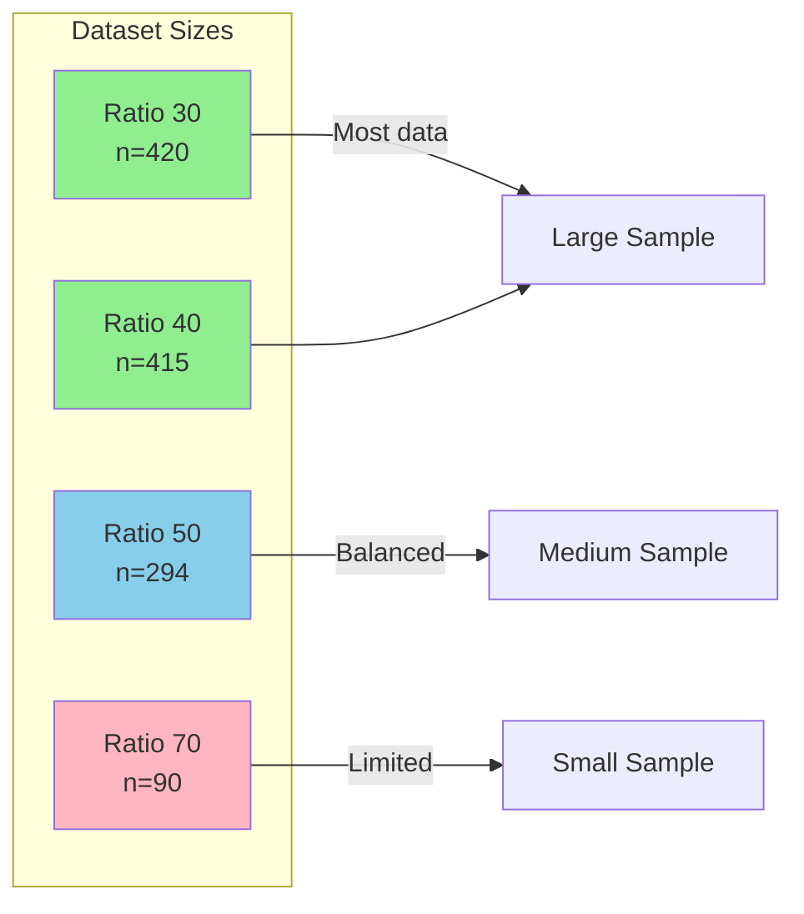

---

## DRIVE Correlations

### Position-Based Strength Features

```mermaid
xychart-beta
    title "DRIVE: Key Position Correlations by Ratio"
    x-axis [GP_str_5, GP_str_8, GP_str_13, GP_str_21, GP_str_29]
    y-axis "Correlation (r)" -0.3 --> 0.3
    bar [0.131, -0.178, 0.221, 0.124, 0.172]
    bar [0.134, -0.169, 0.230, 0.117, 0.177]
    bar [0.191, -0.163, 0.254, 0.193, 0.183]
    bar [0.229, -0.104, 0.208, 0.236, 0.107]
```

### Drive Feature Hierarchy

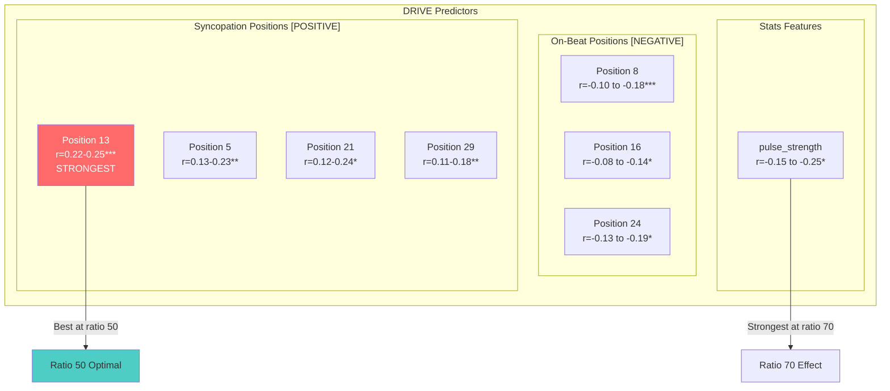

### Drive Summary Table

| Position | Ratio 30 | Ratio 40 | Ratio 50 | Ratio 70 | Interpretation |
|----------|----------|----------|----------|----------|----------------|
| GP_str_13 | +0.221*** | +0.230*** | **+0.254***| +0.208* | Syncopation = Drive |
| RP_str_13 | +0.223*** | +0.230*** | **+0.242***| +0.242* | Consistent across ratios |
| GP_str_5 | +0.131** | +0.134** | **+0.191***| +0.229* | Strengthens at high ratios |
| GP_str_21 | +0.124* | +0.117* | **+0.193***| +0.236* | Strengthens at high ratios |
| GP_str_8 | -0.178*** | -0.169*** | -0.163** | -0.104 | On-beat = less Drive |
| pulse_strength | -0.157** | -0.153** | -0.175** | -0.252* | Stronger pulse = less Drive |

---

## ROLL Correlations

### Roll Feature Hierarchy

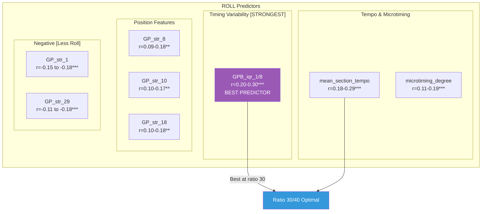

### Roll Summary Table

| Feature | Ratio 30 | Ratio 40 | Ratio 50 | Ratio 70 | Interpretation |
|---------|----------|----------|----------|----------|----------------|
| **GPB_iqr_1/8** | **+0.238***| +0.232*** | +0.203*** | +0.295** | Timing variability = Roll |
| mean_section_tempo | **+0.259***| +0.254*** | +0.176** | +0.286** | Faster = more Roll |
| microtiming_degree | +0.188*** | +0.185*** | +0.167** | +0.112 | Weakens at high ratio |
| GP_iqr_10 | +0.188*** | +0.184*** | +0.171** | +0.120 | Position 10 variability |
| GP_str_8 | +0.161*** | +0.159** | +0.176** | +0.092 | On-beat strength |
| GP_str_1 | -0.180*** | -0.173*** | -0.149* | -0.201 | Position 1 = less Roll |

---

## PULSE Correlations

### Pulse Feature Hierarchy

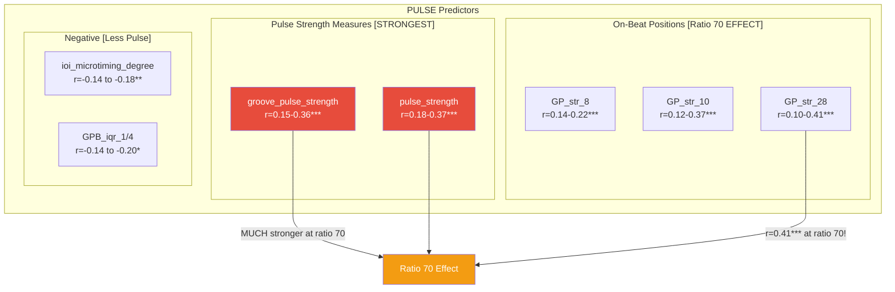

### Pulse Summary Table

| Feature | Ratio 30 | Ratio 40 | Ratio 50 | Ratio 70 | Interpretation |
|---------|----------|----------|----------|----------|----------------|
| **groove_pulse_strength** | +0.153** | +0.163*** | +0.225*** | **+0.361***| Dramatic increase at r70 |
| **pulse_strength** | +0.182*** | +0.183*** | +0.218*** | **+0.365***| Dramatic increase at r70 |
| GP_str_8 | +0.154** | +0.149** | **+0.221***| +0.136 | Best at ratio 50 |
| GP_str_10 | +0.115* | +0.120* | +0.084 | **+0.368***| Explodes at ratio 70 |
| GP_str_28 | +0.101* | +0.104* | +0.114 | **+0.406***| Strongest at ratio 70! |
| ioi_microtiming_degree | -0.143** | -0.144** | -0.174** | -0.183 | IOI variability = less Pulse |

---

## Ratio Comparison Overview

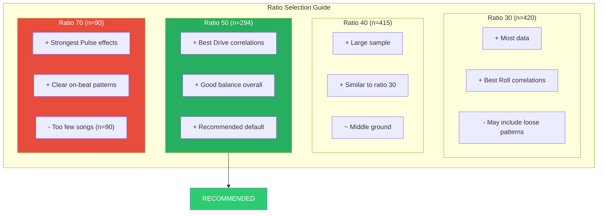

---

## Best Features Per Target

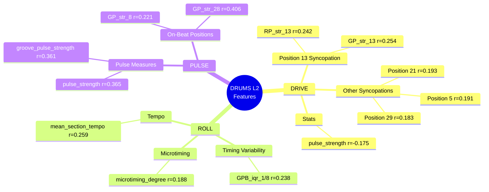

---

## Conclusions

### 1. Drive is Syncopation-Driven
- **Position 13** is the universal Drive predictor across all ratios
- Syncopated positions (5, 13, 21, 29) consistently positive
- On-beat positions (8, 16, 24) consistently negative
- **Best ratio: 50** (strongest syncopation effects)

### 2. Roll is Variability-Driven
- **GPB_iqr_1/8** (eighth-note timing variability) dominates
- Faster tempo = more Roll
- More microtiming = more Roll
- **Best ratio: 30/40** (strongest correlations, most data)

### 3. Pulse is Regularity-Driven
- **pulse_strength** and **groove_pulse_strength** are key
- Effect DRAMATICALLY increases at ratio 70
- High-ratio songs have clearer pulse patterns
- **Best ratio: 50** (balance) or **70** (if sample size permits)

### 4. Ratio Recommendations

| Use Case | Recommended Ratio |
|----------|-------------------|
| General analysis | **50** |
| Drive research | **50** |
| Roll research | **30 or 40** |
| Pulse research | **50** (or 70 with caution) |
| Maximum sample size | **30** |

---

## Appendix: Significant Features Count

| Ratio | Drive (p<0.05) | Roll (p<0.05) | Pulse (p<0.05) |
|-------|----------------|---------------|----------------|
| 30 | ~35 | ~40 | ~25 |
| 40 | ~35 | ~38 | ~25 |
| 50 | 35 | 37 | 18 |
| 70 | ~20 | ~15 | ~25 |

*Note: Ratio 70 has fewer significant features due to smaller sample size (n=90)*

---

# DRUMS L1 vs L2 Comparison

## L1 Overview (16 positions = 1 bar)

### Dataset Sizes (Same as L2)

| Ratio | After DGA merge |
|-------|-----------------|
| 30    | **420** songs   |
| 40    | **415** songs   |
| 50    | **294** songs   |
| 70    | **90** songs    |

---

## L1 DRIVE Correlations

### L1 Drive Summary Table

| Feature | L1 r30 | L1 r40 | L1 r50 | L1 r70 |
|---------|--------|--------|--------|--------|
| **GP_str_13** | +0.226*** | +0.235*** | **+0.263***| +0.193 |
| **RP_str_13** | +0.235*** | +0.238*** | **+0.245***| +0.207 |
| GP_str_5 | +0.139** | +0.141** | **+0.203***| +0.177 |
| GP_str_1 | +0.153** | +0.147** | +0.175** | +0.150 |
| GP_str_8 (neg) | -0.168*** | -0.162*** | -0.135* | -0.127 |
| GP_iqr_13 | +0.186*** | +0.190*** | **+0.201***| +0.162 |

**Key Finding:** Position 13 is STRONGER in L1 (r=0.263) than L2 (r=0.254)!

---

## L1 ROLL Correlations

### L1 Roll Summary Table

| Feature | L1 r30 | L1 r40 | L1 r50 | L1 r70 |
|---------|--------|--------|--------|--------|
| **GPB_iqr_1/8** | **+0.247***| +0.244*** | +0.225*** | +0.295** |
| mean_section_tempo | **+0.258***| +0.254*** | +0.178** | +0.285** |
| microtiming_degree | +0.227*** | +0.224*** | +0.210*** | +0.162 |
| GP_str_1 (neg) | -0.171*** | -0.165*** | -0.159** | -0.130 |
| RP_str_1 (neg) | -0.186*** | -0.182*** | -0.182** | -0.144 |

**Key Finding:** GPB_iqr_1/8 remains #1 predictor, slightly stronger in L1!

---

## L1 PULSE Correlations

### L1 Pulse Summary Table

| Feature | L1 r30 | L1 r40 | L1 r50 | L1 r70 |
|---------|--------|--------|--------|--------|
| **GP_str_8** | +0.155** | +0.153** | **+0.194***| +0.138 |
| **GP_str_10** | +0.112* | +0.115* | +0.093 | **+0.359***|
| groove_pulse_strength | +0.137** | +0.137** | +0.135* | +0.245* |
| GPB_iqr_1/8 | +0.128** | +0.129** | +0.129* | +0.116 |
| RP_str_13 (neg) | -0.137** | -0.131** | -0.106 | -0.021 |
| **pulse_strength** | -- | -- | -- | -- |

---

## L1 Bug: Missing pulse_strength

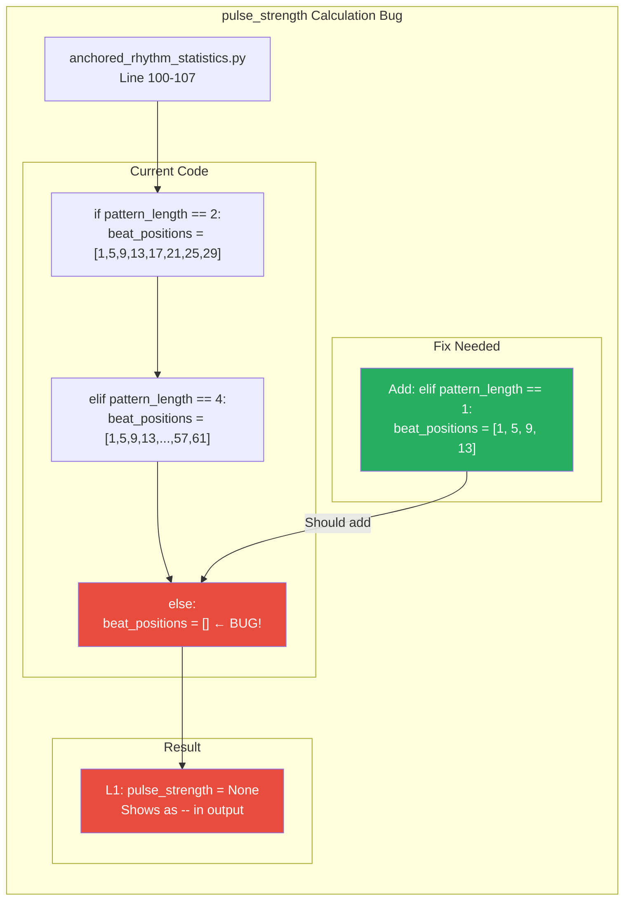

**Location:** `loop_extractor/batch_analysis/anchored_rhythm_statistics.py` lines 100-107

**Problem:** Code only handles `pattern_length == 2` (L2) and `pattern_length == 4` (L4), but not `pattern_length == 1` (L1).

**Fix:** Add `elif pattern_length == 1: beat_positions = [1, 5, 9, 13]`

---

## L1 vs L2 Comparison

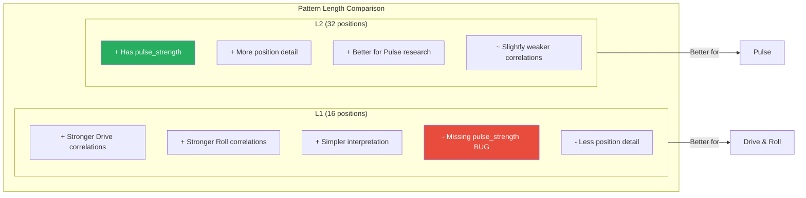

### Summary Comparison Table

| Aspect | L1 (16 pos) | L2 (32 pos) | Winner |
|--------|-------------|-------------|--------|
| **Drive: Position 13** | r=0.263*** | r=0.254*** | **L1** |
| **Roll: GPB_iqr_1/8** | r=0.247*** | r=0.238*** | **L1** |
| **Pulse: GP_str_8** | r=0.194*** | r=0.221*** | **L2** |
| **Pulse: pulse_strength** | MISSING (BUG) | r=0.218*** | **L2** |
| Feature count | 81 | 165 | L2 |
| Interpretability | Simpler | More detail | Depends |

### Recommendations by Pattern Length

| Use Case | Recommended |
|----------|-------------|
| Drive research | **L1** (stronger correlations) |
| Roll research | **L1** (stronger correlations) |
| Pulse research | **L2** (has pulse_strength) |
| Detailed position analysis | **L2** (32 positions) |
| Quick analysis | **L1** (simpler) |

---

## Overall Conclusions

### 1. Pattern Length Effects
- **L1 shows STRONGER correlations** for Drive and Roll than L2
- This is likely due to averaging effects (16 vs 32 positions)
- **L2 is required for Pulse research** due to pulse_strength availability

### 2. Consistent Patterns Across L1 and L2
- **Position 13 = Drive** (syncopation)
- **GPB_iqr_1/8 = Roll** (timing variability)
- **On-beat positions = Pulse**

### 3. Ratio Effects (Same for L1 and L2)
- **Ratio 50** best for Drive
- **Ratio 30/40** best for Roll
- **Ratio 70** shows strong Pulse effects but limited sample

### 4. Bug Fix Required
- `pulse_strength` not computed for L1 - needs fix in `anchored_rhythm_statistics.py`

---

# DRUMS L4 Analysis (64 positions = 4 bars)

## L4 Overview

### Dataset Sizes

| Ratio | After DGA merge |
|-------|-----------------|
| 30    | **389** songs   |
| 40    | **379** songs   |
| 50    | **292** songs   |
| 70    | **90** songs    |

*Note: L4 has slightly fewer songs than L1/L2 because 4-bar repeating patterns are less common.*

---

## L4 DRIVE Correlations

### L4 Drive Summary Table

| Feature | L4 r30 | L4 r40 | L4 r50 | L4 r70 |
|---------|--------|--------|--------|--------|
| **GP_str_13** | +0.217*** | +0.215*** | **+0.238***| +0.179 |
| **RP_str_13** | +0.219*** | +0.217*** | **+0.243***| +0.230* |
| GP_str_21 | +0.190*** | +0.176*** | **+0.227***| +0.290** |
| GP_str_33 | +0.182*** | +0.192*** | **+0.217***| +0.201 |
| GP_str_45 | +0.205*** | +0.203*** | +0.192*** | +0.171 |
| GP_str_37 | +0.153** | +0.167** | +0.158** | +0.266* |
| GP_str_29 | +0.161** | +0.157** | +0.199*** | +0.178 |
| GP_med_21 | +0.101* | +0.087 | +0.108 | **+0.344***|
| pulse_strength | -0.135** | -0.146** | -0.154** | -0.209* |

**Key Finding:** Syncopation "echoes" at positions 13, 21, 29, 33, 37, 45 (every 16 positions + offsets)

---

## L4 ROLL Correlations

### L4 Roll Summary Table

| Feature | L4 r30 | L4 r40 | L4 r50 | L4 r70 |
|---------|--------|--------|--------|--------|
| **GPB_iqr_1/8** | **+0.257***| +0.250*** | +0.222*** | +0.284** |
| mean_section_tempo | **+0.244***| +0.239*** | +0.174** | +0.282** |
| GP_str_40 | +0.189*** | +0.185*** | +0.218*** | +0.096 |
| GP_str_45 (neg) | -0.205*** | -0.194*** | -0.167** | -0.135 |
| RP_str_1 (neg) | -0.187*** | -0.191*** | -0.195*** | -0.268* |
| microtiming_degree | +0.161** | +0.167** | +0.134* | +0.124 |
| GP_med_42 | +0.193*** | +0.193*** | +0.208*** | +0.218* |

**Key Finding:** GPB_iqr_1/8 remains #1 Roll predictor, consistent across all pattern lengths!

---

## L4 PULSE Correlations

### L4 Pulse Summary Table

| Feature | L4 r30 | L4 r40 | L4 r50 | L4 r70 |
|---------|--------|--------|--------|--------|
| **pulse_strength** | +0.183*** | +0.197*** | +0.194*** | +0.294** |
| **GP_str_60** | +0.130* | +0.132** | +0.131* | **+0.387***|
| **GP_str_42** | +0.088 | +0.085 | +0.074 | **+0.352***|
| GP_str_40 | +0.143** | +0.146** | +0.160** | +0.002 |
| GP_str_10 | +0.099 | +0.096 | +0.046 | **+0.302**|
| groove_pulse_strength | +0.144** | +0.150** | +0.183** | +0.248* |
| GP_str_58 | +0.099 | +0.092 | +0.090 | **+0.291**|

**Key Finding:** At ratio 70, positions 60 (+0.387***) and 42 (+0.352***) emerge as strong Pulse predictors!

---

## L4 Syncopation Echo Pattern

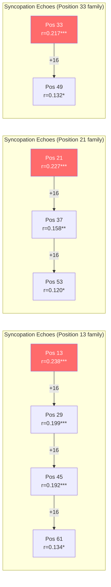

---

## L1 vs L2 vs L4 Comparison

### Summary Comparison Table

| Aspect | L1 (16 pos) | L2 (32 pos) | L4 (64 pos) | Winner |
|--------|-------------|-------------|-------------|--------|
| **Drive: Position 13** | r=0.263*** | r=0.254*** | r=0.238*** | **L1** |
| **Roll: GPB_iqr_1/8** | r=0.247*** | r=0.238*** | r=0.257*** | **L4** |
| **Pulse: pulse_strength** | MISSING | r=0.218*** | r=0.194*** | **L2** |
| **Pulse: GP_str_60** | N/A | N/A | r=0.387*** | **L4** |
| Feature count | 81 | 165 | 329 | L4 |
| Sample size (r50) | 294 | 294 | 292 | Similar |
| Syncopation detail | 1 bar | 2 bars | **4 bars** | L4 |

### Pattern Length Effects

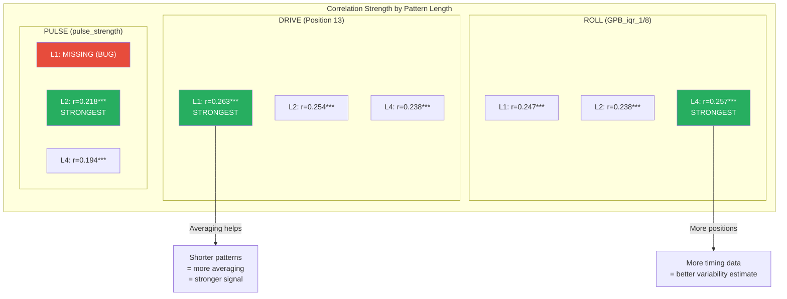

---

## Updated Recommendations

### Pattern Length Selection Guide

| Use Case | Recommended | Reason |
|----------|-------------|--------|
| Drive research | **L1** | Strongest Position 13 correlation |
| Roll research | **L4** | Best GPB_iqr_1/8 correlation |
| Pulse research | **L2** | Has pulse_strength, best correlation |
| Syncopation detail | **L4** | Shows echo patterns across bars |
| Quick analysis | **L1** | Simplest, fewest features |
| Full position analysis | **L4** | 64 positions, most detail |

### Ratio Selection (Same for all Ls)

| Use Case | Recommended Ratio |
|----------|-------------------|
| General analysis | **50** |
| Drive research | **50** |
| Roll research | **30 or 40** |
| Pulse research | **50** (or 70 with caution) |
| Maximum sample size | **30** |

---

## Key Discoveries from L4

### 1. Syncopation Echoes
- Position 13 effect repeats every 16 positions (13, 29, 45, 61)
- Position 21 family: 21, 37, 53
- Position 33 family: 33, 49
- This confirms syncopation patterns repeat across bars

### 2. Late-Bar Pulse Effects (Ratio 70)
- **Position 60** emerges as strongest Pulse predictor (r=+0.387***)
- **Position 42** also very strong (r=+0.352***)
- These are "on-beat" positions in bars 3-4
- Suggests Pulse perception strengthened by consistent patterns across multiple bars

### 3. GPB_iqr_1/8 Universality
- Best Roll predictor in ALL pattern lengths
- L4 shows slightly stronger effect (r=0.257***) than L1/L2
- Timing variability at eighth-note level is fundamental to Roll perception

### 4. L4-Specific Findings
- More positions to show syncopation "echo" patterns
- Late-bar positions (40-63) show unique effects
- GP_med_21 becomes very strong at ratio 70 (r=+0.344***)

---

# Multi-Stem Comparison (L2 ratio50)

## Overview

Analysis of **four stems**: DRUMS, BASS, OTHER, VOCALS at L2 ratio50 (n=294 songs each).

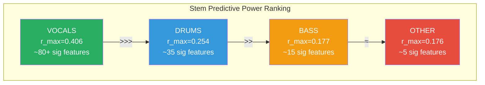

**Key Finding:** Despite worse onset detection, VOCALS show **60% stronger correlations** than DRUMS!

---

## DRIVE Correlations by Stem

### Drive Comparison Table

| Feature | DRUMS | BASS | OTHER | VOCALS | Pattern |
|---------|-------|------|-------|--------|---------|
| **pulse_strength** | **-0.175**\*\* | -0.010 | -0.013 | **+0.406**\*\*\* | DRUMS neg, VOCALS pos! |
| **GP_str_13** | **+0.254**\*\*\* | +0.067 | +0.003 | +0.115* | DRUMS-specific |
| **GP_str_20** | -0.028 | +0.074 | -0.072 | **+0.337**\*\*\* | VOCALS-specific |
| **GP_str_8** | **-0.163**\*\* | -0.010 | -0.036 | **+0.249**\*\*\* | Opposite signs! |
| total_ioi_count | +0.096 | +0.065 | -0.010 | **+0.367**\*\*\* | VOCALS only |
| microtiming_complexity | +0.053 | -0.038 | +0.104 | **+0.279**\*\*\* | VOCALS strongest |
| GP_str_21 | **+0.193**\*\*\* | +0.075 | -0.041 | **+0.194**\*\*\* | DRUMS & VOCALS |
| GP_str_11 | +0.092 | **+0.169**\*\* | -0.019 | +0.151** | BASS-specific |
| ioi_microtiming_degree | +0.103 | -0.052 | **+0.168**\*\* | -0.137* | OTHER pos, VOCALS neg |
| BP_str_3/16 | +0.001 | **+0.150**\*\* | -0.049 | -0.103 | BASS-specific |

### Drive Mechanisms by Stem

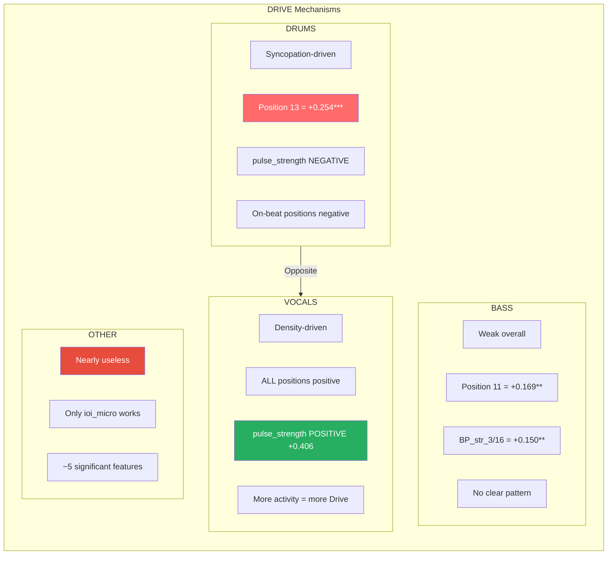

---

## ROLL Correlations by Stem

### Roll Comparison Table

| Feature | DRUMS | BASS | OTHER | VOCALS | Pattern |
|---------|-------|------|-------|--------|---------|
| **mean_section_tempo** | **+0.176**\*\* | **+0.176**\*\* | **+0.176**\*\* | **+0.176**\*\* | **UNIVERSAL!** |
| **GPB_iqr_1/8** | **+0.203**\*\*\* | +0.075 | -0.021 | **-0.162**\*\* | DRUMS pos, VOCALS neg! |
| microtiming_degree | **+0.167**\*\* | +0.119* | +0.031 | +0.134* | DRUMS strongest |
| GP_str_22 | +0.076 | **+0.177**\*\* | +0.129* | -0.093 | BASS-specific |
| GPB_iqr_3/16 | +0.041 | **+0.159**\*\* | +0.099 | -0.095 | BASS-specific |
| GP_str_10 | **+0.165**\*\* | +0.085 | **+0.150**\*\* | **-0.189**\*\* | DRUMS/OTHER pos, VOCALS neg |
| GP_str_18 | **+0.176**\*\* | +0.075 | +0.088 | -0.135* | DRUMS pos, VOCALS neg |
| GP_str_20 | +0.020 | +0.033 | -0.044 | **-0.233**\*\*\* | VOCALS strongly negative |
| GP_iqr_10 | **+0.171**\*\* | +0.088 | +0.046 | **-0.234**\*\*\* | DRUMS pos, VOCALS neg |
| GP_iqr_31 | -0.038 | **-0.154**\*\* | +0.027 | +0.032 | BASS-specific negative |

### Roll Mechanisms by Stem

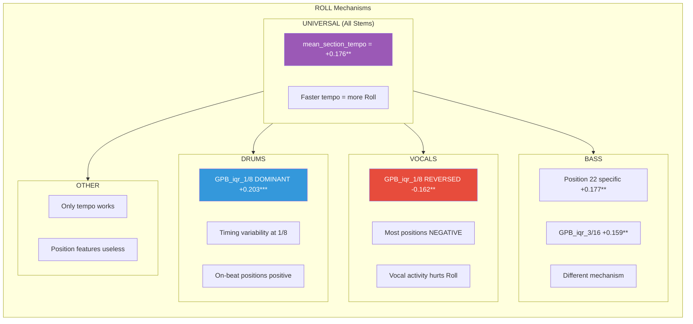

**Critical Finding:** `mean_section_tempo` shows IDENTICAL correlation (+0.176\*\*) across ALL FOUR stems!

---

## PULSE Correlations by Stem

### Pulse Comparison Table

| Feature | DRUMS | BASS | OTHER | VOCALS | Pattern |
|---------|-------|------|-------|--------|---------|
| **pulse_strength** | **+0.218**\*\*\* | -0.025 | +0.012 | **-0.283**\*\*\* | DRUMS pos, VOCALS neg! |
| **groove_pulse_strength** | **+0.225**\*\*\* | +0.101 | **+0.163**\*\* | **-0.203**\*\*\* | ALL significant, VOCALS opposite |
| **GP_str_8** | **+0.221**\*\*\* | -0.022 | -0.018 | **-0.243**\*\*\* | Opposite signs! |
| total_ioi_count | +0.013 | -0.021 | +0.056 | **-0.350**\*\*\* | VOCALS strong negative |
| microtiming_complexity | -0.081 | +0.010 | -0.079 | **-0.305**\*\*\* | VOCALS strongest |
| groove_ioi_pulse_strength | +0.010 | **+0.170**\*\* | -0.071 | +0.121* | BASS-specific |
| GP_med_30 | +0.017 | **+0.170**\*\* | +0.096 | -0.077 | BASS-specific |
| GP_med_1 | +0.013 | **+0.154**\*\* | -0.090 | -0.089 | BASS-specific |
| ioi_microtiming_degree | **-0.174**\*\* | +0.055 | **-0.159**\*\* | +0.106 | DRUMS/OTHER neg |
| GP_str_20 | +0.072 | -0.059 | -0.002 | **-0.263**\*\*\* | VOCALS-specific |

### Pulse Mechanisms by Stem

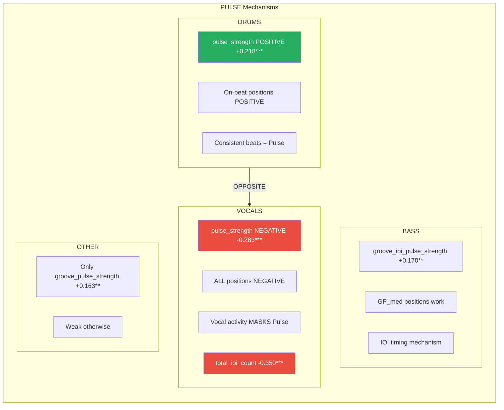

---

## Sparsity Comparison (Non-Zero Counts)

| Position | DRUMS nz | BASS nz | OTHER nz | VOCALS nz | Notes |
|----------|----------|---------|----------|-----------|-------|
| GP_str_0 | 294 | 198 | 176 | 197 | DRUMS always has onset at 0 |
| GP_str_1 | 50 | 134 | 88 | 133 | DRUMS sparse at syncopation |
| GP_str_4 | 280 | 94 | 78 | 189 | DRUMS dense on quarter notes |
| GP_str_8 | 271 | 104 | 120 | 207 | DRUMS densest on beat 3 |
| GP_str_13 | 60 | 92 | 80 | 161 | VOCALS 3x denser than DRUMS |
| GP_str_16 | 288 | 170 | 150 | 190 | All stems have bar downbeat |

**Key Insight:** DRUMS is very sparse at syncopation positions (13, 21, 29 have ~50-70 non-zeros), while VOCALS is dense everywhere (130-210 non-zeros). This explains why syncopation matters for drums but not vocals.

---

## Summary: Stem Comparison

### Best Features Per Stem

| Stem | Best Drive Feature | Best Roll Feature | Best Pulse Feature |
|------|-------------------|-------------------|-------------------|
| **DRUMS** | GP_str_13 (+0.254) | GPB_iqr_1/8 (+0.203) | groove_pulse_str (+0.225) |
| **BASS** | GP_str_11 (+0.169) | GP_str_22 (+0.177) | groove_ioi_ps (+0.170) |
| **OTHER** | ioi_micro_deg (+0.168) | tempo (+0.176) | groove_pulse_str (+0.163) |
| **VOCALS** | pulse_strength (+0.406) | tempo (+0.176) | total_ioi_count (-0.350) |

### Mechanism Summary

```
                   DRUMS              BASS               OTHER              VOCALS
                   ─────              ────               ─────              ──────
DRIVE
  Best r           +0.254***          +0.169**           +0.168**           +0.406***
  Mechanism        Syncopation        Weak/Position 11   Weak               Density
  pulse_strength   NEGATIVE           None               None               POSITIVE

ROLL
  Best r           +0.203***          +0.177**           +0.176**           +0.176**
  Mechanism        Timing variability Position 22        Tempo only         Tempo only
  GPB_iqr_1/8      POSITIVE           None               None               NEGATIVE

PULSE
  Best r           +0.225***          +0.170**           +0.163**           -0.350***
  Mechanism        On-beat strength   IOI timing         groove_ps          Negative density
  pulse_strength   POSITIVE           None               None               NEGATIVE
```

---

## Key Discoveries from Multi-Stem Analysis

### 1. VOCALS Reverse DRUMS Patterns

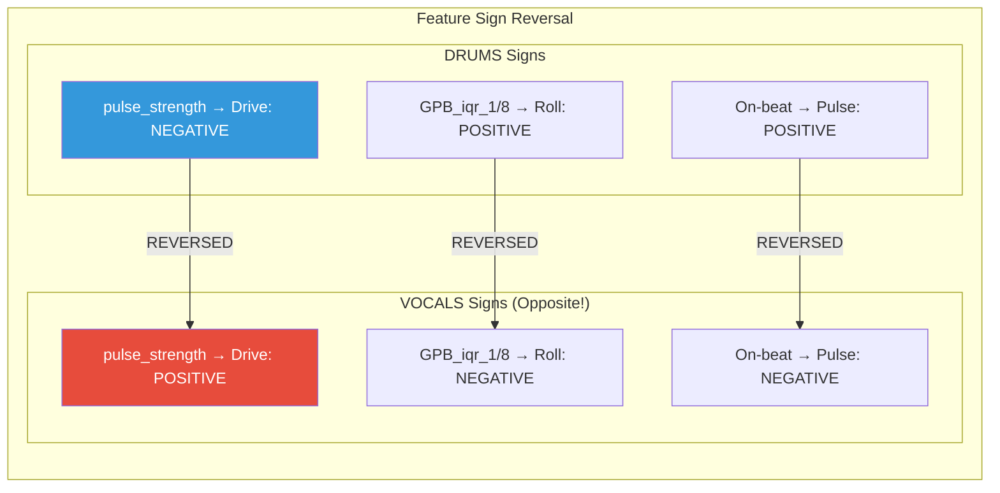

### 2. OTHER Stem is Nearly Useless
- Only ~5 significant features total
- Only `mean_section_tempo` and `groove_pulse_strength` work
- No position-based patterns
- Likely too heterogeneous (guitars, synths, effects mixed together)

### 3. mean_section_tempo is Universal
- Exactly **+0.176\*\*** for Roll in ALL FOUR stems
- Faster tempo = more Roll, regardless of instrument
- This is the ONLY feature that works identically everywhere

### 4. VOCALS Act as Perceptual "Noise"
- More vocal activity = **more Drive** (energy/excitement)
- More vocal activity = **less Pulse** (masks the beat)
- More vocal activity = **less Roll** (disrupts flow)
- Despite worse onset detection, vocals have STRONGEST correlations!

### 5. BASS Has Unique Mechanisms
- Position 22 specific for Roll (+0.177\*\*) - not significant in other stems
- GPB_iqr_3/16 works for Roll (+0.159\*\*)
- Pulse works through IOI timing (`groove_ioi_pulse_strength`)
- Different from drums - not syncopation-based

### 6. Stem Ranking by Predictive Power

```
VOCALS >>> DRUMS >> BASS ≈ OTHER
(r=0.41)   (r=0.25) (r=0.18) (r=0.17)
```

---

## Recommendations for Multi-Stem Analysis

### When to Use Each Stem

| Research Goal | Primary Stem | Secondary Stem | Avoid |
|---------------|--------------|----------------|-------|
| Drive research | VOCALS | DRUMS | OTHER |
| Roll research | DRUMS | BASS | OTHER |
| Pulse research | DRUMS | VOCALS (negative) | OTHER |
| Syncopation effects | DRUMS | - | VOCALS, OTHER |
| Density effects | VOCALS | - | DRUMS |
| Timing variability | DRUMS | BASS | OTHER |

### Combined Stem Features

For maximum predictive power, consider combining:
1. **DRUMS Position 13** (syncopation → Drive)
2. **VOCALS pulse_strength** (density → Drive)
3. **DRUMS GPB_iqr_1/8** (timing variability → Roll)
4. **ALL STEMS mean_section_tempo** (universal → Roll)
5. **DRUMS groove_pulse_strength** (regularity → Pulse)
6. **VOCALS total_ioi_count** (inverse density → Pulse)

### Interpretation Guidelines

| If you find... | It means... |
|----------------|-------------|
| DRUMS syncopation high | More perceived Drive |
| VOCALS dense everywhere | More perceived Drive, less Pulse |
| DRUMS on-beat consistent | More perceived Pulse |
| VOCALS on-beat active | LESS perceived Pulse (masking) |
| DRUMS timing variable (1/8) | More perceived Roll |
| Higher tempo (any stem) | More perceived Roll |
